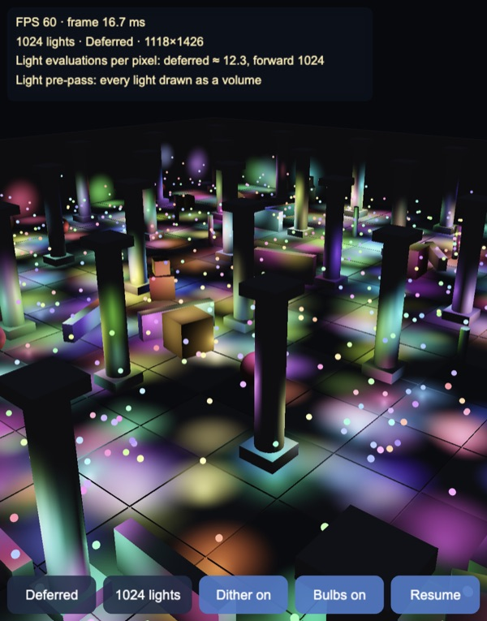
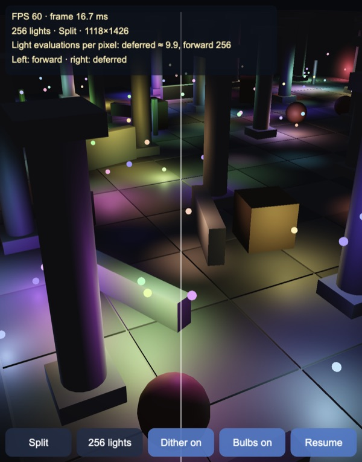
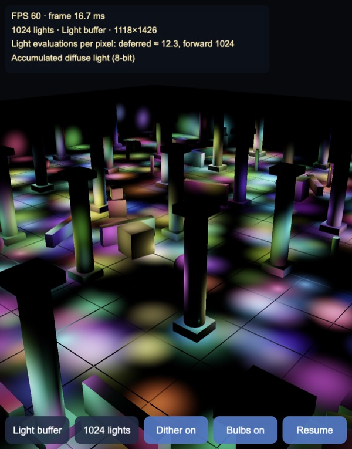
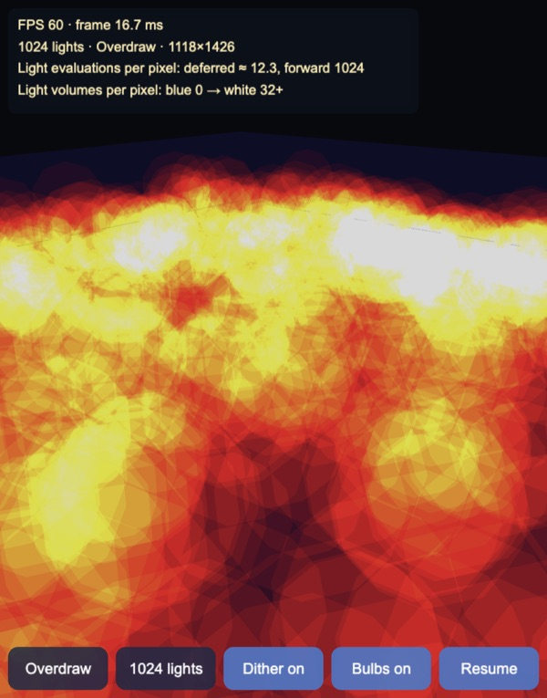
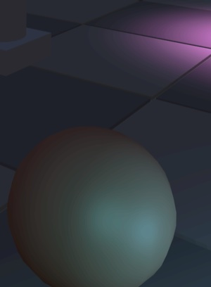

# Deferred lighting: a light pre-pass on 8-bit render targets

Up to 1,024 moving point lights in Cocos Creator 3.8, built and previewed
with Enji. Every light is drawn as a small bounding volume that shades only
the pixels it covers, so the cost follows how much screen the lights cover,
not how many there are. Everything runs through the engine's ordinary cameras
and render textures: no custom render pipeline, no multiple render targets,
no float render targets, only 8-bit RGBA. Next to it, a brute-force forward
path loops over every light in every pixel, for comparison.

1,024 lights at 60 FPS (Apple Silicon, Enji preview, 1118×1426 canvas). Each
light pass fragment is one light evaluation; here that is about 12 per pixel,
against 1,024 per pixel for the forward loop.

## How it works

This is the *light pre-pass* (Engel 2008, also called deferred lighting):
the G-buffer holds only depth and normal, the lights are accumulated into a
light buffer, and a final pass draws the meshes again and applies the
light, so materials stay ordinary forward shaders. Three passes per frame,
each a camera ordered by priority (`assets/game/deferred/DeferredPipeline.ts`):

1. **G-buffer.** A camera parented to the scene camera, with the same field of
   view, draws a copy of every mesh (`GBUFFER_LAYER`) with `dl-gbuffer.effect`
   into an RGBA8 render texture at screen size: rg linear depth over 60 m in
   two bytes, ba the view-space normal's x and y (z is rebuilt, facing the
   camera).
2. **Lights** (`dl-light.effect`). All light volumes are one mesh: a copy of
   an icosphere per light (42 vertices, 80 triangles), each vertex carrying
   its light's index. The light positions, radii and colours live in a
   64×32 RGBA32F texture, refilled from the CPU every frame; the vertex shader
   reads its light from there, moves and sizes the copy, and passes the light
   to the fragment shader. Details:
   - **Back faces only, no depth test.** Every pixel inside a volume's screen
     footprint is shaded exactly once per light, even with the camera inside
     the volume, and nothing needs the scene's depth buffer (which a second
     camera's render texture does not share).
   - **The volume must enclose the light.** An icosphere with its vertices on
     the light's radius cuts the sphere off between them, up to 6.6% of the
     radius short, which would clip a ring off every light. Scaled by
     1 / inradius (×1.07) every face lies outside the sphere.
   - The fragment rebuilds the view position and normal from the G-buffer,
     skips pixels beyond the radius, and adds rgb: diffuse light, a: specular
     luminance (Blinn-Phong) with additive blending. The falloff is
     windowed inverse-square (Karis 2013), which reaches zero at the radius
     with zero slope.
   - **8 bits per channel.** The light buffer stores light × 0.25, so it
     covers 0 to 4 (see the tests for why). Each light's output is dithered
     by a 4×4 Bayer pattern shifted per light index, so rounding to 8 bits
     turns into fine noise instead of bands.
3. **Scene.** `dl-lit.effect` draws the meshes with albedo × (ambient +
   diffuse light) + specular, then an exposure curve. The light buffer has
   one specular value per pixel, so its colour is taken from the diffuse
   light's hue there: exact under one light, approximate where lights of
   different colours overlap (CryEngine 3 did the same).

The forward path in the same shader loops over the light texture per
fragment with the same maths in world space. A small glowing bulb at every
light is the volume mesh again, shrunk to 6 cm (`dl-bulb.effect`).

`assets/game/deferred/Shading.ts` is the lighting and the 8-bit encodings in
TypeScript, line for line the shaders, and `tools/test.mts` renders a floor
with it on the CPU.

## Forward and deferred side by side

256 lights, forward on the left of the white line, deferred on the right.
The low wall and floor tiles crossing the line show no seam.

## The light volumes

| Light buffer (diffuse) | Volumes per pixel |
|---|---|
|  |  |

The overdraw view adds one 8-bit level per volume fragment and is read back
to count them exactly (blue 0, red, yellow, white 32 or more). Volumes pile up
towards the far end of the hall, where many distant lights cover the same
pixels; that, not the light count, is what the deferred path pays for. The
HUD estimates the same number on the CPU every half second (each volume's
near-clipped screen bounds, after Mara & McGuire 2013):

| View | Lights | Read back: mean (max) per pixel | CPU estimate |
|---|---|---|---|
| Overview | 64 | 5.2 (13) | 5.5 |
| Overview | 256 | 7.9 (27) | 8.4 |
| Overview | 1024 | 10.8 (43) | 11.6 |
| Close-up among the lights | 64 | 5.8 (13) | 6.6 |
| Close-up among the lights | 256 | 11.7 (33) | 12.1 |
| Close-up among the lights | 1024 | 24.8 (74) | 26.1 |

## Dither

| Dither off | Dither on | Forward (reference) |
|---|---|---|
|  |  |  |

A dark corner with 64 lights, brightened ×3. Without dither, every light's
contribution rounds to the same few levels across a smooth falloff and the
floor and the sphere show rings; with the per-light shifted Bayer pattern
the rings dissolve, and the mean matches the forward reference (region means
within 0.4 levels; dither off is up to 0.8 levels darker, as small
contributions round to zero).

## Tests

`node --no-warnings --import ./tools/ts-resolve.mjs tools/test.mts`, 26
checks, all passing. The image tests render a 320×240 floor from the demo's
start camera with the demo's lights, once in float and once through every
8-bit stage, and compare outputs in 8-bit levels.

| Check | Result |
|---|---|
| Icosphere with vertices on the radius | 100% of directions fall short, up to 6.6% of the radius |
| Scaled by 1 / inradius | encloses the sphere (closest surface 1.00007 r); 7.1% more volume |
| 1,024 volumes in one mesh | 43,008 vertices (16-bit indices), 81,920 triangles |
| Falloff | 1 at the light, 0 at the radius, slope there −3.5e-5 |
| Packed depth, normal round trip | 0.46 mm over 60 m; 2.14° worst |
| One light: specular colour rebuilt from the buffer | exact |

Where the deferred image differs from forward (256 lights), each stage
alone:

| Stage | Mean | 99th percentile | Worst |
|---|---|---|---|
| Specular hue taken from the diffuse light | 0.59 | 8.82 | 26.0 |
| 8-bit G-buffer | 0.18 | 1.04 | 2.46 |
| 8-bit light buffer, no dither | 0.81 | 3.90 | 17.1 |
| 8-bit light buffer, dither | 1.15 | 5.68 | 23.3 |
| All together (as shown) vs forward | 1.48 | 9.58 | 28.3 |

Dither adds per-pixel noise but, averaged over 4×4 pixels (roughly what the
eye does), cuts the light buffer's error from 0.32 to 0.20 levels: bands
become noise. The largest errors are the specular colour where differently
coloured highlights overlap.

The light buffer's range, at 1,024 lights:

| Range | Pixels that clip | vs float: mean, p99, worst |
|---|---|---|
| 0–2 | 4.92% | 0.82, 12.6, 32.9 |
| 0–3 | 1.18% | 0.80, 4.28, 29.7 |
| **0–4 (used)** | **0.16%** | 1.03, 5.31, 16.4 |

Light update and texture fill for 1,024 lights take 0.09–0.3 ms per frame
in Node.

## Controls

- Drag to orbit, pinch or mouse wheel to zoom.
- Buttons: view (deferred, forward, split, light buffer, overdraw, normals);
  lights (256, 1024, 64); dither on / off; bulbs on / off; pause.
- Keys: `M` view, `L` lights, `D` dither, `B` bulbs, `Space` pause.
- The HUD shows FPS, the light count and view, and light evaluations per
  pixel: the deferred estimate against forward's one per light.

## Performance

Desktop (Apple Silicon, Enji preview, 1118×1426 canvas). GPU time is from
`EXT_disjoint_timer_query_webgl2` round each frame; on this machine the timer
drifts between runs and overstates long frames (the forward loop at 256
lights reads 12–34 ms while the page holds 56–60 FPS), so take it as a
relative measure.

| Lights | Deferred FPS | Deferred GPU ms | Forward FPS | Forward GPU ms |
|---|---|---|---|---|
| 64 | 60 | 1.7–3.5 | 60 | 5–7 |
| 256 | 60 | 1.9–4.1 | 56–60 | 12–34 |
| 1024 | 60 | 3.1–5.9 | 17–31 | 67–105 |

Turning off only the light camera at 256 lights drops the deferred frame
from 1.9 to 0.75 ms: the G-buffer and final passes cost about as much as the
lights. It has not been measured on a phone yet.

## Not in this demo yet

- Phone measurements.
- Culling hidden volumes: with no depth test, volumes behind walls and
  columns are shaded and then discarded by the radius test. A stencil pass
  (or depth bounds) would skip them; about 2–3 lights actually reach a floor
  pixel against 6–12 volume fragments per pixel.
- Tiled or clustered shading (one light list per screen tile or depth
  slice), the modern alternative: it needs a compute pass or float render
  targets to build the lists, which this setup avoids.
- Shadows for the point lights.
- A separate specular colour buffer, which would remove the hue
  approximation at the cost of a second light pass.
- Native builds: the screen-position lookups assume WebGL's clip-to-texture
  orientation, as on the other targets render textures may be flipped.

Made with Enji 0.3.
