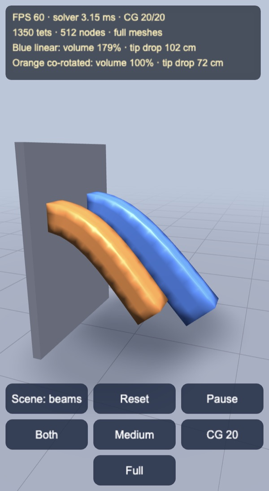
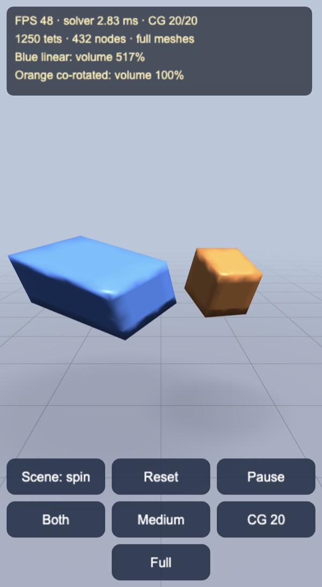
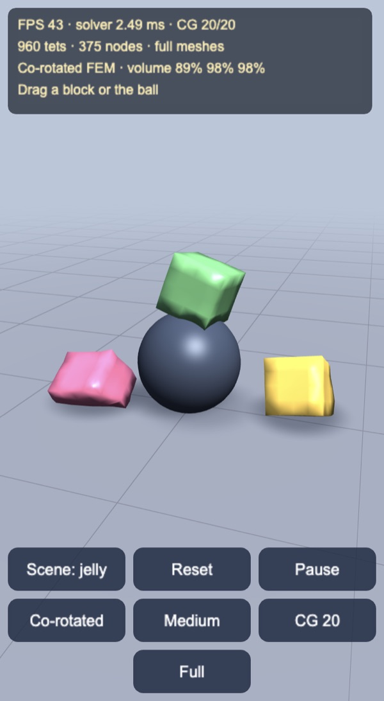

# Co-rotated FEM soft bodies

Finite element soft bodies on tetrahedra for Cocos Creator 3.8, built and
previewed with Enji and sized to run on phones. Two scenes put plain linear FEM
next to co-rotated FEM (Müller & Gross 2004), and a third drops co-rotated
jelly blocks of three stiffnesses onto the ground and a ball.

| Beams: linear (blue) vs co-rotated (orange) | Spinning cubes, 1.3 s in | Jelly blocks landing |
|---|---|---|
|  |  |  |

## How it works

`FemBody` (`assets/game/fem/FemBody.ts`) is a plain TypeScript solver on typed
arrays, with no engine imports, so the same file runs headless in Node.

- **Mesh.** A block of cubes, each split into five tetrahedra, with alternate
  cubes mirrored so that shared faces match. Surface triangles are the faces
  used by exactly one tetrahedron.
- **Elements.** Each tetrahedron is a constant-strain linear element. Its 12×12
  stiffness matrix K_e is built once from Young's modulus and Poisson's ratio,
  using the gradients of the shape functions (the rows of the inverted rest
  edge matrix). Masses are lumped onto the nodes.
- **Co-rotation.** Linear FEM measures strain from the raw displacement x − X,
  so a rotated element looks strained and pushes back. Co-rotated FEM first
  takes the element's rotation R out of its deformation gradient
  F = Ds·Dm⁻¹, and measures strain in the rotated frame. The force becomes
  f = −R·K_e·(Rᵀx − X) and the stiffness R·K_e·Rᵀ. R comes from the iterative
  method of Müller et al. 2016 ("A Robust Method to Extract the Rotational Part
  of Deformations"), warm started from last step's quaternion, so up to 3
  iterations per step are enough.
- **Implicit Euler.** Each step solves
  (M(1 + hα) + (h² + hβ)K′) v⁺ = M v + h (f_el + f_ext) by conjugate
  gradients, warm started from the current velocity. α and β are Rayleigh
  damping. K′ is assembled each step into a block-sparse matrix (3×3 blocks)
  whose pattern, the node adjacency, is built once. Each block of R·K·Rᵀ is
  computed once and mirrored, because K′ is symmetric.
- **Constraints.** Fixed nodes (the beam roots) and the grabbed node are
  Dirichlet conditions with a known velocity. Contacts with the ground and the
  ball are filtered out of the solve as in Baraff & Witkin 1998: a contact node
  keeps zero normal velocity inside CG, and is released next step if its
  constraint force pulls it in.

That last point matters. Projecting contact nodes only after the solve let the
implicit step sink the whole block every frame, and the bottom layer of
elements ended up crushed to a third of its height. With the filtered solve, a
36 cm block settles by what the formula for a column under its own weight
predicts:

| Young's modulus | Sag | Column formula | Volume |
|---|---|---|---|
| 10 kPa | 5.4 cm | 6.4 cm | 95% |
| 30 kPa | 1.8 cm | 2.1 cm | 99% |
| 100 kPa | 0.5 cm | 0.6 cm | 100% |

The meshes are stiffer than the continuum, as linear tetrahedra tend to be.

## Linear vs co-rotated

Same mesh, same material, same solver; only R differs (R = I is linear FEM).
Headless runs with the demo's meshes, after 5 s for the beams:

| Case | Linear | Co-rotated |
|---|---|---|
| Beam, full mesh: tip drop | 97 cm | 47 cm |
| Beam, full mesh: root-to-tip distance (rest 120 cm) | 151 cm | 118 cm |
| Beam, full mesh: volume | 171% | 100% |
| Beam, lite mesh: tip drop / volume | 91 cm / 162% | 58 cm / 100% |
| Cube spinning at 1.5 rad/s, no gravity: volume at 0.6 / 1.2 / 1.8 s | 145% / 268% / 471% | 100% / 100% / 100% |

Linear FEM only works for small rotations. A beam bending past a few degrees
stretches and swells instead of swinging down, and a rigidly spinning cube
reads its own rotation as strain and grows every frame. Co-rotated FEM keeps
the volume and the beam length in both cases. In the jelly scene, the Linear
button shows a quieter version of the same flaw: blocks that land tilted twist
back towards their spawn orientation, because the rotation itself is treated
as strain.

## Mobile

Each scene has a full and a lite mesh. On start-up the demo skips 30 frames,
then averages 60. It switches to lite meshes if that window runs below 50 FPS
or the solver averages over 8 ms. The quality button toggles by hand and turns
the check off. No shadow maps are used: the ground shader draws analytic soft
shadows for the ball and for up to four bodies.

| Scene | Full mesh | Lite mesh |
|---|---|---|
| Beams | 2 × 15×3×3 cells, 1,350 tets | 2 × 10×2×2 cells, 400 tets |
| Spin | 2 × 5³ cells, 1,250 tets | 2 × 3³ cells, 270 tets |
| Jelly | 3 × 4³ cells, 960 tets | 3 × 3³ cells, 405 tets |

## Controls

- Drag a body to grab its nearest surface node, or drag the ball (jelly scene)
  to move it. Drag anywhere else to orbit. Zoom with the wheel or a pinch.
- The buttons switch the scene (beams, spin, jelly), reset, pause, toggle
  linear or co-rotated FEM in the jelly scene, cycle stiffness (soft, medium,
  stiff), cycle CG iterations (5, 10, 20, 40), and toggle full or lite meshes.
- Keys: `C` scene, `R` reset, `Space` pause, `L` linear or co-rotated, `B`
  stiffness, `I` CG iterations, `Q` quality.

## Performance

Enji preview, 20 CG iterations. Solver time includes the mesh normals and
upload. The machine was heavily loaded (load average 50–90), so these figures
are pessimistic.

| Scene | Desktop | 4× CPU throttle (rough mid-range phone) |
|---|---|---|
| Beams, full | 60 FPS, 3.1 ms | 54 FPS, 14.0 ms |
| Beams, lite | 60 FPS, 1.0 ms | 60 FPS, 4.5 ms |
| Spin, full | 60 FPS, 2.8 ms | 59 FPS, 12.5 ms |
| Spin, lite | 60 FPS, 0.7 ms | 60 FPS, 3.0 ms |
| Jelly, full | 60 FPS, 2.4 ms | 60 FPS, 10.6 ms |
| Jelly, lite | 60 FPS, 1.1 ms | 60 FPS, 4.4 ms |

Reloaded under the 4× throttle, the start-up check picked lite meshes on its
own (400 tets, 4.8 ms solver).

Headless checks: `node --no-warnings --import ./tools/ts-resolve.mjs
tools/bench.mts [beam|spin|drop|cost]`. The import hook resolves the
extensionless imports that Cocos code uses.

## Not in this demo yet

- Collisions between bodies, and self collision. Bodies only meet the ground
  and the ball.
- Inversion handling (Irving et al. 2004). Elements crushed flat can stay
  inverted; the demo's stiffness range keeps away from that.
- Plasticity, fracture, and embedding a detailed render mesh in the coarse
  tetrahedra.
- Small-scale IPC (incremental potential contact), the other half of this
  roadmap item.

Made with Enji 0.3.1.
