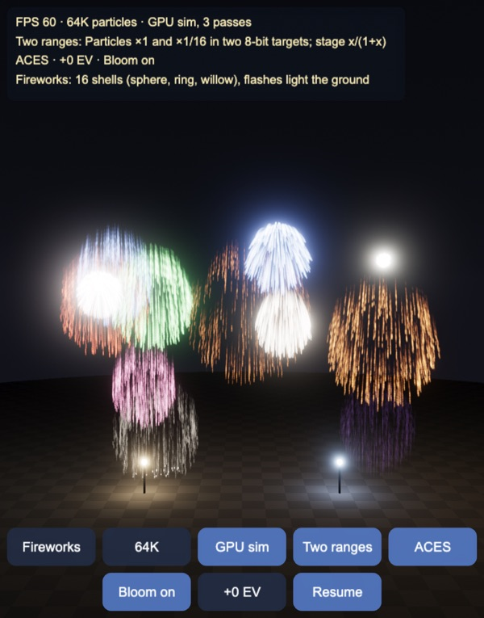
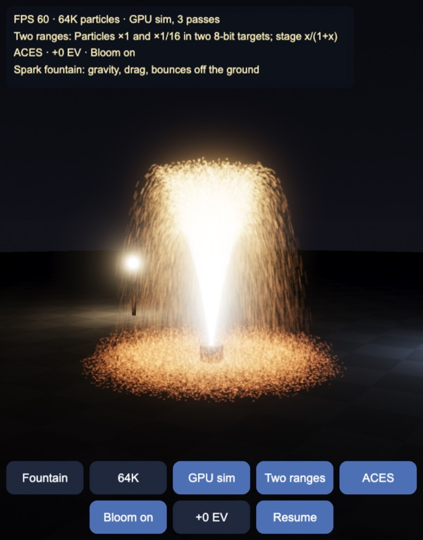
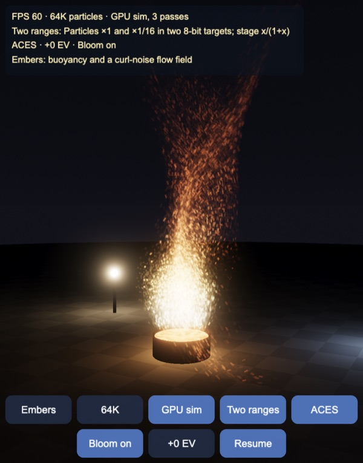
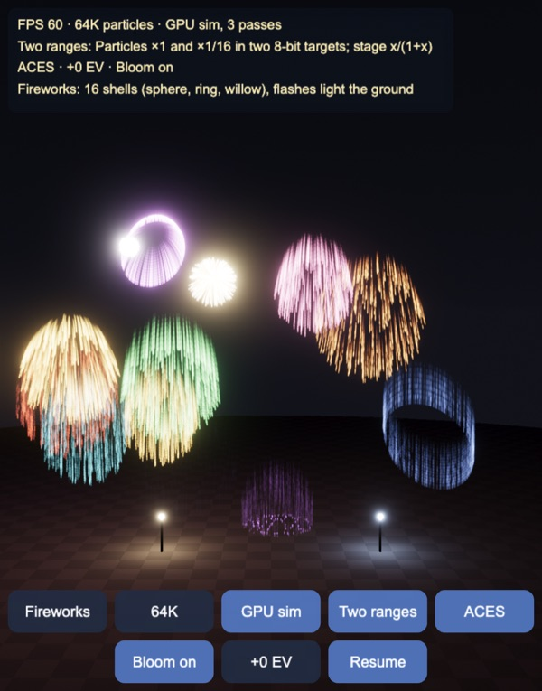
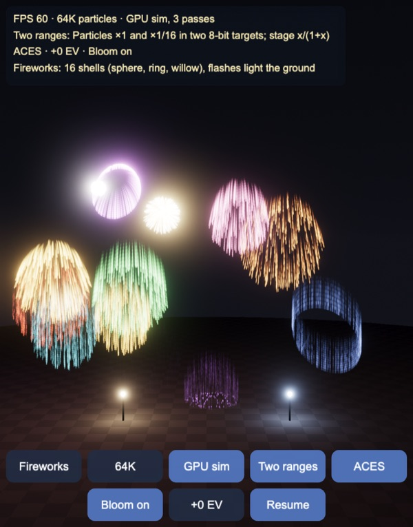
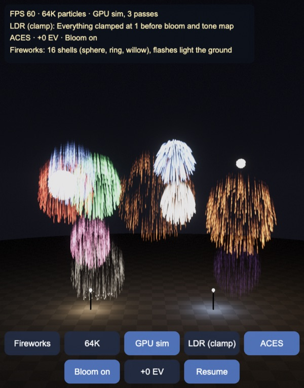
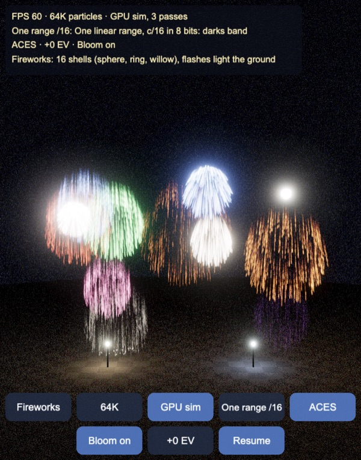
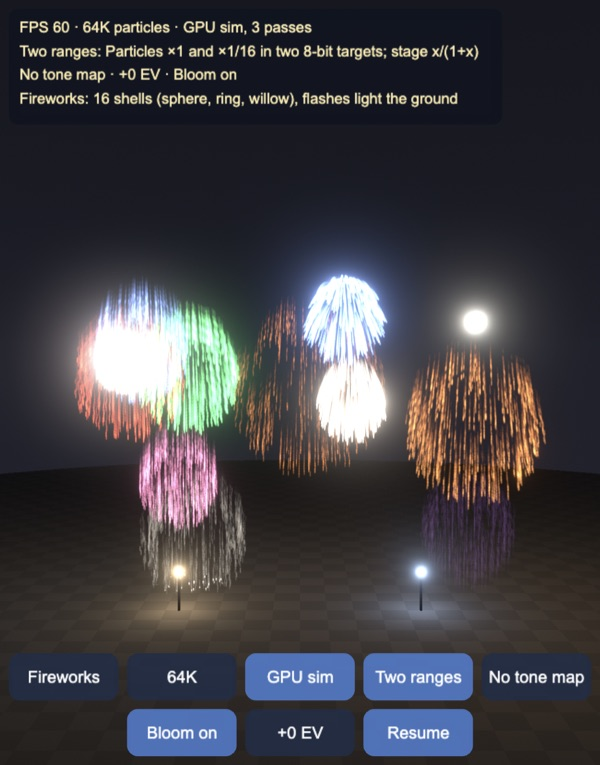
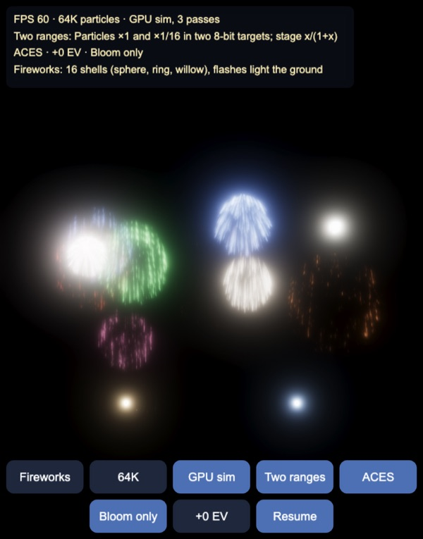
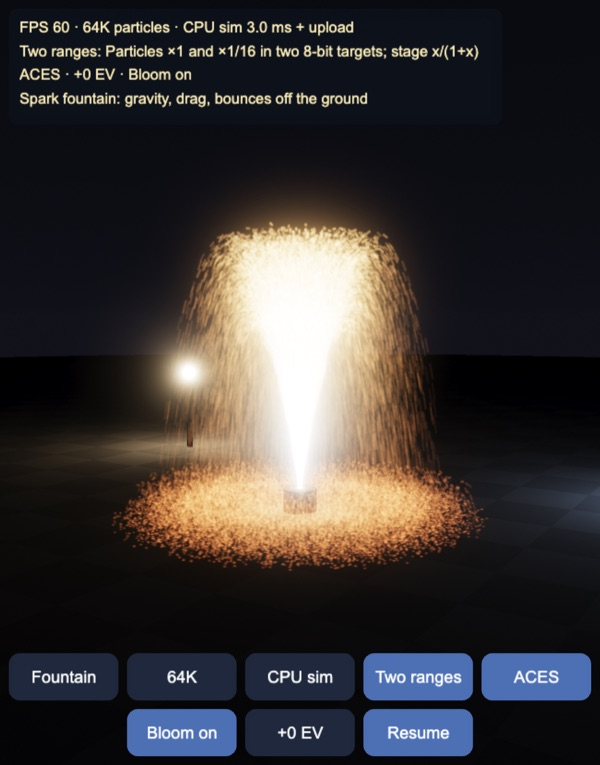

# HDR particles: GPU simulation, bloom and tone mapping on 8-bit targets

Up to **262,144 GPU particles** with HDR bloom and tone mapping, for Cocos
Creator 3.8, built and previewed with Enji. The engine gives a project only
8-bit RGBA render textures, so everything here is stored in bytes: the
particle state (position and velocity, 16 bits per value, in three RGBA8
textures), the light (two linear ranges for additive particles, a
compressive curve for the opaque stage) and the bloom levels. Three scenes:
a spark fountain, embers rising through a curl-noise flow, and fireworks
with trails whose flashes light the ground.



| Fountain | Embers |
|---|---|
|  |  |

## How it works

`assets/game/fx/Particles.ts` and `Hdr.ts` are the maths in TypeScript;
`assets/resources/effects/chunks/hp-particles.chunk` and `hp-common.chunk`
are the same code in GLSL, line for line. The GPU runs the GLSL, the CPU
mode and the tests run the TypeScript.

### Particles that are never created or destroyed

Particle *i* is re-born every `life` seconds at a fixed phase, so its age is
a function of its index and the time. The simulation never allocates, never
compacts and never reads anything back; it only has to notice the step in
which a particle is re-born (`age ≤ dt`, closed so that a birth at exactly
t = 0 is caught by the first step) and start it over from its emitter.

- Fountain (2.8 s) and embers (4.5 s): the phase of texel (x, y) is
  `fract(0.7549 x + 0.5698 y) · life`, the R2 low-discrepancy sequence, so
  births are spread evenly over time instead of coming in pulses.
- Fireworks: 16 shells, each bursting every 3.6 s (16 bursts per cycle from a
  seeded table of centre, speed, colour and kind: sphere, ring or willow).
  The index is split as `shell + 16 × (trail + 16 × star)`: 256 stars per
  shell at 64K, and 16 trail particles per star that share its direction and
  are born 25 ms apart. Each trail particle retraces the star's path 25 ms
  later, so the trails need no history buffer. Only a star's leading particle
  carries the burst flash (400 at birth, gone in 0.12 s).

### Simulation on 8-bit textures

The state is three RGBA8 textures, one texel per particle, two 16-bit values
per texel as (high byte, low byte): A = (x, y), B = (z, vx), C = (vy, vz).
Positions span 24 m from (−12, −1, −12), a step of 0.37 mm; velocities
±24 m/s, a step of 0.73 mm/s. A step is three full-screen passes (one per
output texture) from one set of textures into the other; each pass runs the
whole update and keeps its two values.

Rounding to 16 bits after every step biases slow motion: an increment
smaller than half a step is lost every time. The passes round
**stochastically** (add a per-texel hash in [0, 1) before `floor`), which is
unbiased on average. Key `Q` switches to round-to-nearest for comparison.

Forces, semi-implicit Euler with a bounce off the ground (restitution 0.35,
friction 0.7):

- Fountain: gravity, linear drag 0.25/s, launch at 6.8–8.6 m/s within 10° of
  vertical.
- Embers: buoyancy `0.9 + 1.8 e^(−0.6 age)`, drag 1.4/s, plus a curl-noise
  flow `u = ∇ × ψ`, where ψ has three components, each a product of sines
  (two octaves drifting in time). Its curl is evaluated analytically, so the
  flow is exactly divergence-free and embers swirl without collecting in
  sinks.
- Fireworks: gravity with drag 2.2/s (spheres, rings), or weak gravity 4 m/s²
  and drag 0.9/s (willows, which droop and fall as gold rain).

**CPU sim** runs the same step in TypeScript into byte arrays and uploads
them as the three textures, for comparison.

### Drawing

One quad per particle; the meshes carry only (tail/head, side, index) in
chunks of 16,384 particles (16-bit indices). The vertex shader reads the
state, culls particles that are not alive, and stretches the quad along the
particle's screen motion over 1/30 s. The profile is a Gaussian
`exp(−2d²)` around the streak's centre line, lowered by its value at the
quad's edge (2 radii) so that it reaches exactly 0 there: after the display
gamma, even a small residue shows as a square outline. Two rules keep the
energy constant: a dot never shrinks below one pixel (smaller ones dim by
r² instead of aliasing), and a streak of length L divides the colour by
1 + 1.27 L/r, its area over the dot's.

### HDR in 8-bit targets

| Target | What | Encoding |
|---|---|---|
| stage | sky, ground lit by 8 point lights, lamps, coals | x = c/(1+c), stored as x^(1/2.2) |
| particle low | additive particles × 1 | linear, clamps at 1 |
| particle high | the same particles × 1/16 | linear, clamps at 16 |
| bloom levels | 6 levels from half resolution down | √(c/(1+c)) |

The stage is opaque, so any invertible curve works: `c/(1+c)` maps [0, ∞) to
[0, 1), and the 1/2.2 power spends the codes on the darks. Additive blending
needs linear storage, so the particles are drawn twice, into two ranges, and
decoded as

```
c = low < 0.996 ? low : max(low, 16 · high)
```

Below 1 the low target is exact to 1/255; above it the high one takes over
with steps of 16/255 (6% at 1, 0.4% at 16). Each blend rounds to 8 bits, so
the particle shader adds ±½/255 of hashed dither: a contribution under half
a step then survives on average instead of vanishing.

The bloom levels store `√(c/(1+c))`. No blending happens into them, and
what matters is their faint tails: with plain `c/(1+c)` the first code above
black is 1/255 in linear light, and the coarse levels enlarge that step into
visible blocks. Everything that writes to a target dithers.

### Bloom

The chain of Jimenez 2014 (Call of Duty: Advanced Warfare):

1. Prefilter: decode the three targets at full resolution, average 2×2,
   soft-knee threshold at 1 (knee 0.5) on the brightest channel, write half
   resolution.
2. Five downsamples with the 13-tap filter.
3. Five upsamples with a 3×3 tent, each adding the level's own downsample.
4. Composite: add the top level × 0.9/6 (each level carries the source
   energy once, so the sum is divided by the level count).

The levels are encoded, so **the filters must not run on the stored values**.
Averaging √-encoded bytes and decoding the average badly underestimates a
bright texel next to black: hardware bilinear on the encoded levels keeps
only 1.76 of the 6 units of a small source's light (−70%). The levels are
NEAREST textures and the shaders fetch texel centres and decode before
weighting. The 13 taps are ½ (3×3 tent of taps 2 apart) + ½ (2×2 box of taps
at ±1), so with bilinear weights (1 − f, f) per tap they become a 6×6 kernel
`½ (o ⊗ o + i ⊗ i)` of two separable parts (36 fetches). The tent becomes a
separable 4×4 kernel (16 fetches). The composite upscales the bloom by a
4-fetch bilinear of decoded texels.

| Filtering the encoded levels | Decoding first |
|---|---|
|  |  |

Same frame: decoding first restores the halos round the white burst, the
purple ring and the leading flashes.

### Tone mapping

The composite pass decodes stage + particles + bloom, multiplies by the
exposure (0, +1, −1, +2 EV), tone maps (Stephen Hill's ACES fit with
three.js's 1/0.6 scale, Reinhard per channel, or a clamp), applies the
display gamma 1/2.2 and dithers to the 8-bit screen. The engine's pipeline
writes shader output to the screen as is, so the composite does its own
gamma.

## Results

Node tests in `tools/test.mts` (all pass):

- Every `#define` in the two GLSL chunks (13 constants) equals its
  TypeScript counterpart.
- 16-bit round trip: error ≤ ½ step. A value creeping by 0.1 step per update
  for 1000 updates: round-to-nearest never moves it, stochastic rounding
  moves it 102 steps (exact: 100).
- Fountain, 2.5 s on the 8-bit state against a double-precision run of the
  same step: mean error 3.7 mm with stochastic rounding, 7.5 mm with
  round-to-nearest. Embers, 3 s through the curl flow: 4.2 mm and 3.1 mm,
  at most 26 mm.
- Births per 1/60 s step, 16K particles, over 10 s: fountain 95–101 (mean
  97.5), embers 57–64 (mean 60.7). The same particles with random phases:
  72–126 and 38–80.
- Fireworks index split is a bijection over 64K; a trail particle at
  t + j · 25 ms is where its star's lead was at t (4654 comparisons, error 0).
- Fountain apex straight up at 7.7 m/s: 2.610 m simulated; the closed form
  with linear drag is 2.679 m, less the v0·dt/2 that semi-implicit Euler
  loses, 2.615 m. No particle ever ends a step below the ground. The curl
  flow's divergence by central differences: at most 1.1·10⁻⁹.
- Stage through 8 bits: within 2.3% from 0.02 to 1, 6.8% up to 16, 25% at
  64, which ACES maps to the same display code. One linear range (c/16)
  loses everything below 0.03; LDR loses 94% at 16.
- Additive particles into the two ranges with per-blend rounding and dither:
  300 × 0.0015 → 0.451 (exact 0.45), 40 × 0.05 → 2.015, 12 × 0.4 → 4.800,
  30 × 0.4 → 12.029, 60 × 0.25 → 15.000. Without dither the 300 × 0.0015
  add up to 0. LDR loses at least half of every total above 1.5.
- ACES fit: monotonic from 2⁻¹⁰ to 2⁶; 1, 2, 4, 8, 16 get 5 different
  display codes (Reinhard 5, clamp 1); 18% grey → 21.3%;
  (8, 0.5, 0.1) → (1.00, 0.76, 0.43), bright colours go towards white.
- Soft knee: 0 below 0.5, continuous, exactly c − 1 above 1.5.
- Bloom chain on a 3×3 source of 40 in a 192² image: bloom energy / source
  energy = 5.92 in floats and 5.97 in 8 bits (6 levels); 1.76 when filtering
  the encoded levels. Where the halo adds less than 0.05, the √ encoding is
  within 2 display codes of the float chain; `c/(1+c)` is off by 5 over
  black (both are within 2 over a 0.02 sky).
- Ground lights are the 4 youngest live bursts, every frame.

| Two ranges (the demo) | LDR, clamped at 1 |
|---|---|
|  |  |

Clamped at 1 before the bloom, light only ever reaches the soft knee below
the threshold, so almost nothing blooms: the flashes lose their halos and
every core is the same flat white.

| One linear range, c/16 | No tone map |
|---|---|
|  |  |

Left: the whole image in one linear range of 16 has steps of 0.063, larger
than the sky and the dim ground; the dither turns them into grain. Right:
the same two-range image clamped instead of tone mapped: the sky is lifted
(ACES darkens the toe) and every core above 1 is a flat disc.

| Bloom only | CPU simulation |
|---|---|
|  |  |

Left: the bloom term alone, the light above the threshold spread over six
octaves. Right: the CPU running the same step; it looks the same as the GPU
fountain above and costs 2.5–3 ms per step at 64K.

## Performance

Apple M5 (ANGLE / Metal) in the IDE's browser, canvas 1118 × 1426 pixels.
Frame time is the wall clock of one `director.tick` followed by a 1-pixel
`readPixels` (so the GPU has finished), median of 90 frames; CPU step is
`CpuParticles.step` alone, in the page. Measured with the earlier bloom
filters (bilinear on the stored values) on a lightly loaded machine:

| | 16K | 64K | 256K |
|---|---|---|---|
| Fountain, GPU sim | 3.2 ms | 4.8 ms | 13.4 ms |
| Fountain, CPU sim | 3.5 ms (step 0.6) | 6.8 ms (step 2.5) | 21.3 ms (step 9.0) |
| Embers, GPU sim | 2.8 ms | 4.9 ms | 14.1 ms |
| Embers, CPU step | 2.7 ms | 11.2 ms | 45.3 ms |
| Fireworks, GPU sim | 2.8 ms | 3.8 ms | 8.8 ms |
| Fireworks, CPU sim | 3.4 ms (step 0.7) | 6.8 ms (step 2.8) | 21.6 ms (step 11.4) |

With the GPU simulating, 256K particles still fit in a 60 Hz frame on this
machine. The CPU path is limited by the step itself (embers: two octaves of
12 trigonometric calls per particle) plus uploading three textures. Bloom
was 1.75 ms of the 64K fountain frame (4.84 against 3.09 ms off). With the
decode-first filters (36 and 16 fetches instead of 13 and 9 bilinear taps),
bloom on minus bloom off measured 4.2 ms (median of 6 alternating rounds),
but on a machine with a load average of 9, where the bloom-off frame had
grown from 3.1 to 8.2 ms and rounds varied by ±3 ms. So the cost of the new
filters is not separated from the load yet. WebGL timer queries on ANGLE /
Metal gave inconsistent numbers (bloom off slower than on) and were not used.
Phones have not been measured.

## Controls

- Buttons: scene (fountain / embers / fireworks), particle count (64K, 256K,
  16K), GPU / CPU sim, HDR mode (two ranges, LDR, one range /16), tone map
  (ACES, Reinhard, none), bloom (on, off, bloom only), exposure (0, +1, −1,
  +2 EV), pause. Scene, count and sim restart the scene; the rest change
  live.
- Drag to orbit, wheel or pinch to zoom.
- Keys: `C` scene, `N` count, `G` sim, `H` HDR mode, `T` tone map, `B`
  bloom, `E` exposure, `Space` pause, `Q` stochastic / nearest rounding.

## Not in this demo yet

- Measurements on phones, and a cheaper bloom for them: fewer levels, or the
  hardware-bilinear taps on the coarse levels, where the signal is already
  smooth.
- Soft particles (fading against the depth buffer) and collisions with the
  depth buffer.
- Auto exposure (eye adaptation from a luminance histogram), lens dirt,
  flares.
- A float render target path where the platform has one, for comparison.

Made with Enji 0.3.
