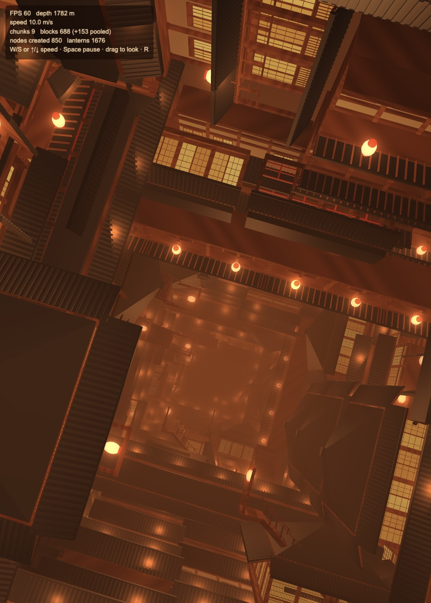
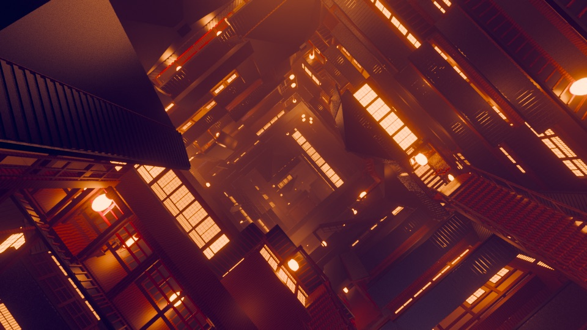

# Infinity Castle

An endless fall through a procedural Infinity Castle (無限城) shaft, in Cocos
Creator 3.8, built and previewed with Enji.

| Enji (real time) | Blender EEVEE reference |
|---|---|
|  |  |

## How it works

- `tools/build_infinity_castle.py`: the Blender kit (pillars, beams, shoji,
  railings, eaves, lanterns, stairs) and block builders (room, corridor, stair,
  facade).
- `tools/export_blocks.py`: runs those builders headless and exports 11 block
  variants to `assets/resources/models/*.glb`, plus `blocks.json` (lantern
  positions and bounds). Material ids and baked lantern light go into
  `COLOR_0`, so every block uses one material. Regenerate with
  `Blender -b --python tools/export_blocks.py`, then `enji import assets/resources/models`.
- `CastleLayout.ts` / `CastleShaft.ts`: seeded layout per chunk of shaft;
  chunks are built ahead of the camera and recycled behind it through per-block
  pools, so node counts level off.
- `castle.effect`: wood, tatami, paper and lacquer shading from the material
  id, the six nearest lanterns as point lights, and warm haze.
  `lantern-glow.effect`: additive halos for every lantern. `haze-sky.effect`:
  the shaft's glow in the distance.

## Controls

`W` / `S` or arrow keys: fall speed. `Space`: pause. Drag: look around; `R`:
reset the view.

## Performance

60 FPS throughout a 6-minute fall to 3.9 km (median frame 16.6 ms, p95 18 ms).
Scene nodes 748 at the start, 901 after 6 minutes, growing ever slower as the
block pools reach their peak use; JS heap 88–146 MB with no upward trend.
Measured on an Apple Silicon Mac in the Enji preview.

Made with Enji 0.4 (`feat/3d-water`).
