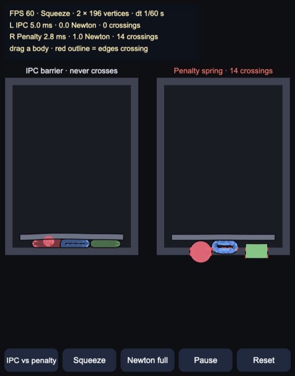
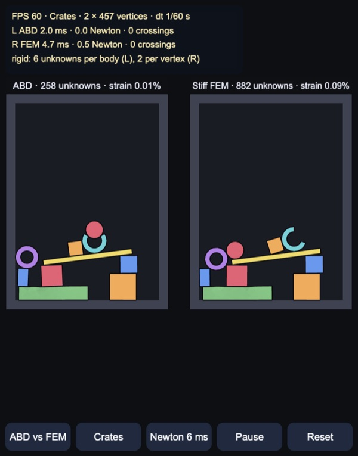
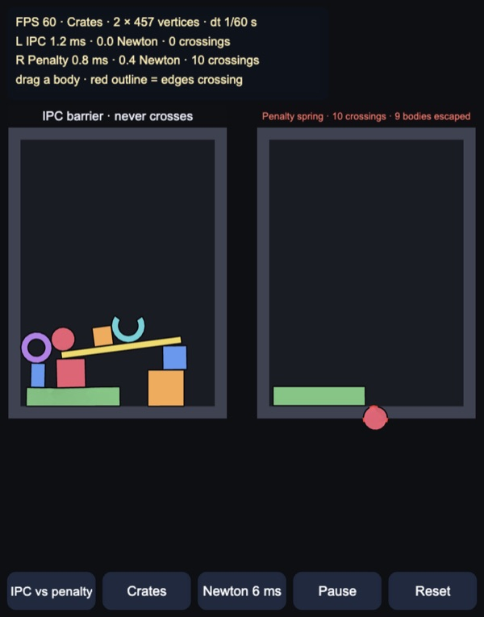
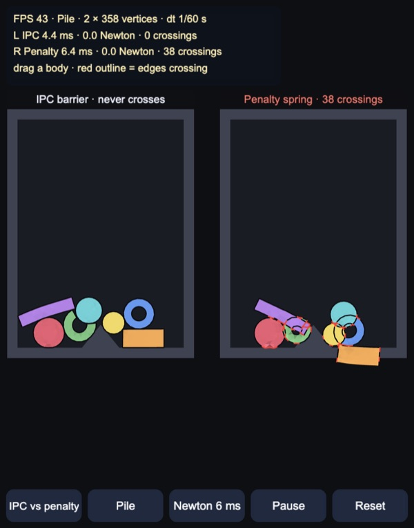
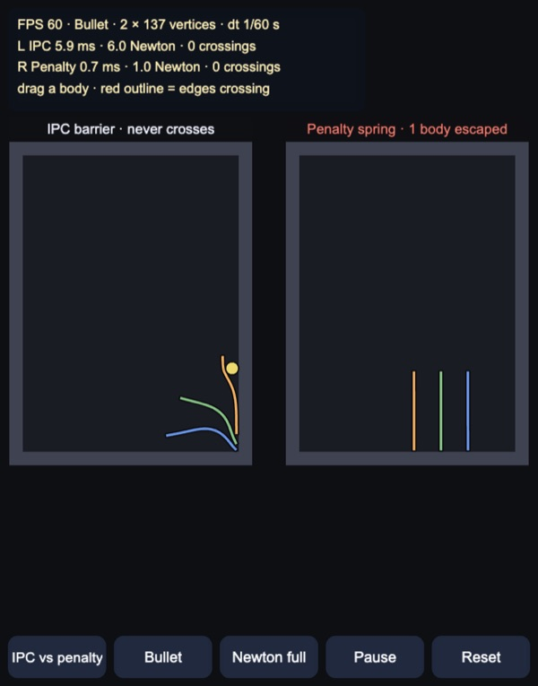

# 2D IPC: barrier contact vs penalty springs

Small-scale **Incremental Potential Contact** (Li et al. 2020) in 2D on the
CPU, for Cocos Creator 3.8, built and previewed with Enji. Soft Neo-Hookean
bodies are stepped with implicit Euler written as one energy minimisation;
contact is a log barrier on the point–edge distance, and every Newton step is
clipped by continuous collision detection, so boundaries never cross. The
default view runs the same scene twice with the same solver: the left side
uses the barrier, the right side a penalty spring in its place. Red outlines
mark boundary edges that cross another edge. Rigid bodies are **affine
bodies** (Lan et al. 2022) in the same solve, six unknowns each; a second
mode puts them next to the same bodies as very stiff FEM.

A plate is driven down to 10 cm above the floor. IPC flattens the jelly ball,
the rubber ring and the jelly block into pancakes: the ring's hole closes to a
slit without its sides passing through each other, and nothing touches. With
the penalty spring the plate pushes all three into the floor; they stay
stuck there after it lifts, with 12–14 crossing edge pairs.

## How it works

Plain TypeScript in typed arrays (`assets/game/ipc/`), in metres, one 60 Hz
step per rendered frame.

- `IpcWorld.ts`: each step minimises the incremental potential
  ½‖x − x̃‖²_M + h²(Ψ + B + D + S) over the vertex positions, where x̃ is the
  inertial prediction, Ψ the Neo-Hookean energy of the triangles, B the
  contact barrier, D the lagged friction potential and S the springs that
  drive the plate and the finger's grab.
  - Projected Newton: the triangle Hessians are made positive semi-definite
    in closed form (2×2 SVD, then the twist, flip and scaling eigenpairs of
    Smith et al. 2019, checked against a numeric projection in
    `tools/test.mts`); the 6×6 contact Hessians by Jacobi rotations.
  - Linear solve: preconditioned CG on a 2×2-block sparse matrix plus
    matrix-free contact blocks, with one banded Cholesky per body as the
    preconditioner (reverse Cuthill–McKee ordering). The tolerance is loose
    (1e-2), because Newton corrects what CG leaves.
  - Line search: the step is first shortened so no triangle inverts and,
    with IPC, so no point crosses an edge (additive CCD, Li et al. 2021, which
    stops at 10% of the remaining gap), then halved until the energy drops.
    Every iterate is therefore free of intersections.
  - Contact: all point–edge pairs closer than d̂ = 2 mm, found on a uniform
    grid, get b(s) = −κ (s − ŝ)² ln(s/ŝ) on the squared distance s, with
    κ = 1e9. The barrier goes to infinity at contact, so it never has to be
    tuned against how hard bodies hit.
  - Friction: Coulomb (μ = 0.4) with normal forces and tangents from the start
    of the step, smoothed below 1 cm/s of sliding.
  - Driven plate: its vertices are unknowns pulled to the scripted path by
    stiff springs, on top of its own stiff elasticity. A plate with infinite
    force would leave the barrier nothing to push against and drive the gap
    to zero.
- Penalty mode is the same solver with ½k(δ − d)² for d < δ (k = 2e5 N/m,
  δ = 5 mm) instead of the barrier, and no CCD. A finite spring has to be
  tuned for the hardest hit; anything faster or heavier goes through.
- `BandedPreconditioner.ts`, `Geometry.ts` (distances and their derivatives,
  barrier, CCD, PSD projections), `Mesh2D.ts` (disks, rings, rectangles,
  wedges), `Scenes.ts`.
- `IpcView.ts`: one dynamic mesh with every moving triangle (darker when
  compressed, lighter when stretched) and a quad per boundary edge.

### Newton budget

Because every Newton iterate is intersection free, the step can stop early
without breaking the guarantee: an unconverged step is only softer and more
damped. Each world gets 6 ms per step (the button cycles 6 ms, 3 ms and full
convergence); the first iteration always runs. Without the budget, impacts
take up to 26 Newton iterations (40 for the bullet) and single frames over
150 ms on the desktop.

## Rigid bodies: affine body dynamics

A rigid body in `IpcWorld` moves as x = p + A x̄, with x̄ the rest offset of a
vertex from the centre of mass. Its unknowns are p and the two columns c₀, c₁
of A, so every vertex is x = p + x̄ c₀ + ȳ c₁: three 2D blocks with scalar
weights (1, x̄, ȳ). That fits the solver's 2×2-block layout as it is:

- Contact, friction, CCD, the grab and the line search still work on vertex
  positions. Gradients reach the body through Jᵀ, contact Hessians as JᵀHJ
  inside the matrix-free product. Because J is constant, a body's vertices
  move on straight lines within a step, and the vertex CCD is still exact.
- The body adds ½(q − q̃)ᵀM(q − q̃), where M holds the mass and the second
  moments Σm x̄², Σm x̄ȳ, Σm ȳ². Because x̄ is measured from the centre of mass,
  gravity acts on p only. It also adds h²·κ·area·‖AᵀA − I‖², which keeps A a
  rotation, with κ = 1e7 N/m. The 4×4 Hessian of that term is PSD-projected.
- The banded preconditioner gets one exact 6×6 block per rigid body,
  including JᵀH_iiJ from each contact vertex.
- **Warm start.** Plain Newton bled spin off fast. A straight Newton step
  leaves the curved set of rotations, the stiff orthogonality energy makes
  the line search cut it short, and Newton then stops on its step-size
  tolerance before the rotation has advanced. A free body spinning at 6 rad/s
  needed about 15 iterations per step and lost about 4% of its spin per step.
  Each step now first tries to move every rigid body to the rotation closest
  to its inertial prediction (the 2D polar decomposition, one `atan2`). That
  move goes through the same CCD and line search as any other step. A free
  spin then converges in 0 Newton iterations and keeps 54% of its spin after
  2 s. The rest is implicit Euler's own damping, the same that soft bodies
  get.

Soft and rigid bodies share one Newton solve. In the Crates scene, rigid
crates, a 1 m plank, a ring and a hook land on a jelly mattress, and a jelly
ball lands on them. The ABD vs FEM mode runs the scene twice. On the left the
rigid bodies are affine bodies; on the right the same meshes are Neo-Hookean
with E = 1e8 N/m, 100 times the stiff material. Each label shows the
unknowns and the largest ‖FᵀF − I‖ over the rigid bodies' triangles. For an
affine body that equals ‖AᵀA − I‖.

`tools/bench.mts`, Crates with IPC for 6 s, full Newton convergence, Node:

| Rigid bodies as | Unknowns | Step median / p95 | Newton per step | Largest strain | Crossings |
|---|---|---|---|---|---|
| ABD, κ = 1e6 | 258 | 1.3 / 11.9 ms | 1.5 | 0.30% | 0 |
| **ABD, κ = 1e7** (default) | 258 | 1.3 / 11.5 ms | 1.9 | 0.11% | 0 |
| ABD, κ = 1e8 | 258 | 2.2 / 18.6 ms | 4.2 | 0.015% | 0 |
| FEM, E = 1e8 | 882 | 2.9 / 34.9 ms | 2.2 | 0.70% | 0 |

At the default κ the rigid bodies deform six times less than the stiff FEM
ones, with 3.4 times fewer unknowns, and the heavy steps cost a third. A
stiffer κ makes them even more rigid, but Newton needs more iterations
because the rotation set is curved; 1e7 is the trade-off.

In the Enji preview (Chrome), timing each world separately while stepping
Crates 180 frames from reset (median / 95th percentile / worst):

| Setup | ABD world | FEM world |
|---|---|---|
| Desktop, 6 ms budget | 3.3 / 7.2 / 7.6 ms | 6.4 / 8.6 / 9.1 ms |
| Desktop, full convergence | 5.5 / 18.3 / 48 ms | 9.3 / 45.7 / 111 ms |
| 4× throttle, 3 ms budget | 4.5 / 6.3 / 7.3 ms | 7.1 / 9.8 / 11.1 ms |
| 4× throttle, full convergence | 12.5 / 59 / 171 ms | 22.1 / 142 / 358 ms |

With a budget the FEM world runs into it almost every step and stops less
converged. The ABD world mostly finishes on its own.

The penalty spring does badly with rigid bodies. A crate dropped from 1.9 m
hits at about 6 m/s, which is 10 cm per step against a 5 mm skin, and there is
no deformation to spread the impact. Within a few seconds all eight rigid
bodies, and the jelly ball riding on them, have fallen through the floor.
IPC holds all of them.

## Scenes

| Pile | Bullet |
|---|---|
|  |  |

**Pile**: seven bodies (jelly, rubber and one rigid disk; a C-shape, a ring, a
long bar) fall onto a wedge. With IPC they settle in contact; with the
penalty spring they sink into each other and the orange bar sinks into the
floor.

**Bullet**: a rigid disk at 30 m/s, half a metre per step, against three 3 cm
rubber slabs. CCD finds the first touch inside the step, so IPC stops it and
knocks the slabs over. The penalty spring barely sees the contact: the disk
passes the slabs and the wall within a few steps and leaves the scene (the
label says "1 body escaped").

`tools/bench.mts` runs every scene headless for 6 s with full Newton
convergence (crossings are counted between all boundary edges after every
step):

| Scene | Model | Steps with crossings | Closest gap | Outcome |
|---|---|---|---|---|
| Pile | IPC | 0 of 360 | 0.016 mm | settled |
| Pile | penalty | 348 of 360 (up to 32 pairs) | — | bodies sunk into each other |
| Squeeze | IPC | 0 of 360 | 0.007 mm | ball squashed to 15.9 cm of 30 |
| Squeeze | penalty | 167 of 360 (up to 14 pairs) | — | bodies pushed into the floor |
| Bullet | IPC | 0 of 360 | 0.025 mm | bullet stopped by the slabs |
| Bullet | penalty | 2 of 360 (up to 2 pairs) | — | bullet went through 3 slabs |
| Crates | IPC | 0 of 360 | < 0.001 mm | settled |
| Crates | penalty | 358 of 360 (up to 16 pairs) | — | rigid bodies fell through the floor |

The rigid bullet passes the slabs in fewer steps than the stiff FEM one did,
so fewer steps show a crossing; it still goes through all three.

`tools/test.mts` checks the following:

- the distance derivatives against finite differences;
- the assembled energy gradient (barrier, penalty, friction, grab) against
  finite differences;
- the gradient over the rigid bodies' unknowns, with contacts, friction and a
  grab on the plank;
- both PSD projections;
- a rigid free fall against implicit Euler, and a free spin staying a
  rotation;
- ABD bodies staying stiffer than the stiff FEM ones;
- that no IPC scene ever has a crossing.

## Controls

- Drag a body to pull it by the nearest vertex. In compare mode both sides
  get the same hand.
- Buttons: mode (IPC vs penalty, ABD vs FEM, IPC only, penalty only); scene
  (Pile, Squeeze, Bullet, Crates; ABD vs FEM jumps to Crates if the scene has
  no rigid bodies); Newton budget (6 ms, 3 ms, full); pause; reset.
- Keys: `M` mode, `C` scene, `B` budget, `Space` pause, `R` reset.

## Performance

At start-up the demo times 60 frames after a 30-frame warm-up. Below 50 FPS
it drops the Newton budget to 3 ms; if compare mode is still below 40 FPS
after the next 60 frames it shows IPC alone (the mode button brings the
comparison back).

Time per frame for both solvers, the crossing count and the mesh upload,
measured in the Enji preview by stepping the scene 180 frames from reset
(300 for Squeeze), best of three runs. Rendering a thousand flat triangles is
not included and is negligible. The 4× column uses Chrome CPU throttling as a
rough phone.

Median / 95th percentile / worst frame (measured before the Pile's stiff
disk became a rigid body, a 37-vertex change; see above for the Crates
scene):

| Setup | Vertices | Desktop, 6 ms budget | 4× throttle, 3 ms budget |
|---|---|---|---|
| Compare, Pile | 2 × 358 | 8.3 / 16.7 / 18 ms | 26.1 / 32.5 / 35 ms |
| Compare, Squeeze | 2 × 196 | 3.0 / 14.1 / 18 ms | 10.7 / 27.0 / 39 ms |
| Compare, Bullet | 2 × 137 | 3.2 / 7.4 / 8 ms | 7.3 / 9.5 / 11 ms |
| IPC only, Pile | 358 | 4.2 / 8.8 / 10 ms | 12.6 / 19.0 / 21 ms |
| IPC only, Squeeze | 196 | — | 4.8 / 22.9 / 32 ms |
| Compare, Pile, no budget | 2 × 358 | 13.0 / 83.4 / 159 ms | 57.3 / 309.5 / 661 ms |

So a phone at a quarter of this desktop runs the comparison at about 30–40
FPS on the heaviest scene and IPC alone near 60. Under 4× throttling the
start-up check switched to 3 ms at frame 89; the pile had settled by the
second check, so it kept compare mode. With the 6 ms budget the throttled
Pile compare was 26.4 / 34.4 / 41 ms, about the same: most steps stop after
one Newton iteration either way, so the cost is that of one iteration, about
3 ms per world on Pile at 1×. Roughly two thirds of it is the banded
factorisation and CG, a fifth assembly. The closed-form Hessian projection
took the throttled Pile compare from about 34 to 26 ms per frame and IPC
alone from about 17 to 13 ms, against projecting each 4×4 by Jacobi
rotations.

The machine was heavily loaded by other processes during all runs (load
average 35–60 on 10 cores). A dot-product loop in the page ran at
0.5–0.7 GMAC/s unthrottled and 0.11 GMAC/s throttled, and Node runs of the
same code varied by up to 4× from one minute to the next, so the numbers are
on the pessimistic side.

## Not in this demo yet

- 3D (point–triangle and edge–edge distances, and many more pairs per body).
- Adaptive barrier stiffness (IPC grows κ when contacts get too close); κ is
  fixed here, which is enough at these scales.
- Codimensional shells and rods.
- A less damped integrator (BDF2 or Newmark) for spinning rigid bodies.
- Rigid-only scenes with many bodies, where a dedicated 6×6 block solver
  would beat the shared CG.
- Warm-starting soft bodies from the previous step's velocity, and a
  multigrid or domain-decomposition preconditioner for larger meshes.

Made with Enji 0.3.
