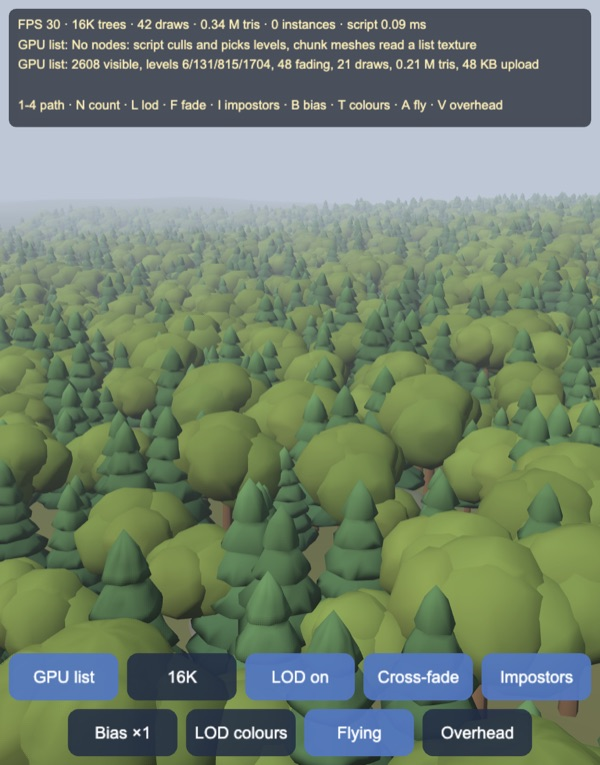
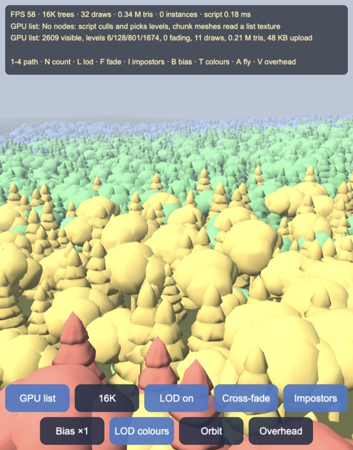
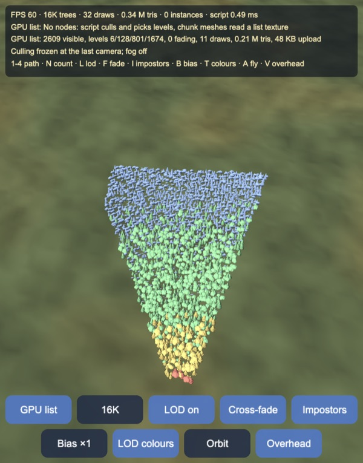
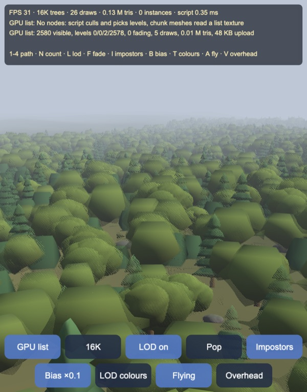
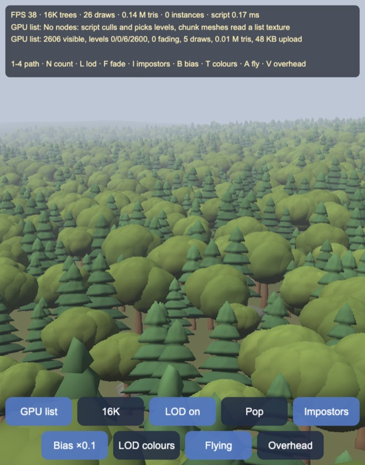
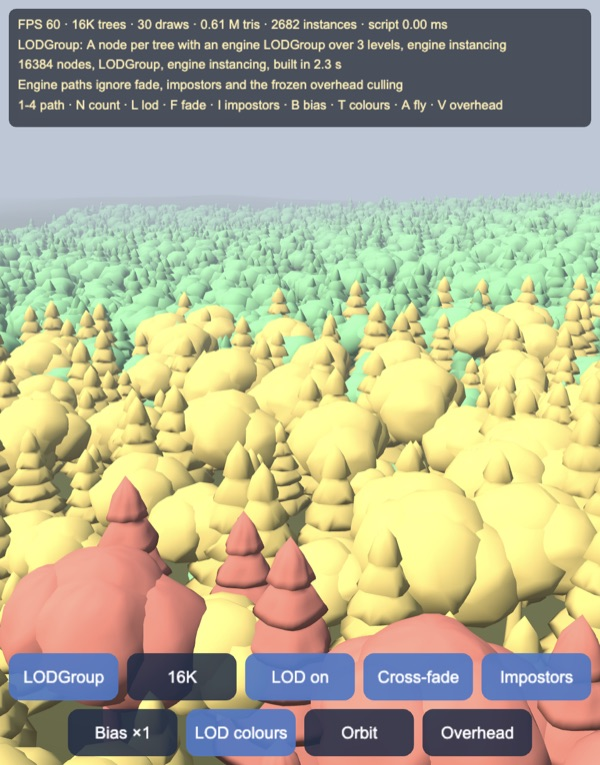
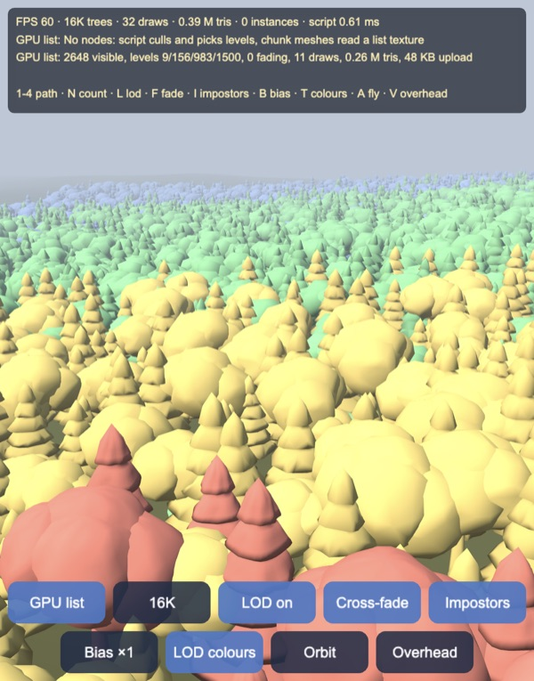
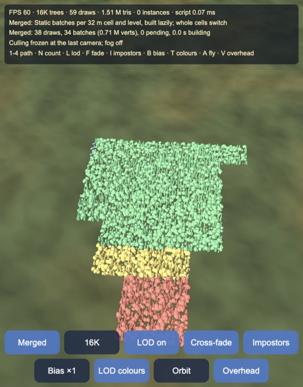

# LOD, instancing and batching: a forest of up to 64K trees, four ways

Up to **65,536 trees and rocks** for Cocos Creator 3.8, built and previewed
with Enji, drawn four ways so that their draw calls, triangles and CPU costs
can be compared on the same forest:

1. **Nodes**: a node per tree, full detail, one draw per visible tree.
2. **LODGroup**: a node per tree with the engine's `LODGroup` over three
   levels and engine instancing.
3. **Merged**: static batches, one vertex buffer per 32 m cell and level,
   built lazily while flying.
4. **GPU list**: no node per tree. The script culls cells and trees, picks
   each tree's level with hysteresis, cross-fades level changes and writes a
   compact list into a float texture. About 10 draws of shared chunk meshes
   then read that list and the trees' transforms in the vertex shader. The
   farthest level is a billboard impostor baked at startup.

All the LOD meshes are generated at startup by quadric edge collapse (QEM),
and the impostor atlas is baked at startup from the full-detail meshes.

| Levels by colour (red 0, yellow 1, green 2, blue impostor) | Culling frozen, seen from above |
|---|---|
|  |  |

## How it works

`assets/game/lod/` splits into pure TypeScript and engine code. The pure
modules are the maths and the data layouts, and the Node tests import them
directly: `Geometry`, `Trees`, `Simplify`, `MeshError`, `Forest`, `Culling`,
`Lod`, `Pack`, `Impostor`, `Merge`, `Species` and `Shading`. The engine
modules build on them: `Meshes`, `Baker`, `NodePath`, `MergedPath` and
`GpuPath`. `effects/chunks/lod-common.chunk` repeats the shared constants,
tints, Bayer matrix and texture reads in GLSL, and a test checks that the
two copies agree.

### Trees and their LOD meshes

There are three species, all closed meshes: a conifer (stacked noisy cones,
2,020 triangles), a broadleaf tree (lumpy ellipsoid crown, 2,080) and a rock
(720). Levels 1 and 2 keep 25% and 8% of level 0's triangles, made by
**QEM edge collapse** (Garland & Heckbert 1997):

- Every face plane p = (n, −n·x₀), with n a unit normal, gives the quadric
  K_p = p pᵀ. A vertex carries Q = Σ area · K_p over its faces, so vᵀQv is
  its area-weighted squared distance to those planes.
- Collapsing edge (a, b) to v̄ costs v̄ᵀ(Q_a + Q_b)v̄. The best v̄ solves the
  3×3 system ∇ = 0 when that system is well conditioned. Otherwise it is
  the cheapest of a, b and the midpoint.
- Edges come from a min-heap with lazy invalidation. A collapse is rejected
  if it would flip a face's normal or leave a zero-area face.

The baseline is **vertex clustering** (Rossignac & Borrel 1993): snap
vertices to a grid, with the cell size bisected to hit the same triangle
budget. The error measure is symmetric: sample both surfaces evenly by area
and take exact point-to-triangle distances (Ericson) both ways. At equal
budgets QEM's RMS error is 3.1–8.9× lower:

| RMS error / radius | Conifer | Broadleaf | Rock |
|---|---|---|---|
| Level 1, QEM vs clustering | 0.21% vs 1.86% | 0.77% vs 3.30% | 0.74% vs 2.80% |
| Level 2, QEM vs clustering | 1.06% vs 6.25% | 2.20% vs 6.77% | 2.30% vs 9.54% |

At about 4%, QEM starts to collapse whole parts (the broadleaf tree's worst
error reached 79% of its radius), so the farthest level is an impostor
rather than a fourth mesh.

### Screen size, levels and hysteresis

The screen size of a tree is the radius of its bounding sphere as a fraction
of half the viewport height:

  s = r · cot(fov/2) / d,  with cot(fov/2) = `matProj.m05`

Level k is used while T[k] ≤ s < T[k−1], with T = (0.28, 0.1, 0.035). On a
1080-pixel-high screen that is a sphere radius of 151, 54 and 19 pixels.
Where each level switches in, its largest deviation from level 0 is
4.4–5.6 pixels at 1080p, and its RMS deviation is 0.4–1.4 pixels.

A tree changes level only once s is past the boundary by a margin h = 10%:
it goes finer when s ≥ T(1 + h) and coarser when s < T(1 − h). A tree whose
size jitters ±6% around a boundary never switches; without the margin it
switched 289 times in 2,000 frames.

The engine's `LODGroup` computes its screen usage as
`objectSize · scale · cot(fov/2) / (2d)`. Setting `objectSize = 2r` and the
group's local centre to the sphere centre makes that usage exactly s, so
the LODGroup path uses the same thresholds. At the same camera the two paths
pick the same level for every near tree (see Results).

### Culling

The six frustum planes are taken from the view-projection matrix
(Gribb & Hartmann): row 4 ± rows 1, 2 and 3. The forest is cut into 32 m
cells. Each cell's box encloses every tree's bounding sphere, not just the
tree bases, so a test on the box is conservative. Each box is classified
against the planes using its corner farthest along each plane normal and its
corner nearest:

- **outside**: the whole cell is skipped;
- **inside**: every tree is drawn without further tests;
- **intersecting**: each tree's sphere is tested.

At 16K trees a typical view needs 1,882 sphere tests, and the result is
exactly the set that testing all 16,384 trees gives. Trees beyond 420 m are
dropped.

### Cross-fades without blending

A level change cross-fades over 0.4 s. Both levels are drawn, each through
a screen-door mask built from a 4×4 Bayer matrix, d = (i + 0.5)/16. Each
list entry carries a code:

- the incoming level gets code f, the fade progress, and keeps the pixels
  where d < f;
- the outgoing level gets code −f and keeps the pixels where d ≥ f.

The two masks are complementary, so every pixel is drawn by exactly one of
the levels: no transparency, no sorting, and depth stays correct. The masks
cover f to within 1/16 in every 4×4 block.

`discard` turns off early depth testing, which tile-based GPUs (all phones,
and Apple's) rely on. So fading trees go into a second set of buckets whose
material has the `FADE` variant, and steady trees are drawn without any
`discard` at all.

### GPU list path: the data layout

The **instance texture** is RGBA32F, 1,024 texels wide, with 2 texels per
tree: (x, y, z, scale) and (cos yaw, sin yaw, tint, species). It is
uploaded once.

The **list texture** is RGBA32F, 1,024 wide. Its header row holds one texel
per bucket, (first entry, count). The buckets are 24: steady or fading, ×
3 species × 4 levels. After the header come the entries, two per texel, as
(tree index, fade code). Each frame uploads only the header and the rows in
use with `device.copyBuffersToTexture`, 32–80 KB.

The **chunk meshes** hold K copies of one level, each vertex tagged with its
copy index `a_copy`. The engine's meshes have 16-bit indices, so
K = ⌊65,536 / vertices⌋: 62–771 copies of a mesh level and 4,096 billboards.

Copy k of chunk j reads entry j·K + k of its bucket, then the tree's two
texels, and places the vertex: `pos + rotateYaw(v · scale)`. Draws per frame
are Σ ⌈count_b / K_b⌉ over the buckets: 8–11 with no fades, up to about 20
while trees fade. The last chunk of each bucket draws only the copies in
use, by setting its input assembler's `indexCount` to (count − j·K) × the
indices per copy. Before that change every chunk drew all K copies, and the
spare ones were sent off-screen in the vertex shader: 0.77M triangles in
every view. After it, 0.18–0.22M.

The script's share per frame: 0.1–0.3 ms at 4K–16K trees, 0.4–0.6 ms at 64K.

### Impostors

Each species is baked from 8 azimuths into one 1024 × 768 atlas with
128-pixel cells: albedo, gamma-encoded, in rows 0–2 and normals in rows 3–5.
The bake is one orthographic shot of 24 rotated copies on a hidden layer.
The pixels are read back, the colour is dilated into the empty texels, and
the mips are built on the CPU and uploaded as a mipmapped texture.

At run time the impostor is a billboard turning about the vertical axis,
with right = (t_z, 0, −t_x) for t the horizontal direction to the camera.
Its frame coordinate is a = (atan2(t_x, t_z) − yaw) / (2π/8). The two
nearest frames are blended by the fractional part, and a fixed alpha test at
0.5 is applied to the blend. Lighting uses the baked normal rebuilt in the
billboard's frame: n = n_x · right + n_y · up + n_z · t.

**Mips that keep coverage** (Castaño 2010): averaging alpha pulls thin
foliage below the 0.5 test, so distant trees would thin out. Each mip level
of each cell is scaled by the k that makes the fraction of texels with
k·α ≥ 0.5 equal level 0's, found by bisection over k in [0.5, 16]:

- The three species stay within 5% of level 0's coverage down to 16-pixel
  cells (plain box-filtered mips: 3.4–4.2%; solid silhouettes average to
  about 0.5 at their edges, so they hold up well anyway).
- At 8- and 4-pixel cells they stay within one texel.
- A speckled crown, 30% of its pixels set, disappears entirely in plain
  mips; the preserved mips keep it within 26%.

A first version dithered between the two frames per pixel, and that broke
mip selection. Neighbouring pixels in a 2×2 quad read different frames, so
the implicit derivatives spanned an eighth of the atlas and the smallest mip
was picked: close impostors became flat polygons. The fix takes the
gradients from the continuous coordinates within the frame, before any
`discard`, and passes them to `textureGrad`. The frames are now blended
instead of dithered.

| Frame dither, implicit derivatives | Frames blended, `textureGrad` |
|---|---|
|  |  |

Both shots use bias × 0.1, so 2,600 of the 2,606 visible trees are
impostors. On the right only the few nearest trees are meshes.

### Merged path

A batch is every tree of one cell at one level, pre-transformed into one
world-space vertex buffer and split at 65,536 vertices. Batches are built
lazily, at most 4 ms of building per frame (checked before each build), and
evicted least recently used beyond 6M vertices. While a batch is not built
yet, the cell shows whatever level it already has.

A cell's level comes from the nearest point of its box and its largest tree,
so it is conservative: almost no cell reaches impostors. The whole cell
switches at once, and without a fade.

The first version built meshes with `MeshUtils.createMesh`, which copies
through plain arrays and writes attribute by attribute: 37 ms for a
100K-vertex level-0 cell. Writing the interleaved buffer directly and
handing it to `Mesh.reset` takes 3.3 ms. The GPU path's chunks use the same
builder.

### Node paths

The **Nodes** path has one node and one `MeshRenderer` per tree, at level 0,
without instancing. The **LODGroup** path gives each tree three child
renderers under a `LODGroup` and turns on engine instancing (the effect
reads `a_matWorld0..2` under `USE_INSTANCING`). Both are capped at 16K
nodes; 64K LODGroups take about 20 s to build.

## Results

Node tests in `tools/test.mts` (28 checks, all pass):

- Every shared `#define` (light, fog, texture width, frames, atlas rows)
  equals its TypeScript constant. The GLSL level tints and Bayer matrix equal
  the TypeScript ones, and the matrix holds each of the 16 levels once.
- Every species mesh is closed. QEM hits each budget within 2 triangles
  (2020/504/162, 2080/520/166, 720/180/58), leaves no zero-area triangle,
  and keeps the enclosed volume within −10% / +5% (worst 0.903).
- QEM's RMS error is at least 3.1× lower than clustering's at equal budgets.
  At 1080p each level's largest deviation is under 6 pixels where it
  switches in.
- Each chunk of K copies fits 16-bit indices.
- The frustum planes agree with the clip-space test on 100K random points.
  Box classification is conservative (no visible point in an outside box,
  no hidden one in an inside box). Cell culling followed by sphere tests
  selects exactly the trees that testing every tree selects.
- Hysteresis: 0 switches against 289 without it. `stepLevel` settles in one
  step. LOD off draws level 0 everywhere; impostors off stops at level 2.
- The cross-fade masks are complementary and cover their fraction to 1/16.
  A level change fades for 23 frames at 60 Hz (0.4 s), over 16 completed
  fades. With fades off, each visible tree is exactly one entry.
- Every packed bucket reads back entry for entry the way the vertex shader
  reads it, over 240 frames of a walk. Steady buckets hold only code-1
  entries, and fading buckets only fading ones.
- The GPU path's instance transform equals the merged path's
  pre-transformed vertices (7.6·10⁻⁶ m), and both equal the node path's
  quaternion rotation (7.6·10⁻⁸ m).
- The frame for a view from baked azimuth k is exactly k, whatever the
  tree's yaw.
- Coverage-preserving mips: the bounds given under Impostors, and never
  worse than plain mips.

| `LODGroup` (engine), same camera | GPU list, same camera |
|---|---|
|  |  |

Near the camera the engine's `LODGroup` and the GPU path pick the same level
for every tree. In the distance the GPU path switches to impostors (blue),
while the `LODGroup` keeps level 2 out to the fog.

| GPU list, culling frozen | Merged, same frozen culling |
|---|---|
|  |  |

Culling is frozen at the flying camera, and the camera moves 330 m up with
fog off. The GPU path draws the frustum's wedge tree by tree (0.34M
triangles in total). The merged path draws whole 32 m cells, including
their parts outside the frustum, at the level of their nearest corner:
1.51M triangles.

## Performance

Apple M5 (ANGLE / Metal) in the IDE's browser, canvas 1118 × 1426 pixels,
with a load average of about 5 from other processes. A frame is the wall
clock of one `director.tick(1/60)` followed by a 1-pixel `readPixels`, so
the GPU has finished. The harness is `tools/bench-page.js`: paste it into
the page's console.

**Fixed view** (camera at the forest's west edge looking east). All paths
are built side by side and shown one at a time, alternating over 6 rounds of
60 frames, so that the machine's load hits each path equally. Below: the
median of the round medians, then draws (including about 21 for the HUD and
the ground) and triangles (including 0.13M for the ground).

| | 4K trees | 16K trees | 64K trees |
|---|---|---|---|
| Nodes, level 0 | 6.6 ms · 1,438 draws · 2.58M | 14.4 ms · 3,351 · 6.06M | capped at 16K |
| LODGroup + instancing | 5.6 ms · 26 · 0.36M | 18.4 ms · 28 · 0.64M | capped at 16K |
| Merged | 4.0 ms · 48 · 1.00M | 4.4 ms · 73 · 1.26M | 3.9 ms · 112 · 1.25M |
| GPU list | 3.2 ms · 29 · 0.31M | 3.5 ms · 29 · 0.34M | 3.6 ms · 29 · 0.34M |

Round medians varied by ±1 ms (for example, 3.3–4.6 ms for merged at 16K),
so merged and GPU list are equal within the noise on a static view.

**Flying** at 7 m/s at canopy height, 900 frames after 60 frames of warm-up:

| | Median | 99th pct. | Worst | Frames > 16.7 ms | Script, worst |
|---|---|---|---|---|---|
| GPU list, 16K | 4.2 ms | 11.3 ms | 13.4 ms | 0 | 1.3 ms |
| Merged, 16K | 4.3 ms | 15.2 ms | 38.1 ms | 6 | 11.8 ms |
| LODGroup, 16K | 17.2 ms | 24.1 ms | 26.7 ms | 770 | – |
| Nodes, 16K | 14.3 ms | 26.1 ms | 103.8 ms | 203 | – |
| GPU list, 64K | 4.8 ms | 11.8 ms | 13.3 ms | 0 | 3.4 ms |
| Merged, 64K | 6.0 ms | 14.0 ms | 51.9 ms | 4 | 9.4 ms |

What the numbers say:

- The node paths cost in proportion to the nodes, not to what is drawn.
  16K `LODGroup`s draw 28 batches and still take 18 ms: every frame the
  engine visits every node, model and LOD group. Building them takes 0.4 s
  at 4K and 2.3 s at 16K.
- Static batching is as fast as anything else on a fixed view, but it pays
  while moving. A level-0 batch takes 3–4 ms to build plus its upload, so
  the 4 ms budget still lets a frame reach 10–12 ms of script. After the
  105 m flight it held 2M vertices (80 MB) of batches.
- The GPU list path costs the same at 4K and at 64K trees. Its per-tree
  culling, levels and cross-fades cost 0.1–0.6 ms of script, it draws
  4–6× fewer triangles than merged, and its memory is fixed: 25.3 MB of
  chunk meshes plus 48 bytes per tree in the two textures. No flight frame
  went over 16.7 ms.

Startup: the LOD meshes take 31–92 ms (QEM for three species) and the
impostor bake 170–440 ms. Building the GPU path, the forest and the ground
takes 0.1–0.2 s. Phones have not been measured.

## Controls

- Buttons: path (Nodes / LODGroup / Merged / GPU list), count (16K, 64K,
  4K), LOD on or off, cross-fade or pop, impostors on or off, bias (×1,
  ×0.5, ×2), LOD colours, fly or orbit, overhead view (culling frozen at the
  flying camera, fog off).
- Drag to orbit, wheel or pinch to zoom, when not flying.
- Keys: `1`–`4` path, `N` count, `L` LOD, `F` fade, `I` impostors, `B`
  bias, `T` colours, `A` fly, `V` overhead.

The engine paths ignore the fade and impostor settings and the frozen
culling.

## Engine notes

- `MeshUtils.createMesh` always writes 16-bit indices: at most 65,536
  vertices per mesh. That is why the GPU path's chunks hold K copies and why
  merged cells are split.
- `Material.setProperty` for a `vec4` needs a `Vec4`. A plain array leaves
  the uniform undefined, which here meant black trees.
- `Mat4` has fields `m00`–`m15` and cannot be indexed; use `Mat4.toArray`.
- The template scene renders in HDR with physical exposure. These effects
  write display colours themselves, so `skybox.useHDR` is set to false.
- A draw range is the input assembler's `indexCount`
  (`renderer.model.subModels[0].inputAssembler`).
- ANGLE on Metal compiles a pipeline at its first draw. The GPU path creates
  a renderer for each of its 24 materials up front, so that the first fade
  does not stall in flight.

## Not in this demo yet

- Measurements on phones. The GPU path's vertex shader does 4 texture
  fetches per vertex, which may matter more there than the triangle count.
- Impostors from above: there are 8 horizontal frames only, so a steep view
  (the overhead camera) sees flat cards. Octahedral impostors would cover
  the hemisphere.
- Fades and impostors for the engine paths, shadows, and wind.
- GPU culling: WebGL2 has no compute shaders, so culling and level
  selection stay on the CPU (0.1–0.6 ms here).

Made with Enji 0.3.
