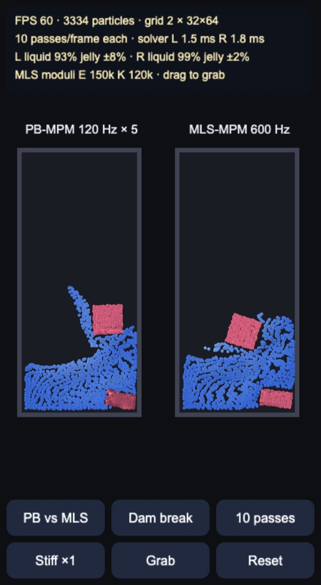
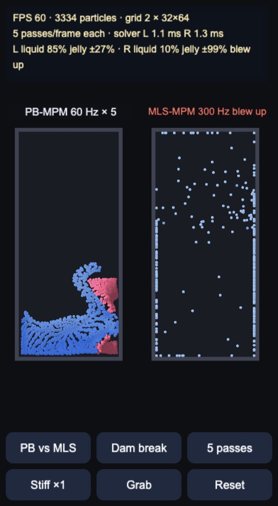
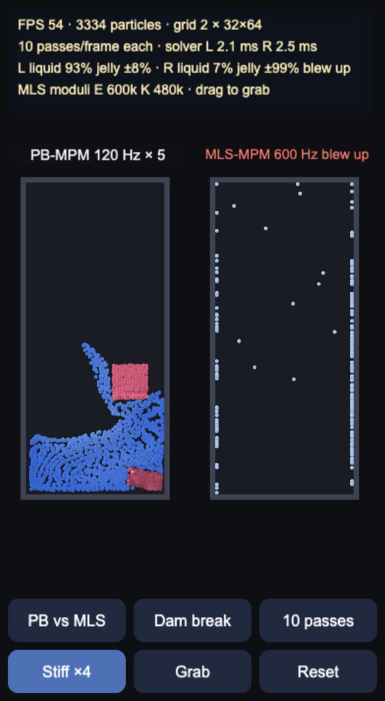
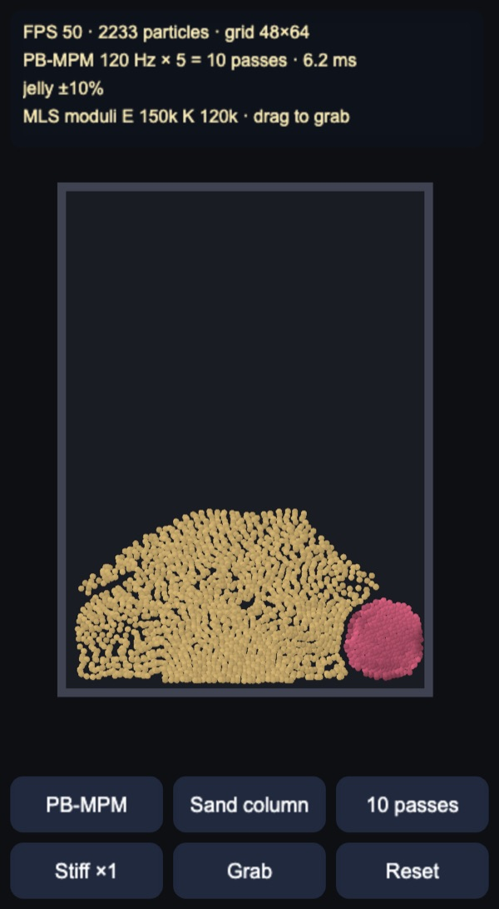
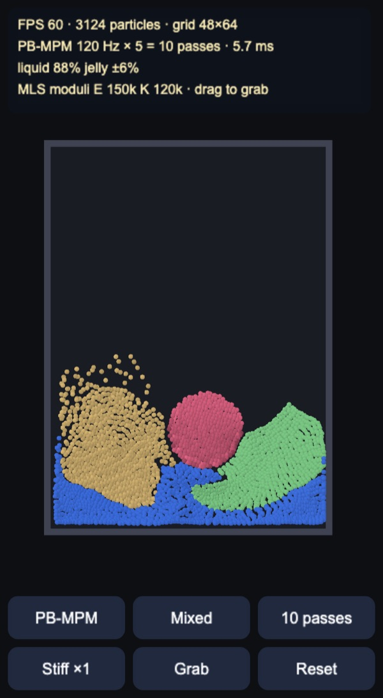

# 2D MPM: PB-MPM vs MLS-MPM

Two Material Point Method solvers on the CPU, for Cocos Creator 3.8, built and
previewed with Enji, sized to run on phones. Liquid, jelly, sand and a
viscoplastic material share one particle and grid layout. The default view runs
the same scene twice with the same number of grid passes per frame:
**Position Based MPM** (Lewin, EA SEED 2024) on the left, explicit **MLS-MPM**
(Hu et al. 2018) on the right.

## How it works

Everything is plain TypeScript in typed arrays (`assets/game/mpm/`), in grid
units (one cell = 1). Particles start 2×2 per cell, transfers use quadratic
B-splines and APIC, and the per-particle loops reduce each 3×3 stencil row by
row because the weights are separable.

- `MlsMpm.ts`: explicit MLS-MPM. P2G scatters momentum plus the stress term
  −Δt·V·4·τ (Kirchhoff stress) together with the affine velocity; the grid
  adds gravity and walls; G2P gathers velocity and its gradient C and updates
  F = (I + Δt·C)·F. Materials: liquid with a J-based equation of state, jelly
  with fixed corotated elasticity, sand with Hencky elasticity and a
  Drucker–Prager return mapping (Klár et al. 2016), visco as jelly with a yield
  band on the singular values.
- `PbMpm.ts`: a CPU port of the EA SEED reference
  ([electronicarts/pbmpm](https://github.com/electronicarts/pbmpm), BSD 3-Clause).
  The grid carries displacements instead of velocities. Each substep runs
  several iterations of one fused sweep: gather the displacement and its
  affine part D from the grid, move D towards what the material wants, scatter
  back. Liquid relaxes towards det F = 1 (with a grid volume correction), jelly
  towards the rotation of F from its closed-form polar decomposition, sand
  towards the plastically projected F. Nothing is integrated explicitly, so the
  step is stable at any Δt: too few iterations make materials softer and lose
  liquid volume, but never blow up.
- `Svd2.ts`: closed-form 2×2 SVD and the plasticity shared by both solvers.
- `MpmSim.ts`: fixed substeps per frame, 1/60 s of simulated time per rendered
  frame, so a slow device plays in slow motion instead of falling behind.
- `MpmView.ts`: all particles go into one dynamic mesh drawn as round point
  sprites (`mpm-points.effect`). Liquid is coloured by speed, jelly by its
  area change, sand with grain noise.
- `tools/bench.mts`: runs the scenes headless in Node and prints cost, liquid
  volume (mean det F) and jelly area error per setting.

### The budget

A "pass" is one gather and one scatter over all particles, which costs about
the same in both solvers. With a budget of N passes per frame:

| Budget | PB-MPM | MLS-MPM |
|---|---|---|
| 5 | 60 Hz × 5 iterations | 300 Hz |
| 10 | 120 Hz × 5 | 600 Hz |
| 20 | 240 Hz × 5 | 1,200 Hz |
| 40 | 240 Hz × 10 | 2,400 Hz |

MLS-MPM's substep must stay below one cell over the material's wave speed.
With the default moduli (E = 150k, K = 120k in grid units) that needs about
450 Hz; the "Stiff ×4" button doubles the wave speed and so the substep rate it
needs.

## At 5 passes per frame

At 300 Hz the explicit stress overshoots on the first impact and MLS-MPM blows
up (the world is frozen a third of a second later so the spray stays visible).
PB-MPM at 60 Hz × 5 keeps going: the jelly is softer and the liquid has lost
volume, but the dam break still reads.

Measured headless on the dam break (32×64 grid, 4 s of simulated time):

| Setting | Passes | Liquid volume | Jelly area error |
|---|---|---|---|
| PB-MPM 60 Hz × 5 | 5 | 78% | 23% |
| PB-MPM 60 Hz × 10 | 10 | 86% | 16% |
| PB-MPM 120 Hz × 5 | 10 | 91% | 10% |
| PB-MPM 240 Hz × 5 | 20 | 97% | 4% |
| PB-MPM 240 Hz × 10 | 40 | 99% | 2% |
| MLS-MPM 300 Hz | 5 | blew up | blew up |
| MLS-MPM 600 Hz | 10 | 99% | 2% |
| MLS-MPM 1,200 Hz | 20 | 99% | 2% |

So with materials this soft, MLS-MPM is more accurate per pass once it is
stable. PB-MPM's advantage is that its cost is set by the quality you ask for,
not by the stiffness of the material: lowering the budget on a slow phone
degrades it gracefully, while MLS-MPM has a hard floor below which it fails.
For the same budget, more substeps beat more iterations (120 Hz × 5 is better
than 60 Hz × 10).

The stiffness button shows the other side of it. With E and K ×4 the
material's wave speed doubles, 600 Hz is no longer enough and MLS-MPM blows up
at 10 passes, while PB-MPM with the same moduli is unchanged:

## Sand and mixed materials

| Sand column | Mixed |
|---|---|
|  |  |

PB-MPM alone at 10 passes. The sand column slumps into a pile at roughly its
friction angle (30°) and stops; the jelly disc stays round. In the mixed scene
sand, the green viscoplastic block and the jelly disc fall into a liquid
layer: the sand sinks in and throws up grains, the visco block sags where it
lands and keeps the bent shape instead of springing back like the jelly.

## Controls

- Drag through the material to grab it (or push it, with the Tool button). In
  compare mode the same hand acts on both sides.
- Buttons: PB vs MLS / PB-MPM only / MLS-MPM only; scene (dam break, sand
  column, mixed); budget (5, 10, 20, 40 passes); MLS stiffness ×1 / ×4; tool;
  reset.
- Keys: `S` solver, `C` scene, `B` budget, `K` stiffness, `T` tool, `R` reset,
  `Q` full / lite grids.

## Performance

At start-up the demo watches the first 60 frames after a 30-frame warm-up. If
they run below 50 FPS, or the solvers alone take more than 8 ms per frame, it
switches once to lite grids: 24×48 per side in compare mode and 36×48 in the
single view, about half the particles, with the scenes scaled to fit. The
status line then says "lite". On the coarser grid the comparison comes out the
same (MLS-MPM still blows up at 5 passes and is fine at 10).

Enji preview, viewport 563×1024, dam break, 10 passes per frame unless noted.
The 4× column uses Chrome CPU throttling as a rough mid-range phone.

| Setup | Particles | Desktop | 4× CPU throttle |
|---|---|---|---|
| Compare, full grids (2 × 32×64) | 3,334 | 60 FPS, solvers 2.0 + 2.4 ms | 38 FPS, 9.2 + 11.0 ms |
| Compare, full grids, 5 passes | 3,334 | 60 FPS, 1.0 + 1.3 ms | 60 FPS, 4.5 + 6.0 ms |
| Compare, lite grids (2 × 24×48) | 1,598 | — | 60 FPS, 4.3 + 5.2 ms |
| Compare, lite grids, 20 passes | 1,598 | — | 43 FPS, 8.4 + 9.9 ms |
| PB-MPM, full grid (48×64) | 2,965 | 60 FPS, 3.6 ms | 45 FPS, 16.6 ms |
| PB-MPM, lite grid (36×48) | 1,513 | — | 60 FPS, 7.8 ms |
| PB-MPM, lite, sand column | 1,215 | — | 54 FPS, 13.6 ms |
| PB-MPM, lite, mixed | 1,517 | — | 55 FPS, 12.3 ms |
| MLS-MPM, lite, mixed | 1,517 | — | 37 FPS, 20.6 ms |

On the desktop the start-up check measured 4.6 ms of solver time and kept the
full grids; under 4× throttling it measured 35 FPS and 19 ms and switched to
lite. Sand costs more per particle than liquid in PB-MPM because every
iteration runs an SVD and the return mapping.

In Node on the same machine a pass costs 85–95 ns per particle for PB-MPM and
95–105 ns for MLS-MPM, which does a stress evaluation and two sweeps per
substep. The single-solver view uses one 48×64 world (2,965 particles in the
dam break, 2,233 in the sand column, 3,124 in the mixed scene); the dam break
runs PB-MPM at 10 passes in 1.8 ms per frame at best. The machine was heavily
loaded by other processes during all of these runs (load average around 15),
so individual runs varied by up to 3× and the numbers are on the pessimistic
side.

## Not in this demo yet

- Lowering the pass budget automatically as well as the grid: it would make
  MLS-MPM blow up on slow devices, which is the point of the comparison but a
  bad default.
- Multithreading: the P2G scatter would need per-thread grids or colouring.
- A liquid surface (marching squares over the grid mass) instead of points.
- 3D, and moving colliders.

Made with Enji 0.3.
