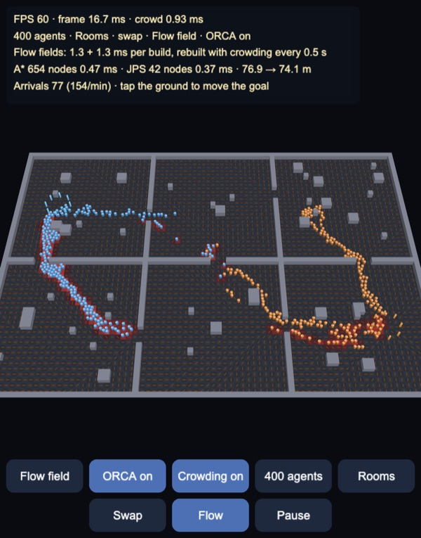
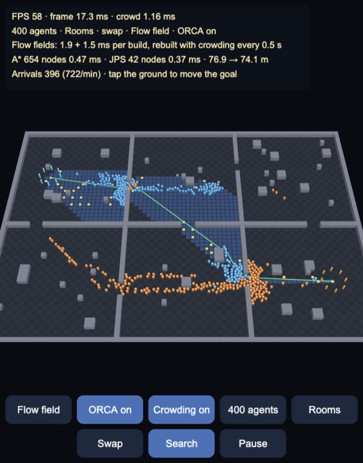
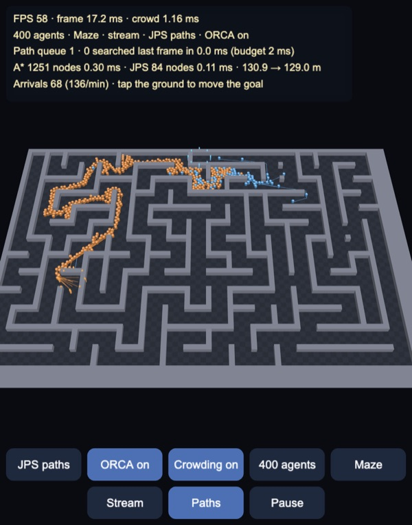
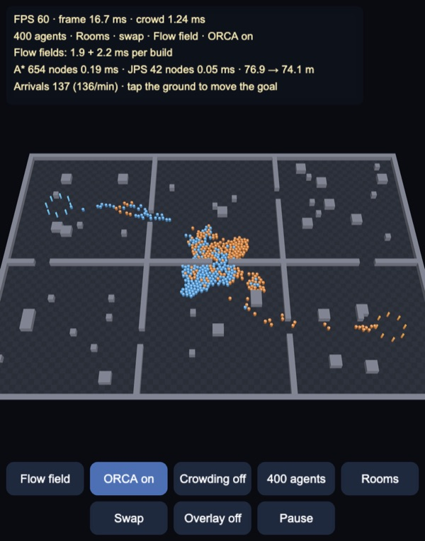
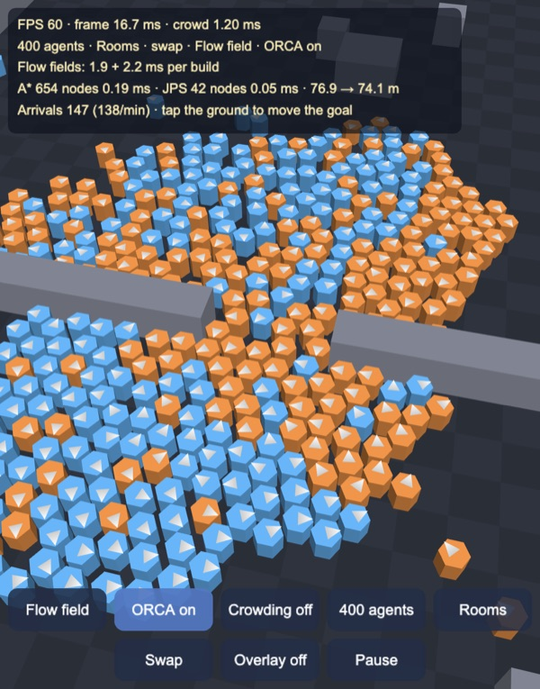
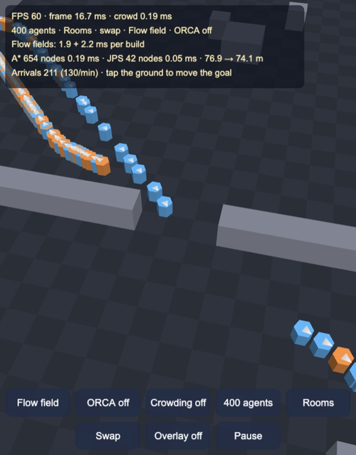
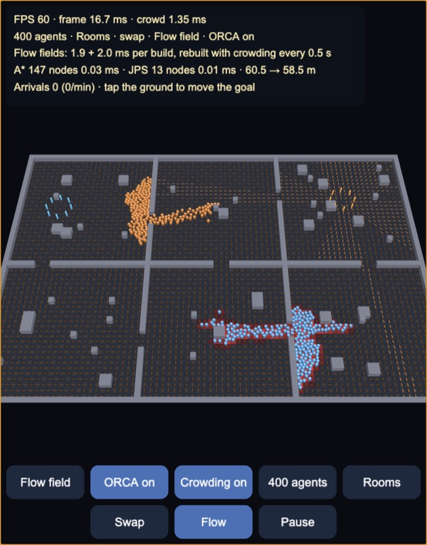

# Pathfinding and crowds: A*, jump point search, flow fields and ORCA

Up to 800 agents walking between two goals on a grid map in Cocos Creator
3.8, built and previewed with Enji. Paths come from A* or jump point search
(JPS), string-pulled into straight runs; or one flow field per goal serves
every agent at once, rebuilt twice a second with a crowding term so the two
groups route round each other. Agents avoid each other with ORCA (optimal
reciprocal collision avoidance, the method of the RVO2 library) and treat
walls as hard constraints. All of it is plain TypeScript on the CPU
(`assets/game/nav/`); the scene is three meshes in an unlit vertex-colour
shader.

400 agents in the *swap* scenario: orange starts top left and walks to the
bottom right room, blue the other way, and each turns round on arrival. The
overlay shows the field to the bottom-right goal: an arrow per cell, cells
tinted red where agents walking the other way make them costly. Here the
groups have split onto different doors instead of meeting in the middle one.
60 FPS, the crowd step 0.9–1.4 ms per frame (Apple Silicon, Enji preview).

## How it works

**The grid** (`Grid.ts`). Two 80 × 56 m maps of 1 m cells: six rooms with
3 m doors, pillars and crates; and a maze with 3 m corridors from a
randomized depth-first search plus 18 extra openings. Moves go to the 8
neighbours, and diagonals only when both cells beside them are free, so
paths never cut a wall corner. Two queries the rest builds on: whether a
segment crosses only free cells (a cell-by-cell walk, Amanatides & Woo
1987), and whether a disc of the agent's radius can slide along it (the
centre line and both lines offset by the radius).

**A\*** (`Search.ts`) with the octile distance as heuristic (exact on an
empty 8-connected grid), a binary heap with lazy duplicates, and per-cell
generation stamps so a new search clears nothing. Ties on f go to the
deeper node.

**Jump point search** (Harabor & Grastien 2011) finds the same shortest
paths while putting far fewer nodes on the open list. On a uniform grid
most shortest paths come in many equal-cost permutations; JPS follows only
the directions that symmetry pruning leaves open from each node and *jumps*
along them, stopping only at the goal or at a node with a forced neighbour:
an opening beside an obstacle that no equally short path could reach
without passing through that node. This is the variant for grids without
corner cutting, whose forced-neighbour rules differ from the original
paper's (as in PathFinding.js). The jump points are expanded back into
cells for smoothing.

**Smoothing** (`Smooth.ts`). Greedy string pulling: from each kept
waypoint, skip ahead while the agent's disc still has a clear run to the
next one. On average a 127-cell maze path becomes 26 waypoints, a 35-cell
room path 5.

**Flow fields** (`FlowField.ts`). Dijkstra from the goal over the whole
grid gives every cell its path cost; each cell then points at its cheapest
neighbour, or straight at the goal if the disc can slide there in a
straight line (the line-of-sight pass, Emerson 2013), which removes the
45° zig-zag of 8-way directions near the goal. Agents read the field with
bilinear interpolation. One build, 1–4 ms, serves any number of agents
walking to that goal; an agent's steering is then one lookup.

**Crowding.** With the crowding term on, the cost of stepping through a
cell is multiplied by 1 + 2 × (agents in it walking the *other* way),
splatted bilinearly from the agents' positions, and each field is rebuilt
every 0.5 s (the two alternate, one rebuild every 0.25 s). This is the density term of Continuum
Crowds (Treuille, Cooper & Popović 2006) without the rest of that method;
Supreme Commander 2 shipped a similar idea. The groups then take different
doors, or keep to separate lanes in the same one. In the stream scenario,
where everyone walks the same way, all agents count, which spreads them
over alternative corridors. A cell then only points straight at the goal
if its cost shows no detour and no crowding on the way.

**ORCA** (`Orca.ts`, `Crowd.ts`), after van den Berg, Guy, Lin & Manocha
2011 and the RVO2 library. Each step:

1. Agents are binned into a uniform hash of 2 m cells; each agent takes its
   10 nearest neighbours within 2 m.
2. Each neighbour becomes a half-plane of allowed velocities: the ones that
   cannot collide with it within the 1.5 s time horizon, each agent taking
   half of the avoidance. Agents that already overlap are pushed apart
   within one step.
3. Walls: every blocked cell within reach gives the closest point of its
   square, and velocity towards it is limited so the disc cannot reach it
   within 0.6 s (v·n ≤ (d − r) / τ). A cell is skipped when its closest
   point lies on the side of a blocked cell nearer the agent, so along a
   straight wall only the cell straight across counts and agents slide
   along walls at full speed. This is a conservative, linear stand-in for
   RVO2's obstacle segments.
4. The new velocity is the one closest to the preferred velocity (from the
   path or the field) that satisfies all half-planes and the speed limit,
   an incremental 2D linear program. When none does, wall constraints stay
   hard and the agent constraints are violated as little as possible
   (RVO2's third program). A tiny random nudge on the preferred velocity
   breaks exactly symmetric standoffs, as in the RVO2 examples.
5. Move, then push anyone still overlapping a wall square back out.

**Scenarios** (`Swarm.ts`). *Swap*: half the agents start at each goal and
walk to the other one, turning round on arrival. *Stream*: everyone walks
from one goal to the other and is put back at a free spot near the start
on arrival. In path mode each agent gets its own A* or JPS path to a random
free spot near its goal, searched from a queue under a time budget of 2 ms
per frame; an agent pushed behind a wall asks for a new one.

## Search: A\* and JPS

The search overlay, from goal to goal: blue cells are the 654 nodes A*
expanded, yellow squares the 42 that JPS expanded, green the smoothed path
(76.9 m on the grid, 74.1 m after string pulling).

Over 500 random queries per map (Node):

| Map | Nodes expanded, A* | JPS | A* per query | JPS per query |
|---|---|---|---|---|
| Rooms | 274 | 30 (9.2× fewer) | 150–500 µs | 60–110 µs |
| Maze | 1,238 | 86 (14.4× fewer) | 360–610 µs | 80–120 µs |

JPS saves less time than nodes because each jump scans many cells. With 800
agents in path mode the queue clears in 32 frames with JPS and 96 with A*
on the rooms map (26 and 117 in the maze), at up to 41 and 12 searches
a frame.

## The maze, one way

The stream scenario in the maze with per-agent JPS paths, the paths
overlay on (the lines run from each agent along its remaining path). The
two goals are 40 m apart in a straight line and 131 m along the corridors.
Arrivals turn blue and go back to the start. In this scenario, path
following and the flow field move about as many agents per minute; the
crowding term adds about 25%.

## Crowding on and off

| Crowding off: both groups take the shortest route | ORCA in the door |
|---|---|
|  |  |

Without the crowding term, both groups' shortest paths run through the same
3 m door and the groups meet in it head-on. ORCA keeps them from
overlapping (right: the noses show each agent's heading), but people
walking through each other's path in a 3 m gap barely move. Arrivals in the
first 60 s, 400 agents (Node, the same code as the demo):

| Steering | Rooms, swap | Maze, stream (90 s) |
|---|---|---|
| Flow fields with crowding | **275** | **196** |
| Flow fields, shortest path | 23 | 158 |
| JPS paths | 29 | 157 |

ORCA off, a few seconds later: the jam dissolves because agents walk
through each other. 3,140 pairs overlap by more than 3 cm, the deepest by a
whole diameter; with ORCA on there are 0–2 such pairs. Walls still hold.

Tapping the ground moves the destination (here into the top-right room).
The field rebuilds at once and the probe on the fourth HUD line re-runs
A* and JPS.

## Tests

`node --no-warnings --import ./tools/ts-resolve.mjs tools/test.mts`, 23
checks, all passing (about 35 s).

| Check | Result |
|---|---|
| A* cost = Dijkstra cost, 400 queries per map | worst difference 3e-13 m |
| JPS cost = A* cost, 500 queries per map; paths valid (free cells, unit steps, no corner cutting) | worst difference 7e-13 m, 0 bad paths |
| Smoothed paths, 300 per map | never longer, every new segment clear for a 0.3 m disc; 3.9% (rooms) and 2.1% (maze) shorter |
| One agent following the flow field from 200 random starts per map, walls as in the crowd | 200/200 arrive, walking 0.95–0.96× the grid path cost, wall penetration 0 |
| Flow field build | 1.1–4.8 ms (Dijkstra 0.5–2.4, line of sight 0.7–3.1) |
| ORCA, two agents head-on | pass without touching |
| ORCA, 32 agents across a 10 m circle | all arrive in 15.5 s; deepest overlap 3.9 cm (2r = 60 cm); without avoidance 59 cm |
| ORCA, 200 agents across a 25 m circle | all arrive in 48.7 s; deepest overlap 9.6 cm; 2.3–5.5 µs per agent per step |
| Rooms swap and maze stream, 400 agents, 60–90 s, six setups | wall penetration 0 in all; deepest agent overlap 3–8 cm |
| Crowding term | 275 arrivals against 23 (plain fields) and 29 (JPS) in the rooms swap |

ORCA's guarantee is for continuous time and feasible constraints. The
overlaps in the dense middle of the circle come from discrete 1/30 s steps
and from steps where no velocity satisfies every neighbour, so the third
program trades a little of each; plain RVO2 does the same.

## Controls

- Drag to orbit, pinch or mouse wheel to zoom, tap the ground to move the
  destination.
- Buttons: steering (flow field, A* paths, JPS paths); ORCA on / off;
  crowding on / off; agents (400, 800, 150); map (rooms, maze); scenario
  (swap, stream); overlay (off, flow, paths, search); pause.
- Keys: `P` steering, `O` ORCA, `C` crowding, `N` agents, `M` map, `S`
  scenario, `V` overlay, `Space` pause.
- The HUD shows FPS and the crowd step time; the scenario; flow field build
  times or the path queue; A* against JPS between the two goals; arrivals
  per minute.

## Performance

Desktop (Apple Silicon, Enji preview). 60 FPS in every setup tried:

| Agents | Steering | Crowd step per frame |
|---|---|---|
| 400 | flow fields with crowding | 0.9 ms |
| 400 | JPS paths | 1.0 ms |
| 800 | flow fields with crowding | 2.2 ms |
| 800 | flow fields, shortest path | 2.4 ms |
| 800 | JPS paths | 2.5 ms |

A flow field rebuild costs 1.3–3.1 ms; with crowding on, one runs every
0.25 s. In Node the whole update (navigation and crowd) is 1.7–3.5 ms per
step for 400 agents. Without ORCA the crowd step drops to 0.2 ms. It has not been measured on a phone
yet.

## Not in this demo yet

- Phone measurements.
- Navigation meshes: everything here is on a uniform grid; a navmesh
  (Recast) with funnel-algorithm smoothing is the usual choice for large or
  multi-level 3D levels.
- Hierarchical search (HPA\*) and JPS+ precomputation for long queries on
  big maps; flow fields per sector rather than for the whole map.
- Crowding in path mode: per-agent paths are planned once and ignore the
  crowd, which is why they jam in the rooms swap.
- Exact obstacle segments in ORCA, and the full Continuum Crowds solve
  (speed fields from density, anisotropic costs).
- Agents of different sizes and speeds, and formations.

Made with Enji 0.3.
