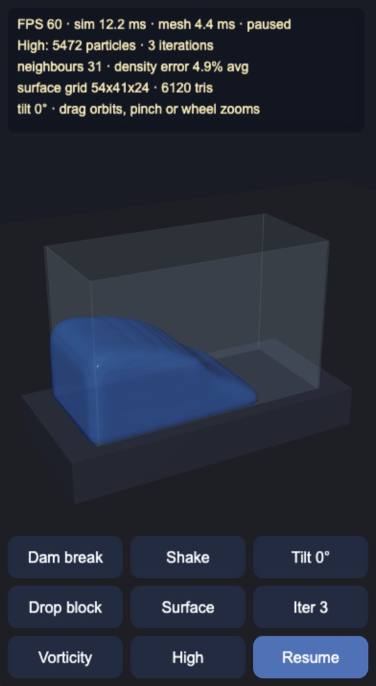
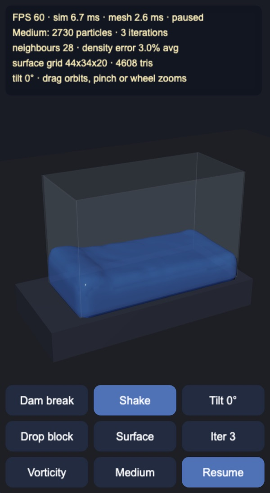
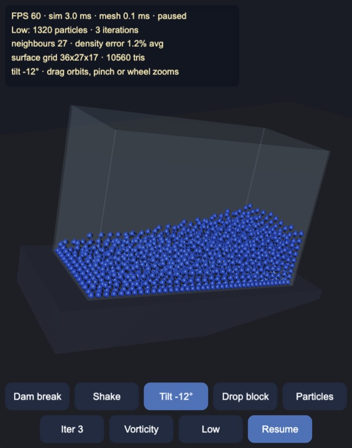

# PBF water

3D Position Based Fluids in a glass tank for Cocos Creator 3.8, built and
previewed with Enji. The particles are simulated on the CPU, and a closed water
surface is rebuilt from them every frame. Three quality levels and an automatic
start-up check keep it at an interactive frame rate on phones.

| Dam break, High | Shaking the tank, Medium | Particles, Low, tilted -12° |
|---|---|---|
|  |  |  |

## How it works

- `PBFSolver.ts`: the solver, plain TypeScript with no engine imports.
  - Position Based Fluids (Macklin, Müller 2013). Each step predicts positions,
    finds neighbours, then runs a few Jacobi iterations of the density
    constraint `C_i = ρ_i / ρ0 - 1`, using the poly6 kernel for density and the
    spiky kernel gradient for the position correction. The rest density `ρ0` is
    the poly6 density of the initial cubic lattice, so the starting block is
    exactly at rest.
  - The constraint is one-sided (only compression is corrected), and the
    artificial pressure term `s_corr` keeps the free surface from clumping.
  - XSPH viscosity smooths the velocities. Vorticity confinement is optional
    (button `O`).
  - Neighbour search uses a uniform grid with cell size `h`. A counting sort
    reorders the particle arrays by cell every step, so the 3×3×3 cell query
    reads contiguous memory. Because the arrays are sorted by cell, every pair
    is stored once, from the particle with the lower index, and each pair pass
    (density, correction, vorticity, XSPH) writes to both particles. Per-pair
    kernel gradients from the density pass are reused by the later passes.
  - Tilting rotates gravity into tank space. Shaking moves the x walls.
  - All state lives in preallocated `Float32Array`s. A step allocates nothing.
- `SurfaceMesher.ts`: splats a `(1 - d²/r²)³` kernel per particle onto a node
  grid clipped to the tank, blurs it with a separable `[1 2 1]` filter, and
  extracts the iso-surface with Naive Surface Nets: one vertex per crossing
  cell, one quad per crossing edge. Normals come from the analytic gradient of
  the trilinear field.
- `ParticleMesh.ts`: draws each particle as a small octahedron coloured by
  speed (the `Particles` and `Both` views).
- `Quality.ts`: the quality levels. Each one sets the particle spacing, and the
  kernel radius (two spacings, so about 30 neighbours at every level), the
  mesher grid, the dropped block and the solver constants that carry units of
  length are scaled with it.

  | Level | Spacing | Particles | Dropped block |
  |---|---|---|---|
  | High | 5.0 cm | 5,472 | 512 |
  | Medium | 6.25 cm | 2,730 | 216 |
  | Low | 8.0 cm | 1,320 | 125 |

- `MainView.ts`: scene, shadow-mapped sun, HUD and the dynamic mesh upload.
  Enji's preview draws the whole preallocated index buffer of a dynamic mesh,
  so the tail left over from a larger earlier frame is zeroed before upload.
  It starts at High and measures 60 frames after a 30-frame warm-up. If the
  frame rate is under 50 FPS or the solver plus mesher take over 12 ms, it drops
  one level and measures again, down to Low. The shadow map is 1024 below High.

## Controls

- Drag to orbit. Pinch or wheel to zoom.
- Buttons and keys: `R` dam break, `S` shake, `T` tilt (0°, 12°, -12°), `D`
  drop a block, `V` view (surface, particles, both), `I` solver iterations
  (2, 3, 4, 6), `O` vorticity, `Q` quality (turns the automatic choice off),
  `P` or `Space` pause.

## Performance

Headless dam break, 6 s at 60 Hz, 3 solver iterations
(`node --no-warnings --import ./tools/ts-resolve.mjs tools/bench.mts`, Apple
Silicon Mac, Node 24). Times are the fastest frame, as the machine was busy.

| Level | Solver | Surface mesh | Front at 0.5 s | Settled depth | Density error after settling |
|---|---|---|---|---|---|
| High | 16.3 ms | 3.9 ms | x = 0.99 m | 0.33 m | 4.0% |
| Medium | 7.2 ms | 2.1 ms | x = 0.98 m | 0.31 m | 1.8% |
| Low | 3.1 ms | 1.0 ms | x = 0.94 m | 0.31 m | 0.8% |

The three levels flow the same way: the front reaches the far half of the
tank at the same time, and the water settles at the same depth. The coarser
levels also end with a lower density error at the same iteration count.

Storing each neighbour pair once made the High solver about 20% faster than
the earlier version (fastest frame 22.1 ms down to 17.8 ms in an A/B run with
the same result), not the halving this README used to predict: the grid query
still visits the same 27 cells, and each pair pass now writes to two particles
instead of one. In the solver step, the density pass now takes
38%, the position correction 27%, the neighbour search 19% and XSPH 12%.

Enji preview, median of 12 half-second windows. The phone column uses Chrome's
4× CPU slowdown.

| Level | Desktop FPS | Desktop solver + mesh | 4× slowdown FPS | 4× solver + mesh |
|---|---|---|---|---|
| High | 60 | 10.1 + 3.2 ms | 16 | 50.8 + 17.1 ms |
| Medium | 60 | 5.1 + 2.0 ms | 24 | 28.5 + 10.7 ms |
| Low | 60 | 2.7 + 1.2 ms | 36 | 14.7 + 6.5 ms |

On the desktop the automatic check keeps High. With the 4× slowdown it drops
to Medium after 8.7 s and to Low after 13.3 s, then stops at 36 FPS. The upload
stays under 0.2 ms at every level.

## Not in this demo yet

- Moving the solver to a Web Worker, so the solver and the renderer overlap.
- Two-way coupling with rigid bodies, and foam or spray particles.
- Refraction. The water is a lit, semi-transparent surface.

Made with Enji 0.3. Based on Macklin and Müller, "Position Based Fluids",
SIGGRAPH 2013.
