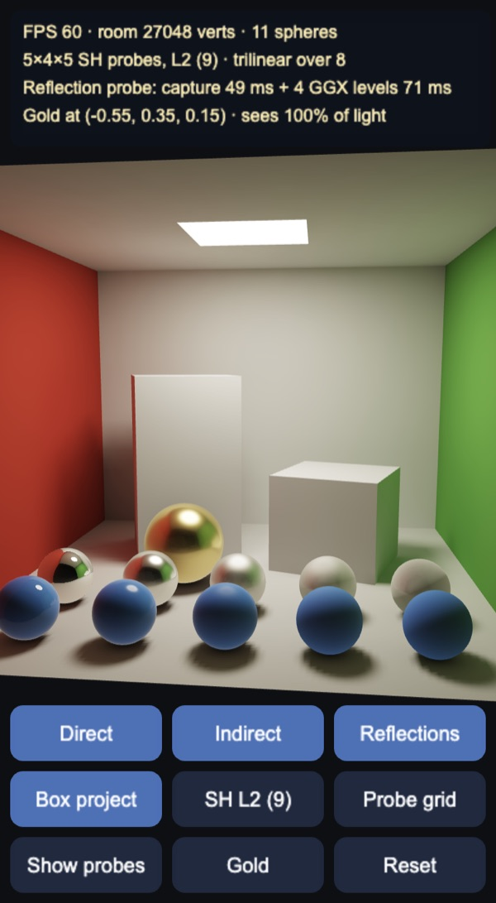
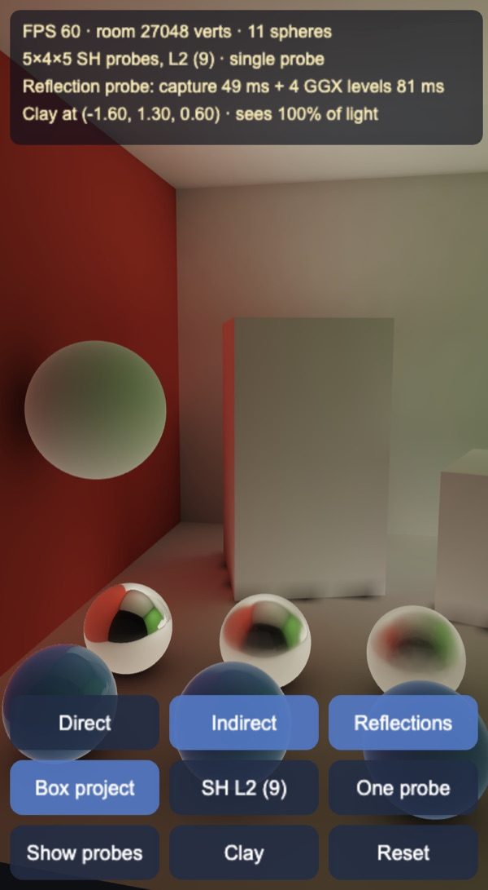
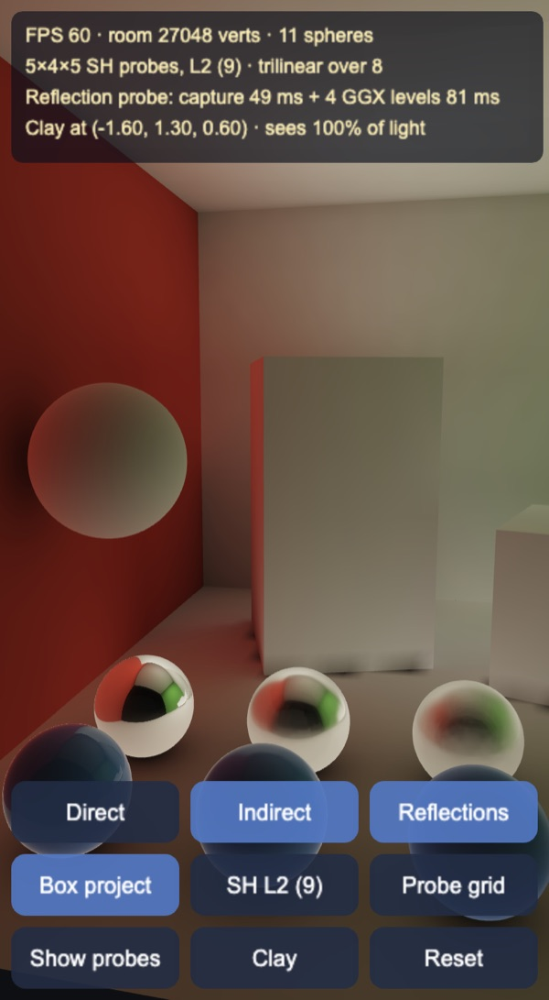
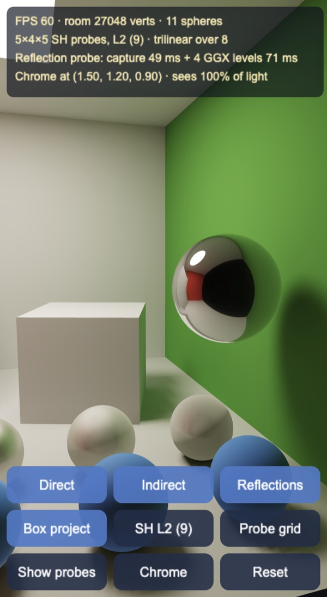
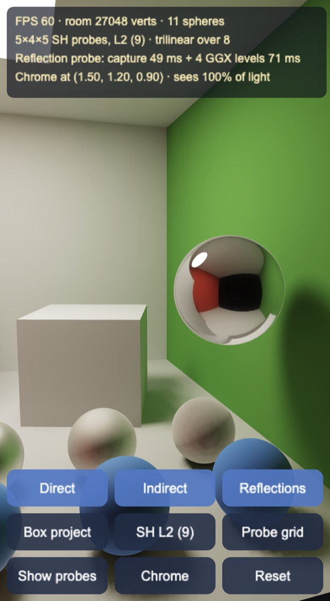
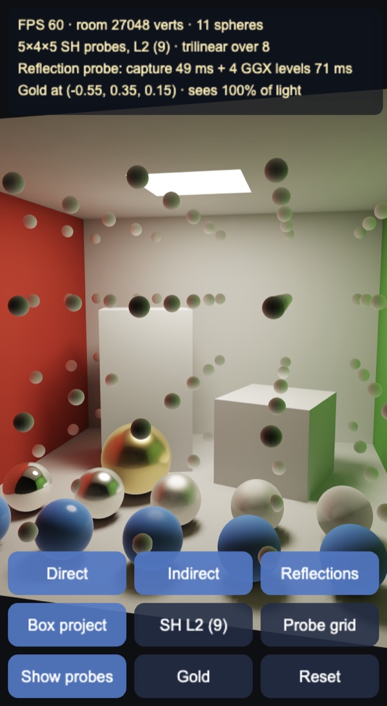

# PBR with light probes

Physically based spheres lit by baked light probes in a Cornell box, for Cocos
Creator 3.8, built and previewed with Enji, sized to run on phones. The room's
light is baked offline: direct light with soft shadows and four bounces of
indirect light go into the walls, and an L2 spherical harmonics probe grid
fills the space. Moving objects take their diffuse light from the probes and
their reflections from a box-projected reflection probe that is prefiltered
when the scene starts.

## How it works

- `tools/bake.mts`: the offline bake, plain TypeScript run by Node against the
  scene in `Room.ts`. It writes `assets/resources/bake/cornell.json` (173 KB).
  - The room is 16 one-sided quads: walls, two rotated blocks and a 1 m² area
    light under the ceiling, ray-traced by brute force.
  - Every quad has a grid of 8 cells per metre. At each corner the bake stores
    the direct light from the panel (6×6 shadow rays) and, separately, the
    indirect light: 1,024 cosine-weighted rays per point, repeated four times so
    that each round gathers one more bounce.
  - Grid corners hidden behind the light panel or under a block would smear
    darkness past the edges when interpolated, so they are sampled just outside.
  - A 5×4×5 grid of L2 SH probes (9 RGB coefficients each) records, from 2,048
    evenly spread directions, the light the walls reflect. The panel itself is
    left out because the runtime adds direct light analytically. The radiance is
    projected onto SH and convolved with the cosine lobe (Ramamoorthi &
    Hanrahan 2001), so evaluating the coefficients gives irradiance / π. Probes
    buried in a block take the mean of their neighbours.
  - The bake takes 16 s on an Apple Silicon Mac
    (`node --import ./tools/ts-resolve.mjs tools/bake.mts`).
- `RoomMesh.ts`: resamples the bake onto the room mesh (27,048 vertices, finer
  on the floor). Indirect radiance goes in `a_color`, direct radiance in a
  second attribute, so each can be toggled and a moving object can shadow only
  the direct part. Occlusion by the ten fixed spheres is applied here once.
- `pbr-room.effect`: adds the moving sphere's contact occlusion and its soft
  shadow from the light per pixel, using analytic formulas shared with
  `Occlusion.ts`. There are no shadow maps.
- `pbr-sphere.effect`: metallic-roughness GGX.
  - Direct light treats the panel as a sphere light. Specular uses Karis's
    representative point with lobe normalisation, and diffuse uses the Frostbite
    sphere-light cosine, so the terminator stays soft. The light is attenuated by
    the object's visibility of the panel (36 CPU shadow rays against the blocks,
    updated when it moves) and by the nearest sphere.
  - Diffuse ambient: the SH coefficients blended on the CPU from the 8 probes
    around the object, evaluated per pixel.
  - Specular ambient: a reflection probe captured at the room centre and
    prefiltered with filtered importance sampling (GGX, N = V = R) into five
    roughness levels: 128² mirror, then 32², 16², 8² and 8². It is stored as RGBM
    in 8-bit cube maps, because float textures are not reliably filterable on
    phones. The reflection vector is corrected against the room box (box
    projection), then the two nearest roughness levels are blended, and the
    result is weighted with Karis's mobile split-sum approximation.
- Everything is tone mapped (ACES fit) and gamma encoded in the shaders, because
  the Enji pipeline writes shader output to the screen as is.

## Probe grid vs one probe

| One probe in the room centre | 5×4×5 probe grid |
|---|---|
|  |  |

Indirect light only, with a clay sphere floating next to the red wall. A single
probe in the middle of the room sees the green wall as much as the red one, so
the sphere comes out green on the side that faces the red wall. With the grid,
the 8 probes around the sphere see the red wall up close, and that side turns
red.

## Box projection

| Box projection on | Box projection off |
|---|---|
|  |  |

A chrome sphere near the green wall. Without the correction the cube map is read
as if the walls were infinitely far away, so the sphere reflects the room as
seen from its centre: the open front fills the middle and the red wall is small.
With box projection, each reflected ray is traced to the room's walls and the
cube map is read in that direction from the capture point, so the red wall
shows at its true size and the green wall right beside the sphere appears along
its edge.

## Probes

Each small sphere is one probe, shaded as a white diffuse ball would be there.
They hold indirect light only, so they are darkest on top (the ceiling is lit
only by bounced light) and pick up the colour of the nearest wall.

## Controls

- Drag the gold sphere to move it (in the plane facing the camera). Drag
  anywhere else to orbit. Zoom with the wheel or a pinch.
- Buttons: toggle direct light, indirect light (walls and SH), reflections and
  box projection; cycle SH bands (L0, L1, L2); switch between the probe grid and
  one probe; show the probes; cycle the sphere's material (gold, chrome, copper,
  red plastic, clay); reset.
- Keys: `D` direct, `I` indirect, `S` reflections, `B` box projection, `L` SH
  bands, `G` grid / one probe, `P` show probes, `M` material, `R` reset.

## Performance

Enji preview, viewport 563×1024:

| | Desktop | 4× CPU throttle (rough mid-range phone) |
|---|---|---|
| Frame rate | 60 FPS | 41–44 FPS |
| Build the room mesh from the bake | 80 ms | 185 ms |
| Capture the reflection probe (128², ray traced) | 50 ms | 169 ms |
| Prefilter 4 GGX levels | 49–86 ms | 157 ms |
| Moving the sphere (shadow rays, SH blend, uniforms) | | 0.9 ms per frame |

The machine was heavily loaded by other processes during these runs, so the
numbers are pessimistic. Building the room mesh and capturing the probe block
the first frame (about 0.35 s on the throttled run). The prefiltered levels then
arrive one cube face per frame, at most about 20 ms each; until a level is
ready, rougher materials use the blurriest level built so far. A frame without
movement does no CPU work beyond the HUD. Per pixel, the room shader evaluates
two analytic sphere terms and the spheres sample at most two cube maps, which
suits phone GPUs.

## Not in this demo yet

- Lightmaps with UVs instead of vertex lighting. The vertex grid is 12.5 cm on
  the bake side, which is enough for the soft light here but not for sharp
  shadows.
- Probe visibility (as in DDGI): a probe near a wall can leak light from the
  other side. The box here is convex apart from the blocks, so it barely shows.
- More than one reflection probe, and a live recapture when objects move.

Made with Enji 0.3.
