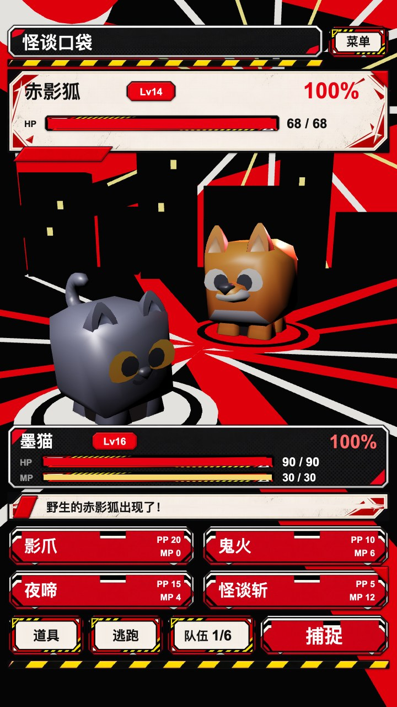
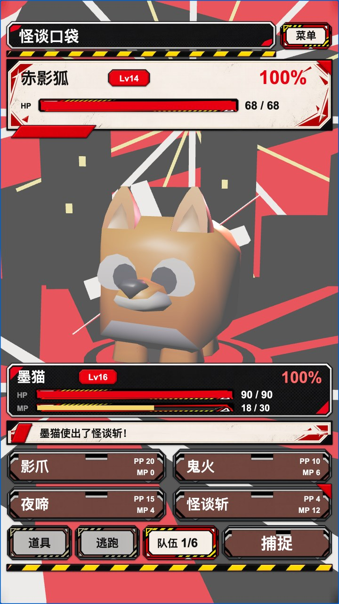
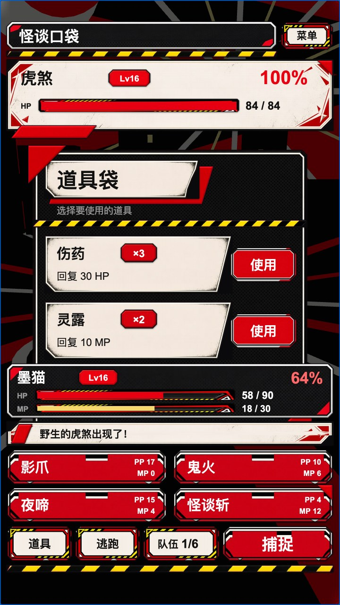
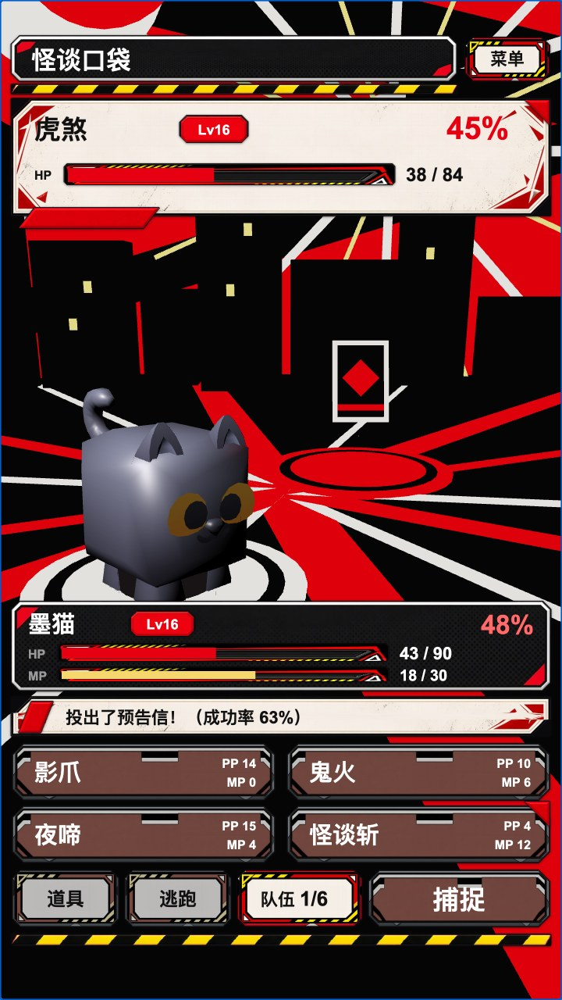
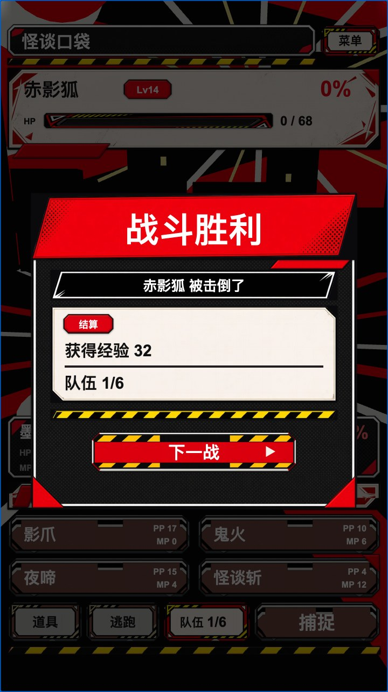

# Phantom Pocket 3D · 怪谈口袋 3D

A Persona 5–style catch-and-battle demo with a live 3D arena. Two Kenney Cube Pets face each other on a
red/black/white stage under a perspective camera; the battle HUD frames the 3D view from above and below.
You fight with four moves (PP and MP costs), the enemy answers every turn, potions heal from the bag,
weakened enemies can be caught with a calling card and join the party, and each win, catch or loss leads
to a result dialog and then a new, different enemy.

Made with Enji 0.3.0 (Cocos Creator 3.8 preview runtime). The old 2D version, `../phantom-pocket`, was
read but not modified.



Demo video (55 s, recorded by `tools/record.mjs`): [video/phantom-pocket-3d.mp4](video/phantom-pocket-3d.mp4).

| Battle start | Big move hitting in 3D | Bag | Catch | Result |
|---|---|---|---|---|
|  |  |  |  |  |

More: `shots/06_catch_result.jpg` (the catch result dialog) and `shots/07_after_run.jpg` (the new
encounter after running away). All shots come from `node tools/playthrough.mjs 7`.

## Run

```sh
cd tools && npm install && cd ..          # playwright-core, for the scripts only
enji host start --project .               # prints previewUrl
# open previewUrl; optional: &seed=7 for a repeatable RNG, &prefab=prefabs/ui/BattleHud to view one prefab
node tools/playthrough.mjs 7              # headless playthrough, writes shots/ and tools/playthrough.result.json
enji host stop --project .
```

Controls: tap a move, 道具 (bag), 捕捉 (catch), 逃跑 (run). 队伍 (party) prints the party in the status
line, and 菜单 (menu) only prints a message.

## Requirements and how they are met

### 1. UI only through auto-ui-pipeline

Three screens, each in `ui-work/<screen>/`. The steps below were all actually run, with
`python3 bin/auto-ui …` in `/Users/shinjiyu/Documents/auto-ui-pipeline`:

1. **brief**: `make_brief` with the new styles `persona3d_battle`, `persona3d_bag` and `persona3d_result`
   (files added, untracked, in the pipeline repo's `ui-kit-test/boundary-lab/styles/`). `BRIEF.md` also
   gets a shared texture vocabulary and a per-screen addendum. The battle addendum reserves
   `stage_view` (x 0, y 300, 720×460) for the 3D view and keeps everything else out of it.
2. **region draft**: `gen.py` → `layout.svg`. **All three drafts were written by Claude Opus 5.5
   (`claude-opus-5-5-medium`), one Cursor Task subagent per screen**, following each screen's
   `DRAFT_PROMPT.md`. Each work dir keeps `gen.py`, `layout.svg`, `NOTES.md`, `report.json`,
   `preview.png` and `iterations.log`.
3. **validate**: battle, bag and result all have 0 errors and 0 warnings (re-checked at the end).
4. **regions** (`regions <layout.svg>`) and **concept-prompt**. Each `concept.png` was produced with
   Cursor's GenerateImage from `concept_prompt.json` plus the screen's colour-block image. The bag and
   result concepts also used the assembled battle screen as a style reference.
5. **pack**: battle 7 atlases, bag 5, result 6 (`prod/atlas/*_{ref,style,mask,prompt.txt,layout.json}`).
6. **atlas images**: GenerateImage, one image per atlas, using the pack prompt with its ref and style
   images (the prompts were trimmed and some hollow/colour rules made stronger), saved as
   `prod/atlas/raw/sd_main_<atlas>_v<n>.png`. Bake QA rejected some images, which were regenerated:
   - battle `button_1`: rims painted solid instead of hollow; v1 passes.
   - battle `deco_1`: hazard stripe too tall; v1 passes.
   - battle `comic_panel`: v0 had a black interior. v0 still passed QA, but bake picked v1 itself
     (lowest concept colour distance).

   `prod/bake/selection.json` overrides two battle picks: `lv_chip`, because v0 painted a black face
   where the role is crimson, and `ink_plate`, because v0's decoration ran behind HUD text. The v2 raws
   from the old project were not reused, because the atlas groupings and canonical shapes differ.
7. **bake**: every texture passes QA (battle 11/11, bag 10/10, result 10/10). Outputs are
   `prod/bake/out/*.png` and `bake.json`.
8. **assemble**: run through `tools/assemble_2x.py`, a wrapper around the pipeline's `assemble.py` (see
   known issues). Outputs are `prod/assembled.png`, `compare_full.png` and `compare_parts.png`.
9. **export**: `tools/export_cocos_layout.py ui-work/<screen> <name>`, adapted from the old project's
   exporter. It writes `assets/resources/ui/<name>/uilayout.json` plus the baked PNGs. The full-screen
   `bg` part is dropped, because behind the HUD is the 3D view and behind dialogs a dim layer.

### 2. Prefabs authored by generator scripts

All prefabs are written by Python generators in `tools/` (outside `assets/`) through the shared writer
`tools/prefablib.py`. It emits engine-format 3.8 JSON: `cc.PrefabInfo` on every node,
`cc.CompPrefabInfo` on every component, and deterministic fileIds. There are no script components and no
nested prefab references.

| Prefab | Nodes | Generator | Content |
|---|---:|---|---|
| `prefabs/battle/BattleStage.prefab` | 104 | `tools/gen_stage.py` | perspective camera rig, directional key light + red sphere rim light + spot on the player, floor with stripes and pads, backdrop (wall, slashes, starburst, bitten moon, city, spikes), `PlayerAnchor` / `EnemyAnchor` (Shadow, Model, FxPoint), `Fx/` (HitBurst, Slash, Fireball, CallingCard, ShockRing, HealRing, inactive) |
| `prefabs/ui/BattleHud.prefab` | 91 | `tools/gen_ui.py` | 82 layout parts + `Fx/` (ScreenFlash, CutIn + Text, PopEnemy, PopPlayer) + 4 `Text` children |
| `prefabs/ui/BagDialog.prefab` | 38 | `tools/gen_ui.py` | 34 layout parts + `Dim` + 2 `Text` children (item counts on their chips) |
| `prefabs/ui/ResultDialog.prefab` | 23 | `tools/gen_ui.py` | 20 layout parts + `Dim` + 1 `Text` child (the 结算 tag) |

How `gen_ui.py` maps `uilayout.json` to a prefab:

- **Parts**: one node per layout part, named by its id and nested like the layout, with children
  ordered by z.
- **Textured parts**: `cc.Sprite` showing the baked PNG for the part's state.
  - `nine_slice` parts are `SLICED`; `affine` and hollow rim parts are `SIMPLE`.
  - Node size includes the bake pad.
- **Buttons**: `type=button` parts get `cc.Button` with the SCALE transition.
- **Bars**: a white sprite tinted with the bar colour, anchored at (0, 0.5) so the width grows from the
  left.
- **Text**: `cc.Label` (SHRINK overflow) carrying the layout's text, size, colour, alignment and weight.
  - When the text part also has a sprite or children (the level chips, the item counts, the 结算 tag),
    the Label goes on a trailing `Text` child so it draws above the badge.
- **Program-rendered parts**:
  - The result divider (`lines_rule`) is a tinted white sprite.
  - The result arrow (`next_arrow`) is a ▶ Label.
- **Widgets**: block anchors (top, bottom, fill, center) become `cc.Widget`.
- **Dialogs**: a full-screen `Dim` (sprite at alpha 170 plus `cc.BlockInputEvents`) and `cc.UIOpacity`
  on the root for fading.
- **Units**: UI prefabs are authored in baked-pixel units (2× the 720×1280 design) with root scale 0.5.
  Cocos draws sliced borders at one texture pixel per node unit, so this keeps 9-slice borders at the
  thickness they were baked at. It also renders labels at 2× font size.
- **`UiGen.ts`**: `gen_ui.py` also writes `assets/game/ui/UiGen.ts`, which maps part ids to node paths
  and lists state frames and bar widths.
- **9-slice borders**: `gen_ui.py` writes each sliced image's borders (slice plus bake pad, in texture px)
  into its `.meta` `subMetas.f9941.userData.border*`, then runs `enji import` on the UI folders so the
  host re-imports them. The prefabs therefore show correct borders when opened alone, too.

What the code does: `assets/game/ui/UiView.ts` and `assets/game/battle/*.ts` only load and instantiate
prefabs, find nodes by path, set labels, sprite states and bar widths, register click handlers, and run
tweens.

Runtime dumps: `node tools/dump_prefabs.mjs tools/dumps <prefab>...` instantiates each prefab alone
(`?prefab=`) and walks the runtime tree. `python3 tools/verify_dumps.py` then compares every node with
two sources and writes `tools/dumps/SUMMARY.md`; all four prefabs are OK:

- **The prefab file**: transform, layer, UITransform, frames, colours, label text, meshes, materials,
  camera and lights.
- **Intent**: every layout part's design-space centre, size, frame, sliced/simple type, text and button
  (for the UI), or the camera, lights, anchors and inactive effects (for the stage).

I checked that the verifier catches a moved node, a changed label, an active effect node and a changed
light intensity.

#### Runtime node creation

The code contains no `new Node` and no `addComponent`. The only nodes created at runtime are prefab
instances:

| Created at runtime | Where | Why |
|---|---|---|
| BattleStage, BattleHud, BagDialog, ResultDialog instances | `BattleGame.start`, `UiView.create` | instantiating the authored prefabs |
| creature model instances | `StageView.setCreature`, under `<Side>Anchor/Model` | the glTF model prefabs from `enji import` can't be referenced from BattleStage.prefab (no nested prefab refs), so code instantiates them under the anchors |

`MeshRenderer.getMaterialInstance(0)` makes per-model material instances for the white hit flash.
These are materials, not nodes.

### 3. Real 3D arena

- **Camera**: perspective, 44° horizontal FOV, at (0, 3, 9) looking at (0, 0.2, 0). It sways slightly
  and looks at a target that the code moves on big moves.
- **Lights**: a warm directional key light, a red sphere rim light behind the enemy, and a spot light on
  the player.
- **Composition**: creature positions were tuned with a projection calculator so both creatures land in
  the HUD's `stage_view` band. The player is closer and turned to a 3/4 profile; the enemy faces the
  player.
- **Feedback**:
  - lunge toward the target;
  - hit shake, a white emissive flash on every mesh of the model, and a rotating hit burst;
  - slash, fireball and shock-ring effects;
  - faint (tip over and shrink);
  - catch: a calling card flies in, the creature shrinks into it, the card wobbles, then sticks or the
    creature breaks out;
  - a heal ring for potions, and a spin-out when running away.
  - Big move 怪谈斩: a red cut-in banner, the camera swooping to the target, and a full-screen flash.
- **Models**: Kenney Cube Pets (cat for the player; fox, crab, polar bear and tiger as enemies), imported
  with `enji import` and instantiated under the anchors.

### 4. Playable loop

- **Moves**: 4 moves with PP and MP costs (影爪 PP20 MP0, 鬼火 PP10 MP6, 夜啼 PP15 MP4, 怪谈斩 PP5 MP12).
  Unaffordable moves show their baked `disabled` art.
- **Enemy AI**: the enemy picks a random move of its two after every player action (move, item or
  failed catch).
- **Bars and text**: HP and MP bars tween from the left; HP %, HP/MP numbers, PP and the status line
  update during play, and floating damage numbers are projected from the 3D hit point into the HUD.
- **Bag**: 伤药 ×3 heals 30 HP; 灵露 ×2 restores 10 MP. Using an item takes the turn.
- **Catch**: chance = min(0.95, 0.25 + 0.7 × (1 − hp/max)). A successful catch adds the species to the
  party and shows the result dialog; a failed one gives the enemy its turn.
- **Run**: goes straight to the next encounter.
- **Result dialog**: shown after a win (EXP), a catch (EXP plus party count) or a loss (the cat is
  restored before the next fight). 下一战 starts an encounter against a species different from the last
  one, out of 4 enemy species, none of them the player's cat.
- **Party count**: the HUD's 队伍 button shows `n/6`.

Headless check: `tools/playthrough.mjs` drives the game with real mouse clicks mapped from node bounds.
The run goes: big move → attack until the enemy faints → result → next encounter (asserted different) →
bag + potion (asserted heal) → weaken to ≤ 50 % → catch until it succeeds (asserted party 2/6) → result →
next encounter → run. It fails on any console error. Seeds 3, 7 and 11 pass; the result of the last run
(seed 7) is in `tools/playthrough.result.json`.

Demo video: `node tools/record.mjs [seed] [out.mp4]` plays a paced run (big move, win, bag + potion,
catch, run) with a visible finger cursor and writes `video/phantom-pocket-3d.mp4` (720×1280, 30 fps). It
renders with Metal ANGLE and encodes with ffmpeg (`FFMPEG`, imageio-ffmpeg, or `ffmpeg` on PATH).

## Rebuilding

UI, after editing a screen's `gen.py`:

```sh
cd /Users/shinjiyu/Documents/auto-ui-pipeline
W=$OLDPWD/ui-work
python3 gen.py  # inside $W/<screen>, rewrites layout.svg
python3 bin/auto-ui validate $W/<screen>                 # must be 0 errors
python3 bin/auto-ui pack $W/<screen>                     # new atlas templates if shapes changed
# GenerateImage each prod/atlas/<atlas>_prompt.txt with <atlas>_ref.png + _style.png
#   -> prod/atlas/raw/sd_main_<atlas>_v<n>.png (1:1 -> 1024², 16:9 -> 1536×864)
python3 bin/auto-ui bake $W/<screen>                     # read QA; regenerate failures or override in selection.json
ui-kit-test/inc-orbit-ui/.venv/bin/python $W/../tools/assemble_2x.py $W/<screen>
cd -
python3 tools/export_cocos_layout.py ui-work/battle battle   # same for bag / result
enji import "$PWD/assets/resources/ui" --project "$PWD"
python3 tools/gen_ui.py                                       # prefabs + assets/game/ui/UiGen.ts
enji import "$PWD/assets/resources/prefabs" --project "$PWD"
```

Stage: edit the constants in `tools/gen_stage.py`, run `python3 tools/gen_stage.py`, then re-import
`assets/resources/prefabs`.

Checks: `enji check --project .`, `enji logs --errors --project .`,
`node tools/dump_prefabs.mjs tools/dumps prefabs/battle/BattleStage prefabs/ui/BattleHud prefabs/ui/BagDialog prefabs/ui/ResultDialog`,
`python3 tools/verify_dumps.py`, and `node tools/playthrough.mjs 7`.

## Project layout

```
assets/game/MainView.ts            entry (bind(root)); ?prefab= harness for dumps
assets/game/battle/BattleGame.ts   turn loop, bag, catch, run, results, test hooks (window.__pp)
assets/game/battle/StageView.ts    3D stage binding and tweens
assets/game/battle/BattleData.ts   species, moves, items, damage / catch formulas, seeded RNG
assets/game/ui/UiView.ts           UI prefab binder (text, bars, states, clicks, dialog in/out)
assets/game/ui/UiGen.ts            generated by tools/gen_ui.py
assets/game/core/Prefabs.ts        prefab loading, find-by-path, overlay setup for the template Canvas camera
assets/resources/prefabs/          the four generated prefabs
assets/resources/ui/<screen>/      uilayout.json + baked PNGs (from export); ui/common/white.png
assets/resources/models/pets/      Kenney Cube Pets glTF + colormap
assets/resources/materials/        p5_*.mtl unlit stage colours
ui-work/<screen>/                  auto-ui-pipeline work dirs (brief, draft, atlases, bake, assembled)
tools/                             generators, exporter, dump / verify, playthrough, screenshots
shots/                             JPEG screenshots from the playthrough
```

## Assets and licences

| Asset | Source | Licence |
|---|---|---|
| Creature models (cat, fox, crab, polar, tiger glTF + colormap) | [Kenney Cube Pets 1.0](https://kenney.nl/assets/cube-pets), found through the kuroneko asset service (`scope=discover text=pets` → `providerId=kenney externalId=cube-pets`); preview in `third_party/cube-pets-preview.png` | CC0 1.0 |
| UI concepts and atlas images (`ui-work/*/concept.png`, `ui-work/*/prod/atlas/raw/*`) and the baked PNGs derived from them | generated for this project with Cursor's GenerateImage from the auto-ui-pipeline prompts | generated for this project, no third-party assets |
| Stage geometry | Cocos built-in primitive meshes (cube, cylinder, sphere, torus, cone, quad) with project unlit materials | engine built-ins |
| Text | system font (Arial / platform CJK fallback) | system |

## Known issues and limits

- **Authoring scale.** UI prefabs use 2× units with root scale 0.5 (see above). Anyone editing them in
  Creator will see 1440×2560 roots.
- **auto-ui-pipeline assemble**: the pipeline venv has resvg_py 0.2.0, which ignores
  `svg_to_bytes(width=, height=)`. `assemble.py` therefore wrote a 720×1280 image holding the top-left
  quarter of the 2× render. `tools/assemble_2x.py` sets the SVG's own size before rendering; the
  pipeline repo was not changed.
- **auto-ui-pipeline regions** takes the `layout.svg` path; given the work dir it fails with
  `IsADirectoryError`.
- **Favicon 404.** Headless Chromium logs
  `Failed to load resource: the server responded with a status of 404 (Not Found)` for
  `http://localhost:7462/favicon.ico`, which the Enji host doesn't serve. The scripts ignore exactly that
  URL. `enji logs --errors` reports `clean: true`.
- **Project TypeScript config.** The template `tsconfig.json` used to fail under plain `tsc` (TS 7:
  `moduleResolution=node10` removed; TS 5 and 7: `types` paths resolved relative to `temp/`). It now
  sets `moduleResolution: bundler`, clears `types` and lists `temp/declarations/*.d.ts` in `files`;
  `tsc --noEmit` is clean on TypeScript 7.0.2 and 5.9.3.
- **Enji version.** The game was built with Enji 0.3.0, whose `enji check` reported `"dimension": "2d"`
  although the 3D modules are on. With 0.3.1 (`feat/3d-water`), which detects the dimension from the
  engine modules, it reports `"3d"`, and the playthrough still passes.
- **Not verified**:
  - opening and building in the Creator 3.8.8 IDE;
  - real devices and touch input (only the 450×800 headless Chromium viewport at DPR 1.6 with SwiftShader);
  - frame rate (not measured).
- **Gameplay scope**:
  - enemy moves have no PP/MP limits;
  - EXP is shown but there is no level-up;
  - the party can't be switched or used in battle;
  - 菜单 has no menu.
- **Busy state**: while a turn plays, all action buttons switch to their disabled art on purpose,
  showing that input is blocked.
