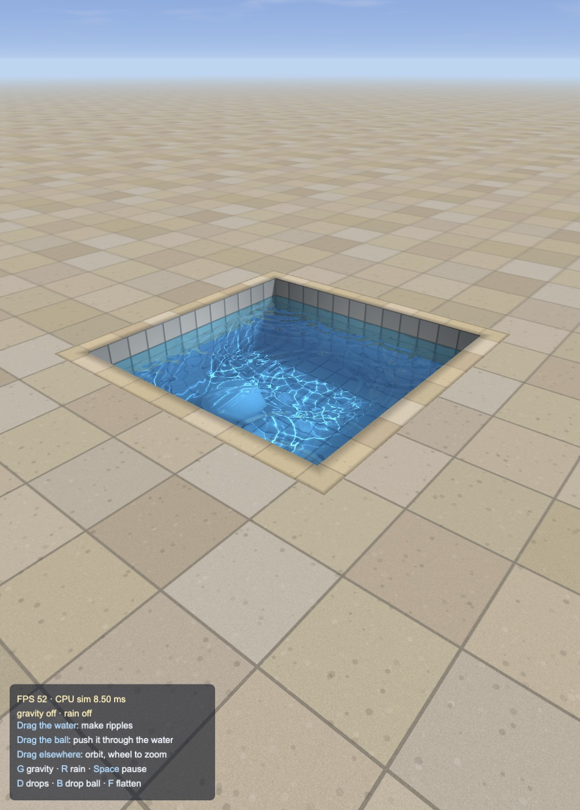
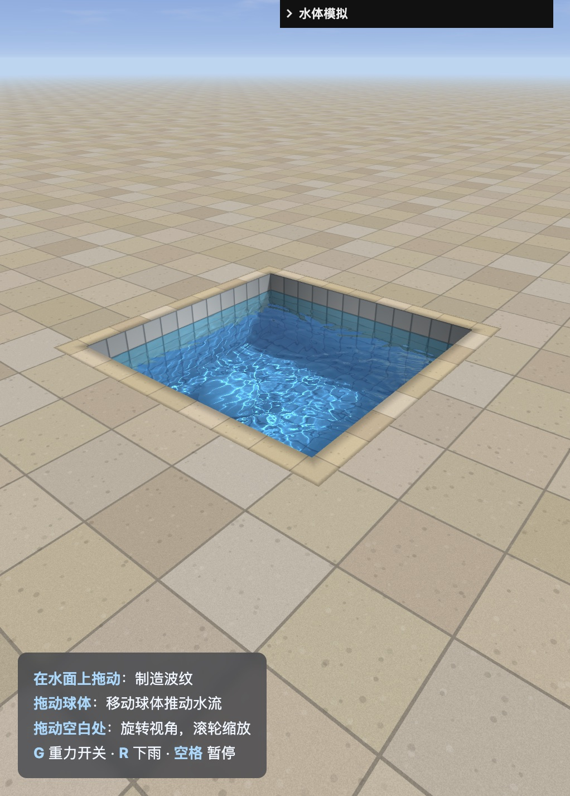
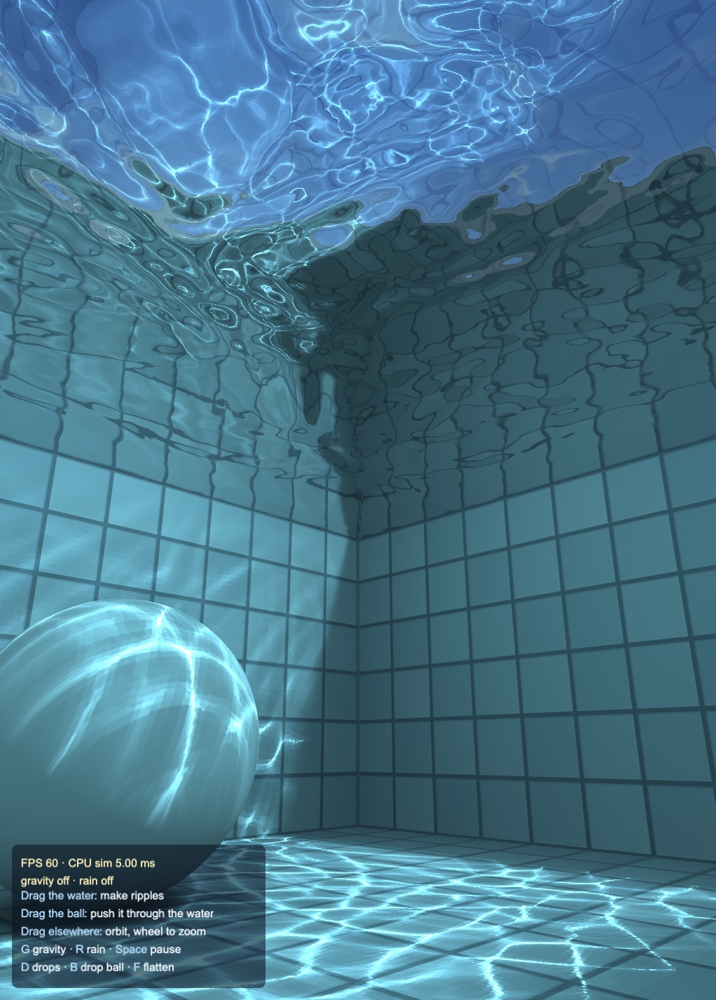
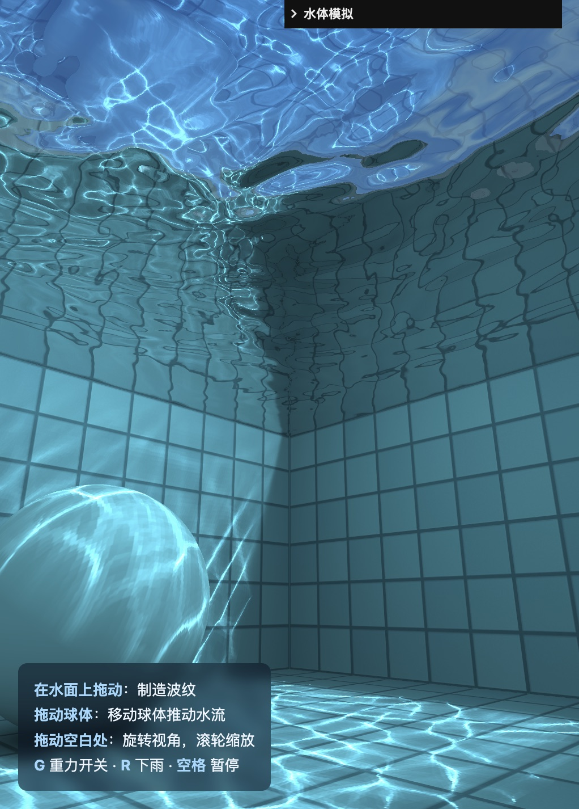
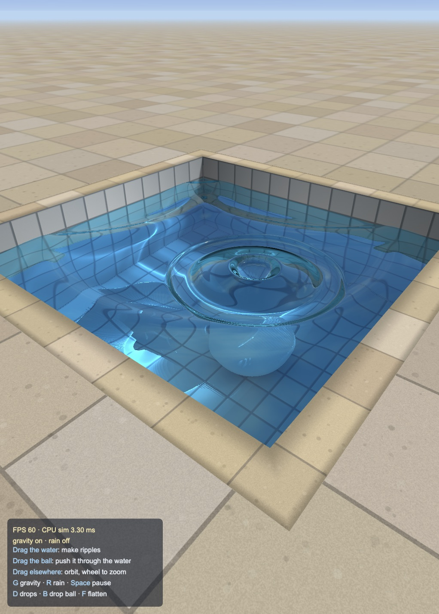

# Pool water

A port of Evan Wallace's WebGL Water (as rewritten for three.js) to Cocos
Creator 3.8, built and previewed with Enji.

| Enji | three.js reference |
|---|---|
|  |  |
|  |  |

## How it works

- `WaterSimulation.ts`: 256×256 height field stepped on the CPU and uploaded
  each frame into an RGBA32F data texture (the renderer has no float render
  targets; see the Enji rendering guide).
- `pool-caustics.effect`: the water grid rendered into an 8-bit render texture
  with `createTexturePass`, producing the caustics map.
- `pool-water.effect`, `pool-walls.effect`, `pool-sphere.effect`: ray-traced
  refraction and reflection against the pool box, sphere and sky cube map.
- `FloatingSphere.ts`: buoyancy and the sphere's displacement of the water.

## Controls

- Drag the water: ripples. Drag the ball: push it through the water.
- Drag elsewhere: orbit; wheel: zoom.
- `G` gravity, `R` rain, `Space` pause, `D` drops, `B` drop ball, `F` flatten.

## Performance

59.4 FPS at the default view (median frame 16.7 ms, p95 21.5 ms); CPU
simulation 4.8 ms per frame on average. Measured on an Apple Silicon Mac in the
Enji preview, 511×713 viewport at DPR 2.

Made with Enji 0.4 (`feat/3d-water`).
