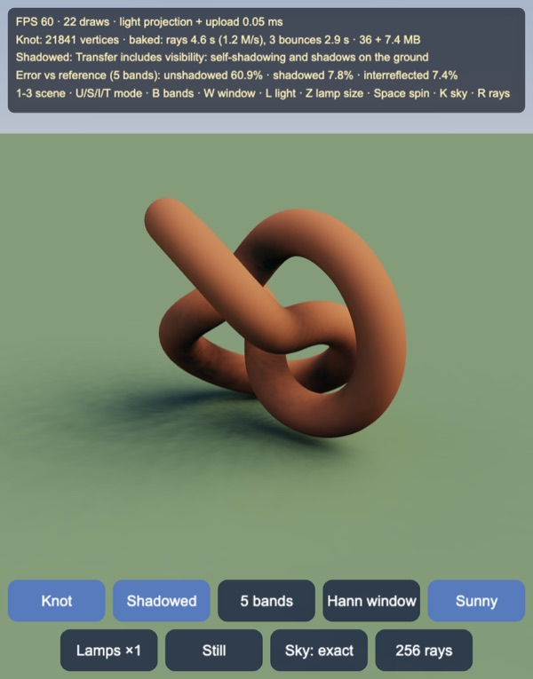
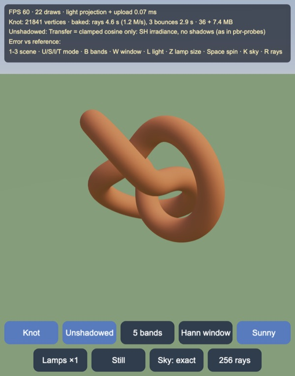
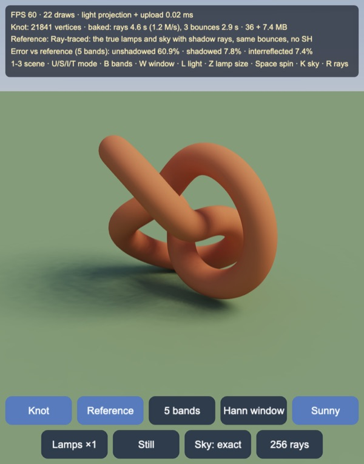
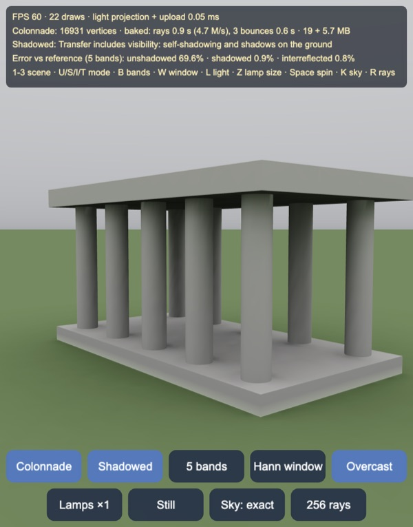
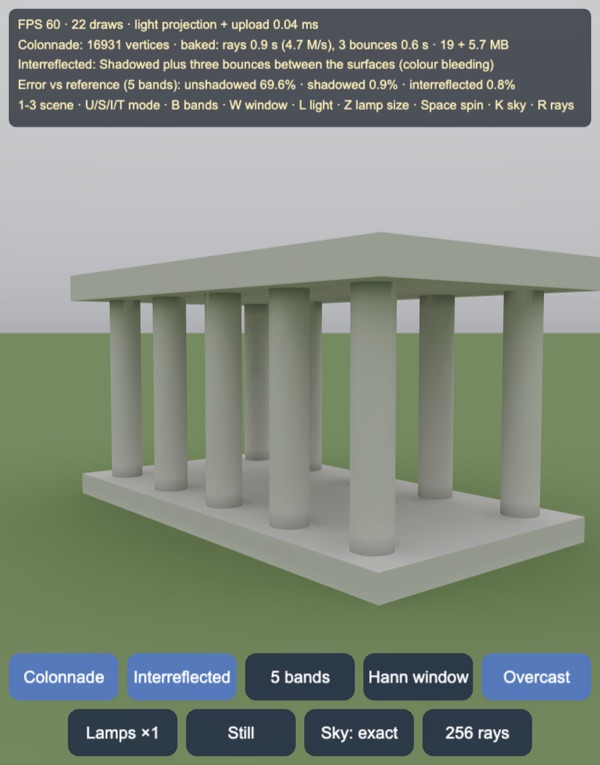
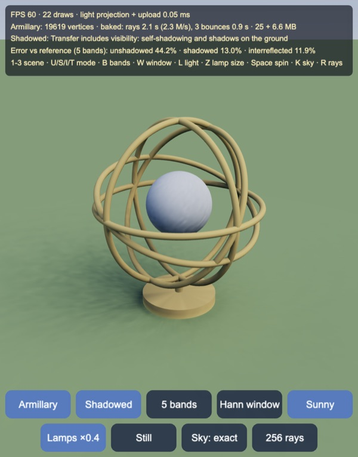
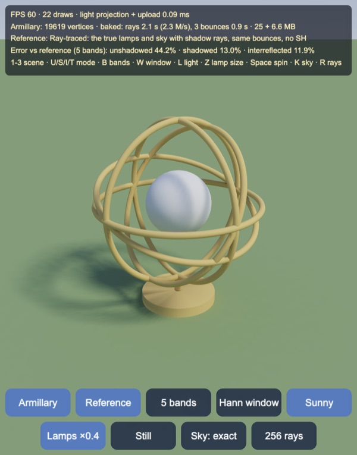
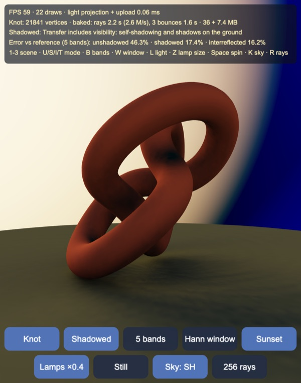
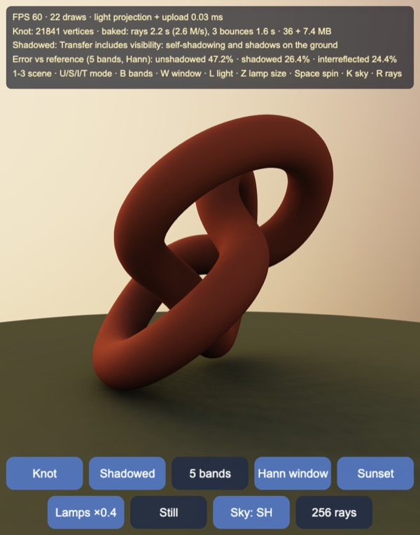

# Precomputed radiance transfer: self-shadowing and bounce light under any distant light

Diffuse **precomputed radiance transfer** (Sloan, Kautz & Snyder 2002) for
Cocos Creator 3.8, built and previewed with Enji. Each vertex of a scene stores
a **transfer vector** of 25 spherical-harmonic coefficients per colour channel.
The vector holds how that vertex responds to light from every direction,
including its own shadows and the light bounced onto it by the rest of the
scene. At runtime the distant lighting (a sky gradient plus up to three round
lamps) is projected to 25 coefficients each frame, and every vertex is shaded
by a dot product in the vertex shader. Lighting can then rotate, change colour
or change size freely and the shadows and bounces follow, at 60 FPS.

The transfer is baked in the browser after the scene loads, time-sliced so the
app stays interactive, and shows progressively as it fills in. Four modes can
be compared on the same scene:

1. **Unshadowed**: the transfer of a lone surface, \(\rho \hat A_l Y(n)/\pi\).
   The same as lighting with an SH irradiance probe, so there is no shadow.
2. **Shadowed**: the transfer includes visibility. Each vertex is occluded by
   the rest of the scene, and the ground gets shadows.
3. **Interreflected**: the shadowed transfer plus three bounces of light
   between surfaces.
4. **Reference**: the same lighting ray-traced per vertex without SH, so the
   error of each mode can be measured and shown on screen.



| Unshadowed (SH irradiance only) | Ray-traced reference |
|---|---|
|  |  |

| Colonnade, overcast, shadowed: 0.9 % error | Colonnade, overcast, interreflected: 0.8 % |
|---|---|
|  |  |

| Armillary, lamps ×0.4, shadowed PRT: 13 % | Ray-traced reference: the rings' shadows PRT cannot hold |
|---|---|
|  |  |

| Sky as its 5-band SH (blue = negative) | Same sky with a Hann window |
|---|---|
|  |  |

## How it works

`assets/game/prt/` splits into pure TypeScript and engine code. The pure
modules are the maths, the bake and the data layouts, and the Node tests
import them directly:

| Module | Role |
|---|---|
| `SH` | Real SH basis for bands 0–4, zonal harmonics (clamped cosine, caps), Hann window, Fibonacci and cosine-distributed directions |
| `Bvh` | Binned-SAH BVH over the scene's triangles, closest hit and any hit |
| `Scenes` | The three scenes as indexed meshes with per-vertex normals and albedo |
| `Bake` | Ray tracing, the sparse bounce matrix, bounces, buried-vertex dilation |
| `Env` | Sky gradient and lamps, their SH projection, the presets |
| `Reference` | Ray-traced shading for one lighting, the error metric |
| `Pack` | Float texture layouts for the transfer and the light |

The engine modules are `Meshes` (the meshes with a vertex id attribute and the
sky sphere) and `MainView`. `effects/chunks/prt-common.chunk` repeats the
basis, texture layouts and tone mapping in GLSL, and tests check that the two
copies agree.

### Transfer vectors

A diffuse vertex with albedo \(\rho\) and normal \(n\), lit by distant
radiance \(L(\omega)\), leaves radiance

\[ B = \frac{\rho}{\pi} \int_{S^2} L(\omega)\, V(\omega)\, \max(n\cdot\omega, 0)\, d\omega, \]

where \(V\) is 1 if direction \(\omega\) reaches the sky. Write the light as
\(L(\omega) = \sum_i L_i Y_i(\omega)\) with real SH basis functions \(Y_i\).
Then \(B = \sum_i L_i T_i\) with

\[ T_i = \frac{\rho}{\pi} \int Y_i(\omega)\, V(\omega)\, \max(n\cdot\omega, 0)\, d\omega. \]

\(T\) depends only on the geometry, so it is baked once. \(L\) depends only
on the lighting, so it is projected once per frame for the whole scene. The
basis uses bands \(l = 0\ldots4\) (25 coefficients), z as the polar axis and no
Condon–Shortley phase. The test checks it is orthonormal to 1.1e-6 and that
each band satisfies the addition theorem, which means rotations do not change
its accuracy.

**Unshadowed** (\(V = 1\)): \(\max(n\cdot\omega, 0)\) is a zonal function
around \(n\). By the Funk–Hecke theorem, its projection is
\(\hat A_l Y_{lm}(n)\), where \(\hat A_l = 2\pi\int_{-1}^{1}\max(t,0)P_l(t)\,dt
= \pi,\ 2\pi/3,\ \pi/4,\ 0,\ -\pi/24\). So
\(T_{lm} = \rho \hat A_l Y_{lm}(n)/\pi\), which is exactly an SH irradiance
probe.

**Shadowed**: \(V\) is found by tracing \(M\) rays per vertex (256 by default,
64 or 1024 selectable). The rays are cosine distributed (pdf
\(\cos\theta/\pi\), Malley's method on a Fibonacci disc), so the cosine and
the \(1/\pi\) cancel out of the estimator:

\[ T_i \approx \frac{\rho}{M} \sum_{j\,\text{escaped}} Y_i(\omega_j). \]

Each vertex's ray pattern is turned about its normal by a golden-ratio angle
(\(2\pi\{v\varphi\}\)). Without this, neighbouring vertices with nearly equal
normals share one pattern, and its error shows as streaks rather than fine
noise. Ray origins are offset by 1.5 mm along the normal.

**Interreflected**: a ray that hits the scene picks up whatever leaves the hit
point. That is the hit point's transfer from the previous bounce, interpolated
from the hit triangle's three vertices with the barycentric weights. Every ray
is fixed at bake time, so each bounce is a linear map:

\[ T^{b}(p) = \frac{\rho_p}{M} \sum_q W_{pq}\, T^{b-1}(q), \qquad T = T^0 + T^1 + T^2 + T^3, \]

where row \(p\) of the sparse matrix \(W\) sums the barycentric weights of
\(p\)'s rays on each vertex \(q\). \(W\) is gathered during ray tracing in CSR
form. The columns are `Uint16` (scenes stay under 65,536 vertices), and the
weights are `Uint16` fractions with \(W_{pq}/M = w/65535\), since each row
sums to at most \(M\). Rays that hit a back face (they started inside a
solid) bring nothing. Each bounce costs one pass over \(W\) with 75 floats per
non-zero, and the colour bleeding comes from multiplying by \(\rho_p\) per
channel. That is why the interreflected transfer is RGB (75 floats) while the
shadowed one is scalar (25 floats, times albedo).

The test for this is a white furnace: a sphere over a ground disc, albedo 1
everywhere, under uniform light 1. Every surface should then leave radiance
1. The shadowed transfer alone falls to 0.004 where the sphere meets the
ground, and ten bounces bring every vertex to 1.000.

### Buried vertices and dilation

Where one solid stands on another, such as the ground under the colonnade's
plinth, vertices lie inside a solid. Most of their rays hit back faces, so
their transfer is nearly black. That alone would not matter, but triangles
that straddle the plinth's edge interpolate between those black vertices and
lit ones, and show dark teeth along the edge.

A vertex counts as **buried** when more than half its rays hit back faces.
After the rays, buried vertices are filled ring by ring, as lightmap texels
are dilated: each one takes the mean of its unburied or already filled
neighbours, until nothing changes. The fill order is planned once and applied
to the shadowed transfer, to each bounce, and to the reference's direct light
and bounces. The test puts a plinth on a ground disc. All 4475 ground vertices
under it are marked buried, none outside it, and the filled values are at
least 0.134 (an open ground vertex has \(T_{00} = 0.282\)).

### Lighting and its projection

The sky is a gradient \(h + (z-h)\sqrt{y}\) above the horizon and a constant
below it. That constant, `below`, is set to what a ground of the scene's
albedo far away reflects, \(\rho E_\text{horiz}/\pi\). Without it, the open
ground beyond the disc reads as black and every vertex near the horizon
darkens. The sky's 75 coefficients are projected numerically once per preset
over 4096 Fibonacci directions.

A lamp is a cone of constant radiance with half-angle \(\alpha\), given by
the irradiance \(E\) it delivers at normal incidence. Its radiance is
therefore \(E/(\pi\sin^2\alpha)\), and resizing a lamp only changes how soft
its shadows are, not how bright it is. A cap is zonal too, with Legendre
moments

\[ k_0 = 2\pi(1-\cos\alpha), \qquad k_l = \frac{2\pi\,(P_{l-1}(\cos\alpha) - P_{l+1}(\cos\alpha))}{2l+1}, \]

so its projection rotated to direction \(d\) is
\(L_{lm} = L_\text{lamp}\, k_l\, Y_{lm}(d)\). That is 25 multiply–adds per
lamp, so the lamps can move every frame. Projecting the lighting and uploading
it costs 0.03–0.11 ms per frame.

The presets are Sunny (one lamp, \(\alpha = 0.3\)), Sunset (a low lamp),
Overcast (sky only, bright zenith) and Studio (three lamps). Lamp sizes are
×1, ×0.4 and ×2.

### Ringing and the Hann window

Cutting a small lamp off at band 4 rings: its SH reconstruction has negative
lobes around it, visible in blue in the "Sky: SH" view. The **Hann window**
\(\sigma_l = (1+\cos(\pi l/n))/2\) tapers the high bands (Sloan, "Stupid SH
tricks"). In the test, the most negative value of a small lamp goes from
−0.149 to −0.037 of its peak.

The window has a cost. It blurs the light, so its RMS error against the
reference is **higher** in every case measured (see the table below; for
example 8.7 % becomes 15.0 % for the knot under the sunny preset). It is a
switch and off by default. It helps when ringing is visible as dark halos,
not when accuracy is the goal.

### The reference

To measure PRT's error and not just look at it, `Reference` shades every
vertex for the current lighting without SH:

\[ B_\text{direct}(p) = \frac{\rho}{M}\sum_{j\,\text{escaped}} L_\text{sky}(\omega_j)
\;+\; \sum_\text{lamps} \frac{\rho}{\pi}\, L_\text{lamp}\, \frac{\Omega}{K}\sum_{k=1}^{K} V(\omega_k)\max(n\cdot\omega_k,0), \]

with \(\Omega = 2\pi(1-\cos\alpha)\). The sky term reuses the bake's escaped
rays, kept as a bitmask, so the only difference from shadowed PRT is the band
limit. Each lamp gets \(K = 48\) shadow rays spread over its cone (a
Fibonacci cap). The bounces use the same \(W\) on RGB radiance. Shadowed PRT
is compared against the direct term and interreflected PRT against the total.
The error is the relative RMS of luminance over all vertices. A reference
takes 0.2–0.8 s, time-sliced. It runs whenever the light is still and the
lighting has changed.

Two identities check the pipeline. Under uniform light, interreflected PRT
equals the reference to 2.3e-6, since both use the same rays and \(W\). Under
a light that is already band-limited, \(\sum L_i T_i\) equals the sum over
escaped rays to 2.8e-8.

### GPU layout

The transfer lives in an RGBA32F texture. Each vertex takes 21 texels: three
channels × seven groups of four coefficients, the last group padded. There are
48 vertices per row, so the texture is 1008 texels wide; the knot needs 456
rows (7.4 MB). The light is a 21×1 texture in the same layout, uploaded every
frame. The scene mesh carries a vertex id attribute `a_vid`. The vertex shader
finds the vertex's row and column and does seven `vec4` dot products per
channel:

```glsl
for (int j = 0; j < 7; j++) {
  c.r += dot(texelAt(transferTex, col + fj, row, tsize), texelAt(lightTex, fj, 0.0, lsize));
  // … g and b at col + 7 and col + 14
}
```

The fragment shader applies the exposure (0.65), Narkowicz's ACES fit and
gamma 2.2. In reference mode, the texture holds each vertex's radiance in
coefficient 0 and the light is a unit vector, so the same shader shows it.

The sky is a sphere centred on the camera, drawn at depth 1 (`p.xyww`,
`depthFunc: less_equal`, no depth write). It shows either the exact gradient
and lamps or, with "Sky: SH", the SH reconstruction the scene is actually lit
by (negative values tinted blue). That is how the ringing shots were made.

### Scenes

All three scenes stand on a ground disc 4.5 m across, with rings that get
denser towards the centre (\(r = R(i/n)^{1.6}\)) where the shadows are.

| Scene | Vertices | Triangles | What it tests |
|---|---|---|---|
| Knot | 21,841 | 43,500 | A (2, 3) torus knot tube, parallel-transported frames with the twist spread along it; deep self-occlusion where the tube crosses itself |
| Colonnade | 16,931 | 31,936 | Ten columns between a plinth and a roof; contact shadows, light between columns, buried ground under the plinth |
| Armillary | 19,619 | 38,672 | Five brass rings around a ball; thin occluders, high-frequency shadows PRT cannot keep |

A test checks that every triangle in each scene winds towards its vertex
normals. One flipped triangle would make its rays start on the wrong side.

## Results

All numbers are relative luminance RMS against the reference over every
vertex, from `tools/test.mts` (lights unrotated, 256 rays, 3 bounces).
"Shadowed n = 1…5" keeps 1 to 5 SH bands of the light.

| Scene | Light | Unshadowed | Shadowed n = 1 / 2 / 3 / 4 / 5 | Interreflected |
|---|---|---|---|---|
| Knot | Sunny | 58.4 % | 49.2 / 22.4 / 15.3 / 11.5 / 8.7 % | 8.3 % |
| Knot | Sunset | 44.2 % | 57.6 / 37.5 / 21.4 / 16.6 / 11.9 % | 11.0 % |
| Knot | Overcast | 52.6 % | 36.9 / 4.1 / 1.7 / 0.8 / 0.6 % | 0.6 % |
| Knot | Studio | 56.7 % | 48.6 / 24.6 / 15.6 / 11.5 / 8.3 % | 7.9 % |
| Colonnade | Sunny | 73.3 % | 52.0 / 25.6 / 15.2 / 8.5 / 6.2 % | 5.6 % |
| Colonnade | Sunset | 55.9 % | 61.7 / 41.2 / 21.8 / 13.8 / 11.9 % | 10.4 % |
| Colonnade | Overcast | 69.6 % | 40.0 / 5.2 / 2.4 / 1.2 / 0.9 % | 0.8 % |
| Colonnade | Studio | 73.2 % | 49.9 / 26.2 / 16.5 / 10.3 / 6.8 % | 6.2 % |
| Armillary | Sunny | 41.2 % | 47.4 / 20.2 / 11.1 / 7.6 / 5.9 % | 5.3 % |
| Armillary | Sunset | 39.4 % | 54.2 / 33.8 / 17.8 / 13.1 / 10.3 % | 9.2 % |
| Armillary | Overcast | 39.1 % | 35.4 / 4.1 / 1.5 / 1.0 / 0.7 % | 0.7 % |
| Armillary | Studio | 39.4 % | 45.9 / 21.4 / 12.3 / 9.4 / 6.3 % | 5.7 % |

What the table shows:

- **Visibility is the point.** Unshadowed lighting (an SH probe) is off by
  39–73 %, mostly because it lights the ground under objects and the insides
  of folds. Shadowed PRT at 5 bands cuts that 4–12× under lamps and 56–88×
  under the overcast sky.
- **Low-frequency light is nearly exact.** Under the overcast sky, 3 bands
  are within 2.4 % and 5 bands within 0.9 %. This is the case PRT was made
  for.
- **Sharp light needs many bands.** The sun and sunset lamps keep improving
  up to band 4 and still leave 6–12 %. Low suns (Sunset) are the worst,
  because most of their energy grazes surfaces where the cosine lobe is cut
  off most sharply.
- **Bounces are cheap and accurate.** Interreflected PRT is always slightly
  closer to the total than shadowed PRT is to the direct light. The bounces
  are smooth, so the band limit costs them almost nothing.

### Lamp size: the frequency limit

From `tools/bench.mts`, shadowed PRT against the direct reference, bands
2 / 3 / 4 / 5, without and with the Hann window:

| Scene | Light | Lamps | Plain | Hann |
|---|---|---|---|---|
| Knot | Sunny | ×1 | 22.4 / 15.3 / 11.5 / 8.7 % | 33.8 / 24.1 / 18.5 / 15.0 % |
| Knot | Sunny | ×0.4 | 27.0 / 21.0 / 18.1 / 15.9 % | 37.0 / 28.3 / 23.5 / 20.5 % |
| Knot | Sunny | ×2 | 16.7 / 8.5 / 4.5 / 2.5 % | 29.9 / 19.5 / 13.5 / 9.9 % |
| Knot | Studio | ×1 | 24.6 / 15.6 / 11.5 / 8.3 % | 34.4 / 25.6 / 20.1 / 16.2 % |
| Colonnade | Sunny | ×0.4 | 28.0 / 18.3 / 12.6 / 11.1 % | 37.7 / 28.2 / 22.1 / 17.8 % |
| Colonnade | Sunny | ×2 | 20.6 / 10.1 / 3.8 / 2.0 % | 32.4 / 22.0 / 15.7 / 11.6 % |
| Armillary | Sunny | ×0.4 | 23.8 / 16.3 / 13.8 / 12.5 % | 34.6 / 25.2 / 20.0 / 17.0 % |
| Armillary | Sunny | ×2 | 15.8 / 6.8 / 3.9 / 3.0 % | 28.6 / 18.2 / 12.3 / 8.9 % |
| Armillary | Studio | ×0.4 | 25.7 / 18.0 / 15.8 / 13.3 % | 35.1 / 26.8 / 21.9 / 18.7 % |

Five bands resolve features of roughly 180°/5 ≈ 36°. A lamp with a half-angle
of 0.6 rad (×2) fits, and the error falls to 2–3 %. A lamp of 0.12 rad (×0.4)
does not: its shadow is smeared into a dark patch, and adding bands from 4 to
5 barely helps. The armillary shots show this. The reference has crisp ring
shadows on the ground and ball, and the PRT version has a soft blob. The real
sun is 0.0047 rad across.

This is why games pair PRT or SH lighting for the sky and bounce light with
shadow maps for the sun, rather than using PRT alone. The 256-ray noise in the
high-order coefficients also shows on smooth surfaces under small lamps, as
the faint mottling on the armillary's ball.

## Performance

Measured on an Apple M5 MacBook in Chrome, with the machine under other load
(load average 5–7). The bake runs in 12 ms slices per frame and uploads the
partial transfer every 250 ms.

| Scene | Rays per vertex | Ray tracing | 3 bounces | \(W\) non-zeros | Bake memory | Transfer texture |
|---|---|---|---|---|---|---|
| Knot | 256 | 2.2 s (2.6 M rays/s) | 1.6 s | 5.9 M | 36 MB | 7.4 MB |
| Colonnade | 256 | 0.9 s | 0.6 s | 2.3 M | 19 MB | 5.7 MB |
| Armillary | 256 | 2.1 s (2.3 M rays/s) | 0.9 s | 3.5 M | 25 MB | 6.6 MB |

In Node (`tools/bench.mts`, same load), varying the ray count:

| Scene | Rays | BVH build | Ray tracing | 3 bounces | \(W\) non-zeros | Bake memory |
|---|---|---|---|---|---|---|
| Knot | 64 | 70 ms | 0.58 s | 0.34 s | 1.6 M | 18 MB |
| Knot | 256 | 71 ms | 2.39 s | 1.20 s | 5.9 M | 35.5 MB |
| Knot | 1024 | 99 ms | 9.53 s | 3.87 s | 17.8 M | 85 MB |
| Colonnade | 256 | 46 ms | 1.06 s | 0.61 s | 2.3 M | 18.5 MB |
| Armillary | 256 | 44 ms | 1.85 s | 0.92 s | 3.5 M | 24.6 MB |

Ray tracing runs at 2.3–4 M rays/s on one thread under load (up to about
5 M/s idle). \(W\) grows less than linearly with the ray count, because more
rays land on vertices already in the row. Storing \(W\) as 16-bit columns and
weights and freeing the bounce buffers when done brought the knot's bake from
72 MB to 35 MB.

At runtime the whole scene is 22 draws at 60 FPS. The per-frame CPU work is
the light projection and a 21-texel upload, 0.03–0.11 ms. The GPU cost is in
the vertex shader: 42 texture fetches and 21 `vec4` dot products per vertex.
The bake itself only runs once per scene and ray count.

Phones have not been measured. For a phone build, the bake would move offline
and ship as data; the 4-band light (16 coefficients, 12 texels) or a
half-float texture would halve the transfer's size and fetches.

## Controls

- Buttons: scene (Knot / Colonnade / Armillary), mode (Unshadowed / Shadowed
  / Interreflected / Reference), bands (5, 4, 3, 2, 1), Hann window, light
  preset, lamp size (×1, ×0.4, ×2), spin or still, sky exact or SH, rays per
  vertex (256, 1024, 64; changing it re-bakes).
- Drag to orbit, wheel or pinch to zoom.
- Keys: `1`–`3` scene, `M` next mode or `U` / `S` / `I` / `T` for a mode,
  `B` bands, `W` window, `L` light, `Z` lamp size, `Space` spin, `K` sky,
  `R` rays.

The error line updates once the bake is done and the light is still: the
reference is traced, then all three modes are measured against it at the
current band count and window.

## Tests

`node --no-warnings --import ./tools/ts-resolve.mjs tools/test.mts` runs 26
checks in about 25 s:

- SH basis orthonormal (1.1e-6) and rotation invariant per band (5.6e-15);
  clamped-cosine moments; cap moments against numeric integration; a rotated
  cap's closed-form projection against brute force (9.2e-5); the Hann window
  shrinking a small lamp's negative lobes (−0.149 → −0.037).
- BVH closest hit and any hit against brute force over 300 rays (0
  mismatches).
- A convex sphere's shadowed transfer equals its unshadowed one (0.0027); the
  ground under a sphere matches the analytic view factor (worst 0.0076 for
  factors up to 0.174); the white furnace (10 bounces reach 1.000).
- PRT equals the reference under uniform light (2.3e-6) and under
  band-limited light (2.8e-8).
- Buried ground under a plinth detected and filled (4475/4475, none outside).
- Every triangle of each scene winds towards its normals.
- The error falls as bands are added, the overcast sky stays under 2 % at 5
  bands, and visibility cuts the error at least 3× against unshadowed. It
  also prints the error table above.
- The packed textures reproduce \(\sum L_k T_k\) for every vertex (2.5e-6);
  the GLSL constants match `Pack.ts`; the GLSL basis matches `SH.ts` exactly;
  the sky shader uses the same gradient as `Env.ts`; cosine rays have mean
  \(\cos\theta = 2/3\).

`tools/bench.mts` prints the bake and lamp-size tables above (about 1 min).

## Engine notes

- New effects need `enji import assets/resources/effects`, and sometimes
  `enji host stop && enji host start`, before the preview bundle finds them.
- The template scene renders in HDR with physical exposure. These effects
  write display colours themselves, so `skybox.useHDR` is set to false.
- The scene meshes are written straight into one `Mesh.reset` buffer:
  interleaved floats (`a_position`, `a_vid`) and 16-bit indices, so each
  scene is one draw and stays under 65,536 vertices. The `Uint16` columns of
  \(W\) rely on the same limit.
- Float textures use `NEAREST` filtering: WebGL2 samples RGBA32F without the
  linear-filtering extension only that way, and the shader reads exact texels
  anyway.
- The orbit camera clamps its pitch to 3°–85°, so the camera always looks
  down a little; the ringing shots look across at a low sunset lamp.

## Not in this demo yet

- **Glossy transfer.** Diffuse PRT is a vector per vertex; glossy PRT needs a
  25×25 transfer matrix per vertex (or per texel), times the BRDF.
- **Per-pixel PRT.** The transfer is per vertex, so shadow detail is limited
  by the mesh. Lightmap-style PRT textures would decouple the two.
- **Dynamic objects.** The transfer assumes rigid geometry. Moving objects
  would need their own transfer (or SH occlusion fields) and could not shadow
  the static scene.
- **Shadow maps for the sun.** The hybrid that games use, PRT for sky and
  bounce plus a shadow map for the key light, is described above but not
  built.
- **Phones.** No measurements; the bake would need to be offline there.

Made with Enji 0.3.
