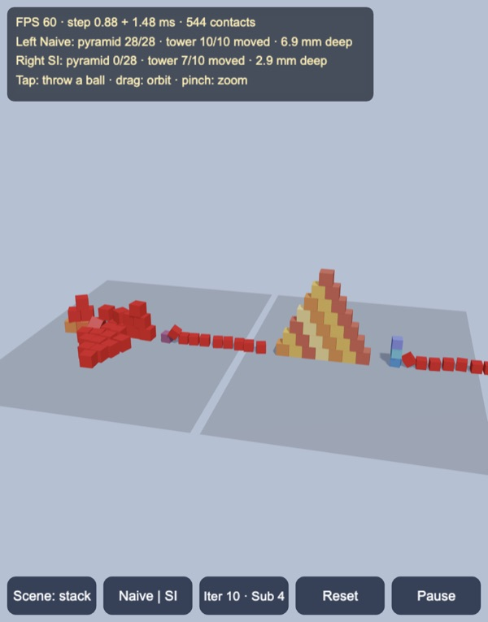
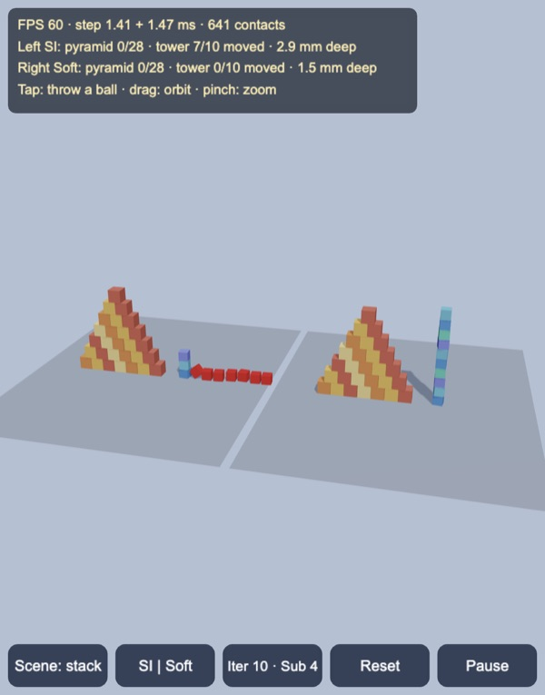
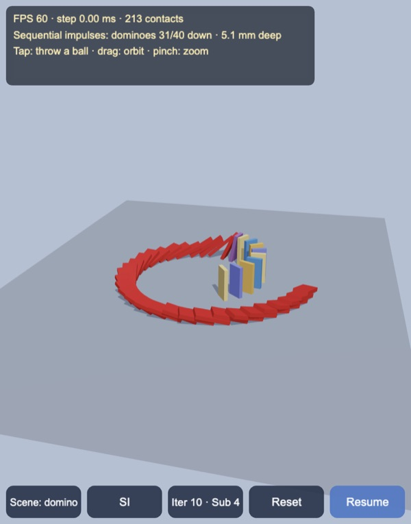
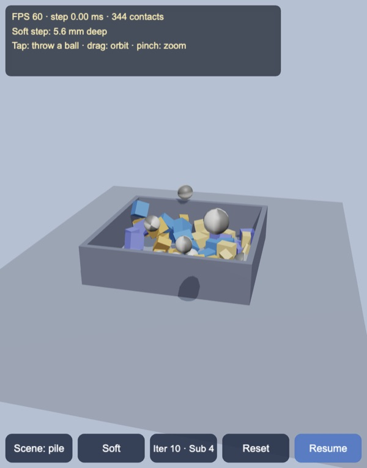

# 3D rigid body stacking: sequential impulses, side by side

Rigid boxes and balls on the CPU for Cocos Creator 3.8, built and previewed
with Enji: separating-axis box collision with clipped contact manifolds that
persist between frames, and three velocity solvers run side by side on the
same scene. **Naive impulses** clamp each iteration's impulse on its own and
start every frame from zero; **sequential impulses** (Catto 2005, Box2D-lite)
clamp the accumulated impulse and warm start from the previous frame;
**soft step** (Box2D v3, Catto 2024) uses substeps, soft contacts and a relax
pass. Boxes that drift more than 2 cm from where they were placed turn red.

The same pyramid of 28 boxes and tower of 10 twisted cubes. Naive clamping
cannot hold any of it: every iteration starts from a guess of zero, so ten
iterations never build up the force a box at the bottom carries. With
accumulated impulses and warm starting the pyramid stands indefinitely. The
ten-cube tower is too much for ten iterations, though.

The soft step at its default four substeps keeps the tower up as well.

## How it works

Plain TypeScript (`assets/game/rigid/`) in metres, one fixed 60 Hz step per
frame (two at most when a frame runs long).

- `Collide.ts`: narrow phase for boxes, spheres and the ground plane.
  - Box–box: separating-axis test over the 3 + 3 face normals and 9 edge
    cross products. Faces win unless an edge axis is clearly better (95% and
    5 mm tolerances, after Randy Gaul's qu3e), so a resting pair does not flip
    between features. A face contact clips the incident face against the
    reference face's four side planes (Sutherland–Hodgman); an edge contact is
    the closest points of the two support edges.
  - More than four points are reduced to four: a first point, the one
    furthest from it, then the two that span the most area. The first point
    is the deepest only when it is more than 1 cm deeper than the others;
    otherwise it is the extreme point along a tangent fixed by the normal.
    Starting from the deepest point every time let millimetre depth noise pick
    a different four corners of the octagon between two twisted cubes each
    frame. Warm starting then never matched, and the soft-step tower swayed by
    5 cm instead of 1.7.
  - Speculative contacts: pairs closer than 2 cm plus the distance either body
    can move this step get contact points, so fast bodies are caught the step
    before they would overlap.
- `World.ts`: sweep and prune along x, persistent manifolds keyed by body
  pair in a fixed order (shape, then id), and the solvers.
  - Warm starting: a new point inherits the old point's normal and friction
    impulses when their anchors in either body's frame are within 2 cm.
  - Each point has a normal row and two friction rows (box friction,
    |λt| ≤ μλn per direction). Speculative points allow the gap to close in
    one step (bias s/h); overlaps beyond a 5 mm slop are pushed out with
    Baumgarte (β = 0.2).
  - Naive: λ = max(0, Δλ) per iteration and friction bounded by that
    iteration's normal impulse, starting from zero every frame.
  - Sequential impulses: λ = max(0, λ + Δλ) on the accumulated impulse, warm
    started, 10 iterations by default.
  - Soft step: per substep integrate velocities, warm start, solve with soft
    contacts, integrate positions, relax without bias. The separation is
    updated in every substep from how far the bodies moved and turned, and
    overlaps are pushed by a damped spring (60 Hz, damping ratio 10, at most
    3 m/s).
- `RigidView.ts`: every body of every world in one dynamic mesh (24 vertices
  per box, 117 per sphere), written on the CPU each frame from positions and
  rotation matrices. One draw call plus the shadow map pass.

### Why the tall tower falls with sequential impulses

A face contact has four points, and which share of the weight each corner
carries is not determined by the physics. Gauss–Seidel sweeps over the corners
leave a little net torque every frame. With rotation locked, a ten-box column
settles under sequential impulses to 2 mm overlaps and stays there. With
rotation free, the error rocks the column and grows. These runs used the
twisted tower in the stack scene, for 30 s each:

| Solver | Effort | Tower after 30 s | Pyramid after 30 s |
|---|---|---|---|
| Sequential impulses | 4, 10 or 20 iterations | falls | stands |
| Sequential impulses | 40 iterations | stands, 4.8 cm max drift | stands |
| Soft step | 2 substeps | falls | one box past 2 cm at 12.6 s |
| Soft step | 4 substeps (default) | stands | one box past 2 cm at 15.2 s |
| Soft step | 8 substeps | stands | stands, all within 0.8 cm |

The soft step has a weakness of its own. With Box2D v3's default contact
stiffness of 30 Hz, the bottom contacts of the tower squeeze by up to 6 mm
under ten boxes. The compression on the lower side tilts the tower, which
loads that side more: a straight column of ten leaned 9 cm at the top after
8 s and kept going. At 60 Hz (the cap is a quarter of the 240 Hz substep
rate) the same column stays within 1 cm.

## Scenes

| Domino | Pile |
|---|---|
|  |  |

**Domino**: 40 dominoes (6 × 50 × 24 cm) on an inward spiral, with the first
one already tipping. All three solvers knock them all down; this scene shows
edge contacts and friction at many angles more than stacking.

**Pile**: 50 boxes of random sizes and 10 balls dropped into a static bin,
with four balls thrown in from the camera (tap anywhere).

`tools/bench.mts` runs every scene headless for 8 s. Step times are from Node
on a desktop that was heavily loaded by other processes (load average around
25 on 10 cores), so they are only a rough guide:

| Scene | Solver | Median step | 95th pct. | Contacts | Outcome after 8 s | Peak overlap |
|---|---|---|---|---|---|---|
| Stack | Naive | 1.25 ms | 2.80 ms | 278 | pyramid 28/28, tower 10/10 moved | 33 mm |
| Stack | Sequential impulses | 1.39 ms | 2.30 ms | 321 | pyramid 0/28, tower 7/10 moved | 6 mm |
| Stack | Soft step | 1.28 ms | 1.76 ms | 320 | pyramid 0/28, tower 0/10 moved | 3 mm |
| Domino | Naive | 0.72 ms | 1.10 ms | 236 | 40/40 down | 19 mm |
| Domino | Sequential impulses | 0.76 ms | 1.08 ms | 229 | 40/40 down | 59 mm |
| Domino | Soft step | 0.92 ms | 3.85 ms | 233 | 40/40 down | 6 mm |
| Pile | Naive | 1.44 ms | 17.6 ms | 308 | settled | 66 mm |
| Pile | Sequential impulses | 1.12 ms | 8.47 ms | 259 | settled | 47 mm |
| Pile | Soft step | 1.32 ms | 14.3 ms | 272 | settled | 45 mm |

The peak overlaps happen briefly during the pile's drop and on edge contacts
between falling dominoes. Once things settle, the overlap is back at about the
slop (5–7 mm) under sequential impulses and 1–2 mm under the soft step.

`tools/test.mts` checks:

- face, twisted-face, edge–edge and separated box pairs, and the direction
  of the normal;
- a dropped box coming to rest;
- a sliding box stopping at v²/2μg under Coulomb friction (within 8%), with
  both stable solvers;
- that the naive solver loses the pyramid while sequential impulses keep it;
- that the soft step keeps both the pyramid and the tower;
- that every domino falls;
- that the pile settles inside the bin without NaNs.

## Controls

- Tap to throw a ball: it follows a ballistic arc through the tapped point,
  in every world at once. Drag to orbit; pinch or scroll to zoom.
- Buttons:
  - scene: stack, domino or pile;
  - mode: Naive | SI, SI | Soft, SI alone or Soft alone;
  - effort: 4, 10 or 20 iterations, with 2, 4 or 8 substeps;
  - reset and pause.
- Keys: `C` scene, `M` mode, `I` effort, `Space` pause, `R` reset.

## Performance

Not measured on phones yet. In the Enji preview on the loaded desktop the
HUD showed mostly 60 FPS with about 1–1.5 ms per world per step in every
scene. The
largest scene has 2 × 70 bodies and about 650 contact points. There is no
automatic quality step yet, and the shadow map is 2048².

## Not in this demo yet

- Sleeping and islands: settled stacks keep being solved, and any slow drift
  stays visible.
- Better convergence for tall stacks under PGS: a block solver for the four
  normal rows of a face, shock propagation, or relaxation.
- Continuous collision for thin, fast bodies. Speculative contacts catch most
  of it, but a falling domino edge can still overlap another by several
  centimetres for a step or two.
- Convex hulls (GJK/EPA), capsules, joints, restitution, and proper rolling
  resistance (balls use extra angular damping instead).
- Large mass ratios: heavy balls on light boxes sink in under sequential
  impulses (8.5 cm for a 51 kg ball on the 1–10 kg boxes of the pile, which
  is why thrown balls are now 20 kg).

Made with Enji 0.3.
