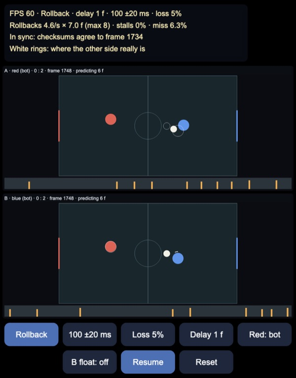
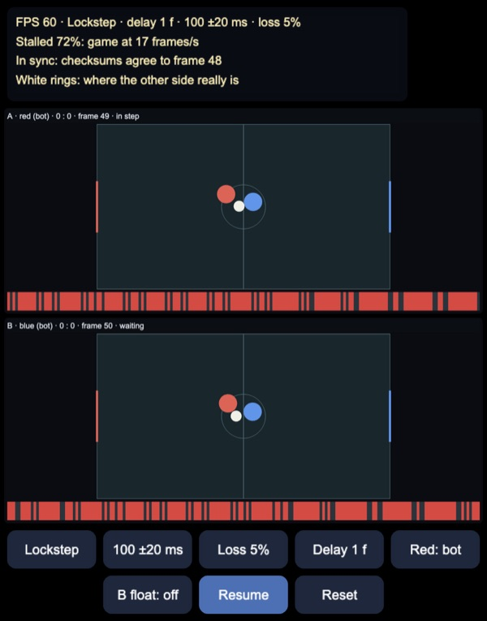
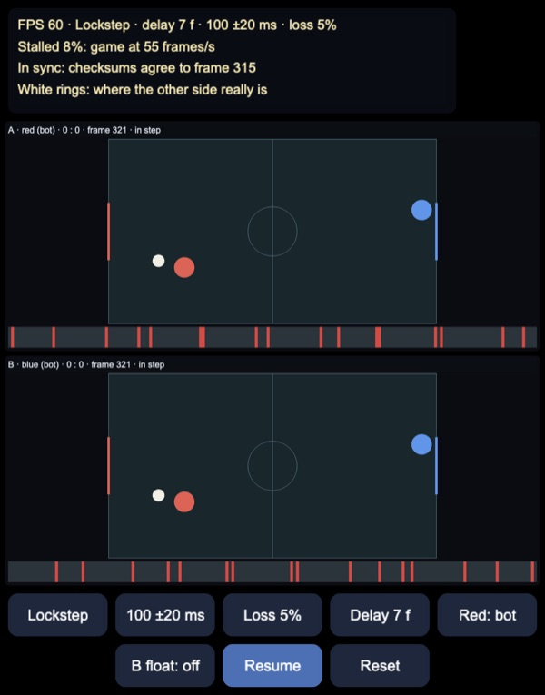
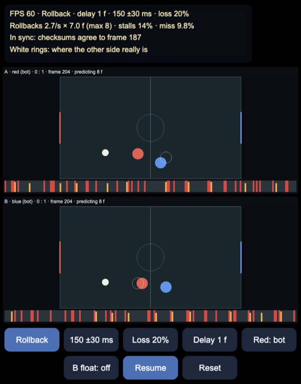
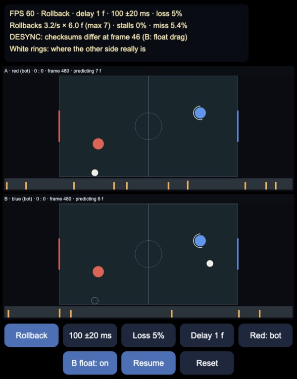

# Rollback netcode: prediction and rollback vs lockstep

GGPO-style **rollback netcode** for a small two-player puck game, for Cocos
Creator 3.8, built and previewed with Enji. Both players' machines run in the
same page as two peers, A (red) and B (blue), joined by a simulated network
with latency, jitter and packet loss. The game is a deterministic fixed-point
simulation: each peer runs it from local inputs plus the inputs it has
received, guesses the inputs it has not received yet, and when a guess turns
out wrong it restores a snapshot and re-simulates up to the present. A
lockstep mode runs the same game the classic way, waiting for the other
side's input before every frame.

Each panel is one peer's screen. White rings mark where the other player and
the puck really are, from a reference simulation that sees both inputs at
once. In the top panel, A has not yet heard that blue changed direction, so
it still shows the puck carrying on to the right; the rings show it has
already come off blue. When blue's input arrives, A rolls back and the puck
jumps to the rings. The strip under each panel shows the last three seconds,
one bar per tick: orange bars are rollbacks (height = frames re-simulated),
red bars are ticks where the peer had to stall.

## How it works

Plain TypeScript in `assets/game/net/`, independent of the engine; the view
only reads the peers' state. The page runs a fixed 60 Hz tick (at most four
per rendered frame); each tick delivers due packets, gives each peer its
input, lets each peer advance, and sends packets.

### A deterministic game

- `Fixed.ts`: Q16.16 fixed point in plain numbers that always hold integers.
  `fmul` and `fdiv` round towards zero, so the sign does not change the
  magnitude (with flooring, negative velocities never decayed to 0 under
  drag). `isqrt` is an exact integer square root: a float estimate corrected
  in both directions, exact up to 2^42.
- `Game.ts`: the whole game state is one `Int32Array` of 19 ints: frame,
  RNG, kickoff timer, scores, and position, velocity and dash cooldown for
  two players and the puck. `step(state, in0, in1)` moves both players
  (acceleration, drag, a dash with a 40-frame cooldown, each confined to its
  half), the puck (drag, wall bounces, goal mouths), resolves circle
  collisions with `isqrt`, and serves after a goal with an xorshift RNG that
  is part of the state. Inputs are five bits: up, down, left, right, dash.
  `checksum` is FNV-1a over the state.
- Snapshots are `Int32Array.set` copies; restoring one and re-simulating
  gives the same bits.

No floats touch the state. Float maths can differ between browsers, CPUs and
compilers (fused multiply-add, `Math.sqrt`/`Math.sin` implementations, x87
vs SSE), and any difference grows until the peers see different games.
Button **B float** makes peer B apply drag as a float multiply instead; its
game drifts from A's within a second and the checksum exchange reports it.

### Peers

`Peer.ts` keeps, per peer:

- a ring of 256 frame-tagged inputs for each side, and a ring of snapshots,
  one taken before each simulated frame;
- `remoteConfirmed`, the newest frame up to which every remote input has
  arrived;
- the remote input it actually used for each frame.

Each tick the peer:

1. Rolls back if an arrived remote input differs from the one it used:
   restores the snapshot of the earliest wrong frame and re-simulates to the
   present with the true inputs. It records how far the remote player jumped.
2. Schedules the local input for `frame + inputDelay`. An input delay of a
   frame or two hides part of the latency without any rollback.
3. Simulates one frame if allowed. Missing remote inputs are predicted as
   the last confirmed remote input (players mostly hold a direction). A peer
   may run at most 8 frames ahead of `remoteConfirmed`; past that it stalls,
   because long rollbacks look bad and cost time.

In **lockstep** mode the peer never predicts: it simulates a frame only when
the remote input for it has arrived, and otherwise stalls. Nothing is ever
wrong on screen, but every frame waits for the network. With an input delay
that covers the round trip it runs at nearly full speed, at the price of
every input taking effect that many frames late.

### Packets

`Link.ts` delays each packet by latency ± uniform jitter (so packets also
arrive out of order) and drops a fraction of them, from a seeded mulberry32
generator. Packets are small and redundant:

- every local input the other side has not acknowledged yet (up to 120), so
  one lost packet costs nothing once the next one arrives;
- an ack of the newest remote frame received;
- the checksum of this peer's newest *final* frame, one that no rollback can
  change any more, because both inputs for it are confirmed.

Each peer compares the other side's checksums with its own for the same
frame. A mismatch is a desync: the games have diverged and no rollback can
fix it. Real games then log the states, resync from the host, or drop the
match.

### The reference

`Session.ts` also runs a third copy of the game with both true inputs and no
network. It draws the white rings, and it is the test oracle: every final
frame of both peers must match it bit for bit.

## Results

Node tests in `tools/test.mts` run the full session headless for 3600 ticks
(one minute) with two bots, seed 7. "Final frames" are frames that both
peers have confirmed inputs for; "jumps" are how far the other player moved
in a single rollback; "view error" is how far the other player is drawn from
its true position on average. Distances are in field units: the field is
16 × 9 and the player radius 0.5.

| Mode, link | Input delay | Frames in 3600 ticks | Rollbacks | Stalls | Jumps mean / max | View error | Mismatches |
|---|---|---|---|---|---|---|---|
| **Rollback, 100 ±20 ms, 5% loss** | 1 | 3595 | 3.1/s, 6.2 frames (max 8) | 5 | 0.28 / 1.41 | 0.046 | 0 of 3590 |
| Rollback, same | 0 | 3540 | 3.3/s, 7.1 frames | 60 | 0.38 / 1.60 | 0.070 | 0 |
| Rollback, same | 2 | 3599 | 3.0/s, 4.9 frames | 1 | 0.22 / 1.22 | 0.031 | 0 |
| Rollback, same | 3 | 3600 | 3.0/s, 4.2 frames (max 6) | 0 | 0.15 / 1.22 | 0.019 | 0 |
| Lockstep, same | 1 | **873** | — | 2727 | — | 0 | 0 |
| Lockstep, same | 7 (117 ms) | 3270 | — | 330 | — | 0 | 0 |
| Rollback, 30 ±20 ms | 1 | 3600 | 3.1/s, 1.9 frames (max 4) | 0 | 0.06 / 0.77 | 0.004 | 0 |
| Rollback, 60 ±20 ms | 1 | 3600 | 3.0/s, 3.8 frames (max 7) | 0 | 0.14 / 0.83 | 0.015 | 0 |
| Rollback, 150 ±20 ms | 1 | 3077 | 2.7/s, 7.5 frames | 523 | 0.38 / 1.37 | 0.076 | 0 |
| Rollback, 100 ±20 ms, 30% loss | 1 | 3427 | 3.1/s, 6.1 frames | 173 | 0.28 / 2.58 | 0.053 | 0 |
| Rollback, perfect link | 1 | 3600 | 0 | 0 | — | 0 | 0 |
| Rollback, perfect link | 0 | 3600 | 3.2/s, 1 frame | 0 | 0.03 / 0.22 | 0.001 | 0 |

About 6% of predictions are wrong (8.6% at 30% loss): the bots hold each
decision for 5–12 frames, so "same as last time" is usually right. Rollback
keeps the game at full speed at 100 ms of latency; at 150 ms the 8-frame
window runs out and it stalls on 15% of ticks, still far less than lockstep.
Lockstep is always exact on screen, but at 100 ms with an input delay of 1
the game runs at a quarter of its speed. Two or three frames of input delay
roughly halve the jumps and the rollback depth, which is why most fighting
games default to a frame or two.

Other checks:

- `isqrt` is the exact floor square root for 200,000 random values up to 2^42.
- Two runs with the same inputs have the same checksum at each of 3600
  frames; one changed input changes the checksum of the next frame.
- Restoring a snapshot and re-simulating is bit-identical.
- No rollback ever re-simulates more than 9 frames (8 + the current one).
- With float drag on peer B the states first differ at frame 47 and the
  checksum exchange reports it at frame 61.

| Lockstep, input delay 1 | Lockstep, input delay 7 |
|---|---|
|  |  |

Left: at 100 ms lockstep stalls on 72% of ticks (red strip) and the game
crawls at 17 frames/s. Right: with 7 frames of input delay it stalls only
when jitter or a lost packet makes an input late, but every move takes
117 ms to show up, on both screens.

| Rollback, 150 ms, 20% loss | Desync from float maths |
|---|---|
|  |  |

Left: past the prediction window, rollbacks (orange) mix with stalls (red);
both peers predict the full 8 frames. Right: with float drag on B, the
checksums differ from frame 46 on; B's puck is at the right while the real
one (ring, bottom left) is where A has it.

## Controls

- Buttons: mode (rollback / lockstep), link (100 ±20, 150 ±30, 60 ±15,
  30 ±10 ms, perfect), loss (5%, 20%, 0%), input delay (1, 2, 3, 7, 0
  frames), red (bot / you), B float (desync on / off), pause, reset. Link and
  loss change live; mode, delay and B float restart the match.
- Play red yourself with **Red: you**: WASD or arrow keys and Space to dash;
  on touch, drag in a direction and tap (or touch with a second finger) to
  dash. Blue stays a bot. Your inputs go through peer A, so the top panel is
  your screen and the bottom one the opponent's.
- Keys: `M` mode, `L` link, `K` loss, `I` input delay, `H` human, `X` float
  desync, `P` pause, `R` reset.

## Performance

One game step is about 0.05 µs in Node; a full tick of both peers, rollbacks
included, about 1 µs in Node and 2 µs in the page. Drawing both panels with
one `Graphics` is about 80 µs. The page holds 60 FPS on desktop; the cost is
in the engine's own frame, not the netcode. Memory is fixed: 256 snapshots of
19 ints per peer.

## Not in this demo yet

- Time sync: real peers' clocks drift, and GGPO slows down the peer that is
  ahead ("frame advantage") so both predict about the same amount.
- Smoothing rollback jumps on screen, e.g. blending the drawn position
  towards the corrected one over a few frames.
- A real transport (WebRTC data channels or UDP) and more than two players
  or spectators.
- Saving inputs to replay a match, which determinism gives for free.
- A host recovering from a desync by sending its state.

Made with Enji 0.3.
