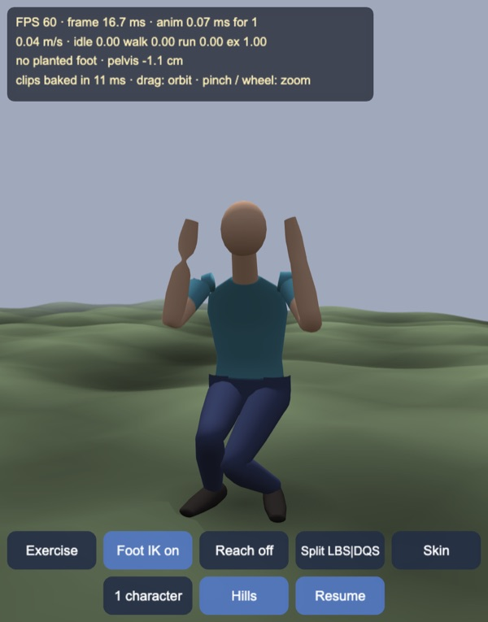
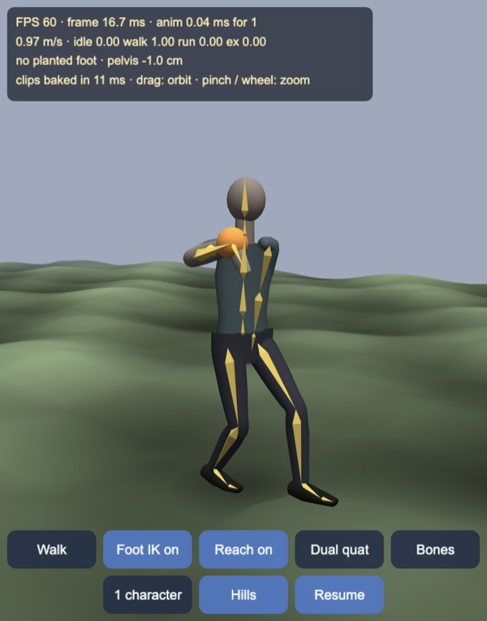
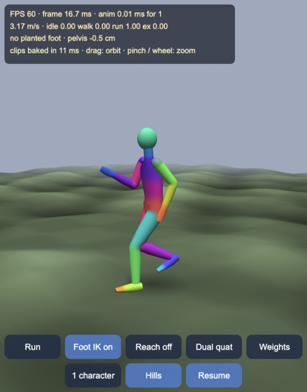
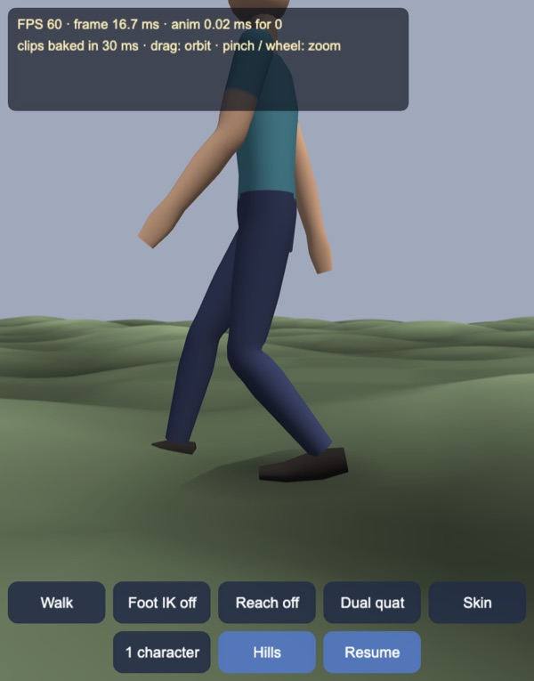
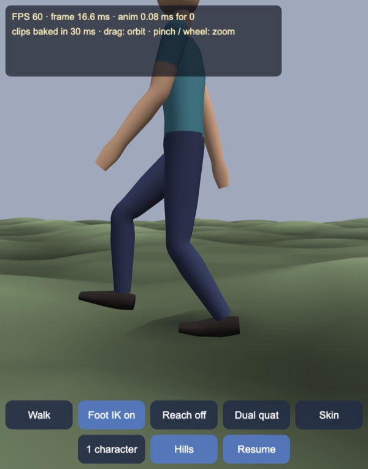
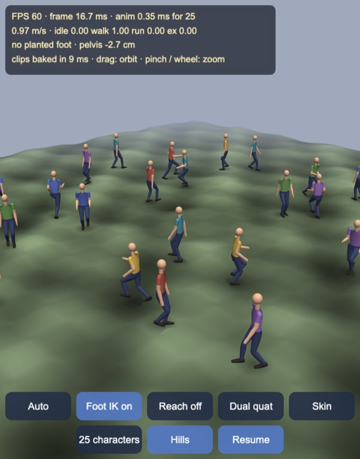

# Skeletal animation with two-bone IK

A procedural skeletal-animation stack for Cocos Creator 3.8, built and
previewed with Enji: a 19-joint humanoid, idle / walk / run / exercise clips
baked at start-up, a 1D speed blend on a shared phase with root motion, foot
and pelvis IK on rolling ground with planted feet pinned in place, a reaching
arm, and GPU skinning by linear blend or dual quaternions. The animation
runtime (`assets/game/anim/`) is plain TypeScript with no engine types, so
`tools/test.mts` runs the same code in Node.

Split view in the exercise clip: left of the screen centre the body is
skinned by linear blend, right of it by dual quaternions. The bent elbow and
the twisted wrist collapse into a pinch with linear blend and keep their
volume with dual quaternions.

## How it works

1. **Skeleton** (`Skeleton.ts`). 19 joints, 1.75 m tall, bind pose with
   identity rotations; poses are local rotations plus a root position, FK
   writes global positions and rotations.
2. **Two-bone IK** (`TwoBoneIk.ts`). Analytic: the hip–knee–ankle triangle
   by the law of cosines, the knee kept in the plane of the target direction
   and the knee's current bend direction (or a pole vector), so an animated
   knee keeps pointing where the clip had it. The end joint keeps its global
   rotation unless given a new one. Unreachable targets straighten the limb
   towards them, stopping just short of fully straight.
3. **Clips** (`Gait.ts`, `Clip.ts`). Walk and run are authored as foot
   trajectories (stance, stride, lift, heel-off, toe-off) and pelvis motion
   (bob, sway, yaw, lean); the legs are solved with the same two-bone IK and
   baked at 30 Hz, with arm swing and elbows on top. Where a stride would
   overstretch a leg, the bake lowers the hips for that frame instead of
   letting the foot miss. Idle breathes and shifts weight; the exercise clip
   bends elbows, knees and spine and twists the wrists, to show skinning.
   Baking all four takes 8–11 ms in the browser.
4. **Speed blend and root motion** (`Character.ts`). Idle → walk → run by
   speed, all sampled at one normalised phase so the feet of both clips hit
   the ground together. The blended cycle length is the weighted mean of the
   clip periods, and the root speed is Σ wₖ·vₖ·(Tₖ/T), so the ground moves at
   the speed the feet push it. Characters walk circles; `Auto` cycles idle 3 s,
   walk 5 s, run 4 s, walk 4 s.
5. **Foot and pelvis IK.** Each foot's contact weight comes from the clip.
   - A planted foot gets its ball of foot pinned in world space from contact
     0.75 (fully at 0.95); the ankle target is then the pin minus the foot's
     tilted ball offset, so the ball stays put while the heel lifts.
   - On terrain the foot is aligned to the ground normal (tilt at most
     0.45 rad) and lifted to the surface.
   - The pin lets go if the body has moved more than 0.12 m away from it;
     the leftover offset is capped and fades out at 14/s.
   - The pelvis drops by a smoothed minimum of the two legs' offsets, then
     by whatever keeps both targets within 0.81 m reach.
   - Turning foot IK off clears the pins (an earlier version kept stale pins,
     and the legs shot out on the next toggle; a test guards this now).
6. **Reach.** An orb wanders in front of the right shoulder, sometimes out
   of reach; the right arm reaches for it with the same two-bone IK (the
   elbow keeps the bend side of the swing animation), faded in and out.
7. **Skinning** (`Skinning.ts`, `anim-skin.effect`). Up to four influences
   per vertex in custom attributes. Per character and frame the CPU computes
   each joint's skinning transform and uploads it as a uniform array:
   - **Linear blend:** three vec4 rows per joint (57 vec4).
   - **Dual quaternions:** real and dual part per joint (38 vec4), hemisphere
     aligned to the first influence, blended, normalised and turned into a
     rotation plus translation in the vertex shader.
   - The choice is a shader define, one material per character and mode.
     Split mode draws the body twice and discards each half by screen side.
8. **Views.** Skin, weights (each joint's colour blended by weight) and
   bones (a muted body with the bone shapes drawn on top, depth test off).

## Views

| Bones, reaching for the orb | Weights, running |
|---|---|
|  |  |

| Foot IK off | Foot IK on |
|---|---|
|  |  |

The same frame on a slope: without foot IK the clip's flat-ground foot sinks
into the hill; with it the foot is placed on the surface, tilted to it, and
the pelvis drops so the other leg still reaches.

25 characters on five rings, each at its own speed and phase.

## Tests

`node --no-warnings --import ./tools/ts-resolve.mjs tools/test.mts`,
32 checks, all passing:

| Check | Result |
|---|---|
| IK reaches every reachable target; bone lengths kept | worst 7.0e-16 m; 7.8e-16 m |
| Knee stays on the animated side | 0 of 500 flipped |
| Baked clips: legs reach the authored feet | 0.00 mm in every frame of all four clips |
| Walk, raw clip, planted foot | slide 8.7 mm/s (0.9% of 0.97 m/s), height error 1.26 mm |
| Run, raw clip, planted foot | slide 35.9 mm/s (1.1% of 3.17 m/s), height error 5.38 mm |
| Walk / run with foot lock | slide 0; pin within 0.52 / 11.9 mm of the clip |
| Walk/run blend, shared phase vs separate clocks | 37 vs 91 mm/s slide; 399 vs 262 planted samples |
| Walk/run blend with foot lock | slide 0, pin within 5.7 mm of the blend |
| Planted ball of foot on uneven ground | 0.00 mm with foot IK; 17.2 mm mean, 89.6 mm worst without |
| Pelvis drop on uneven ground (walk / run) | at most 68 / 71 mm |
| Walking a 4 m circle | slide 0, pin within 33 mm of the clip |
| Foot IK toggled 11 times mid-walk | largest ankle step in one frame 63 mm (143 mm before the fix) |
| Test tube bent 120° | volume LBS 95.7%, DQS 99.4% |
| Test tube twisted 150° | volume LBS 90.1%, DQS 99.9% |
| Body in the exercise clip, 616 blended vertices | closest to its joint: LBS 27% of rest distance (right hand), DQS 100% |
| Body mesh | 3,559 vertices, 6,984 triangles; bones overlay 152 triangles |
| Character update (Node) | 17 µs per character, 25 characters 0.43 ms per frame |

The run clip skates 36 mm/s on its own because 30 Hz keyframes interpolate
the stance foot's arc linearly (at 120 Hz the error disappears). Rather than
bake at a higher rate, foot locking removes it at runtime, along with the
larger skating that blending two gaits and turning on a circle cause.

## Controls

- Drag to orbit, pinch or mouse wheel to zoom; the camera follows the first
  character.
- Buttons: speed (Auto, Idle, Walk, Run, Exercise); foot IK on / off; arm
  reach on / off; skinning (dual quaternions, linear blend, split); view
  (skin, weights, bones); crowd (1, 9, 25); hills on / off; pause.
- Keys: `S` speed, `F` foot IK, `R` reach, `K` skinning, `V` view, `C` crowd,
  `H` hills, `Space` pause.
- The HUD shows FPS, frame time and animation time, the blend weights and
  speed, the planted feet's ground error, slide and pelvis offset, and the
  bake time.

## Performance

Desktop (Apple Silicon, Enji preview), skin view. Script time is the
animation update of all characters plus the uniform uploads, per frame;
"4×" is Chrome's CPU throttling.

| Characters | Skinning | FPS | Script ms | FPS at 4× | Script ms at 4× |
|---|---|---|---|---|---|
| 1 | dual quat | 60 | 0.16 | 59.5 | 0.57 |
| 1 | linear blend | 60 | 0.16 | 59.7 | 0.50 |
| 1 | split | 60 | 0.12 | 59 | 0.67 |
| 9 | dual quat | 53* | 0.50 | 58 | 2.1 |
| 9 | linear blend | 60 | 0.37 | 60 | 1.56 |
| 9 | split | 60 | 0.48 | 60 | 1.76 |
| 25 | dual quat | 60 | 0.84 | 59.5 | 3.5 |
| 25 | linear blend | 60 | 0.61 | 59.2 | 4.6 |
| 25 | split | 59.3 | 1.38 | 55.3 | 6.5 |

\* Measured right after switching the crowd, while the new characters'
materials were still being created.

The per-character CPU cost is small; at 25 characters the drawing (25 ×
3,559 skinned vertices, twice in split mode) is what starts to show under
throttling. Dual quaternions upload a third less data than linear blend and
cost a little more ALU per vertex. It has not been measured on a phone yet.

## Not in this demo yet

- Phone measurements, and a cap on the crowd size from them.
- Imported rigs and clips (glTF): the clips here are procedural, baked from
  gait parameters, and the mesh is built from tubes.
- Cocos's own `SkeletalAnimation` component: this demo skins in its own
  shader so it can switch between linear blend and dual quaternions per
  material and keep the runtime engine-free for the tests.
- Look-at, full-body or multi-bone IK (FABRIK, CCD), and two-handed reaching.
- GPU instancing of the crowd with joint textures; each character is its own
  draw call with its own uniform array.

Made with Enji 0.3.
