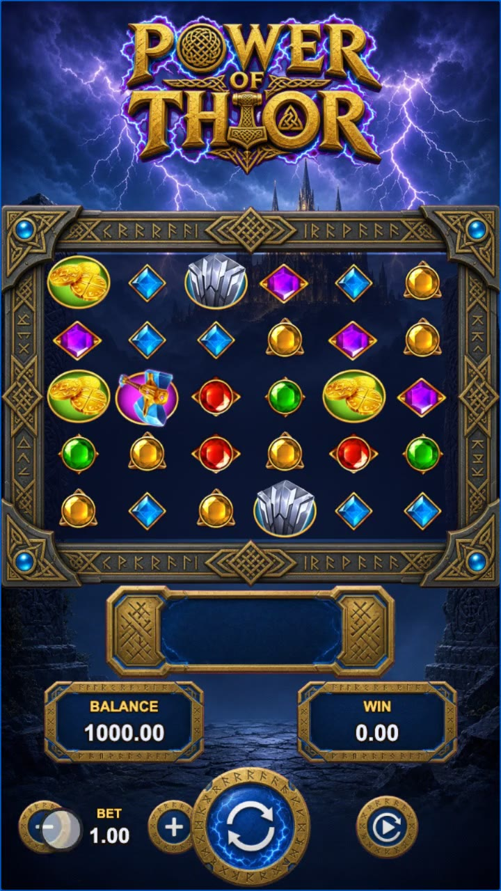
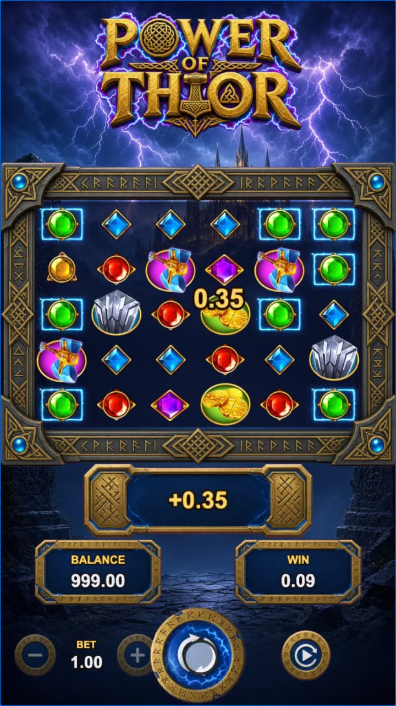
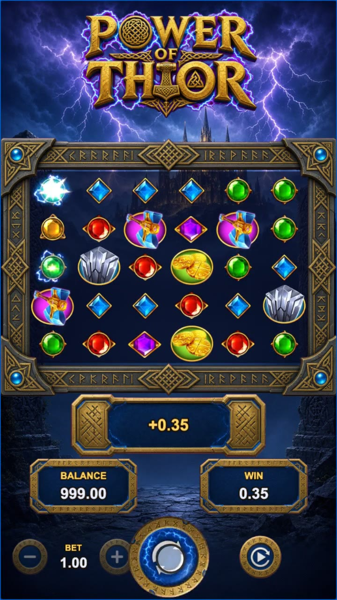
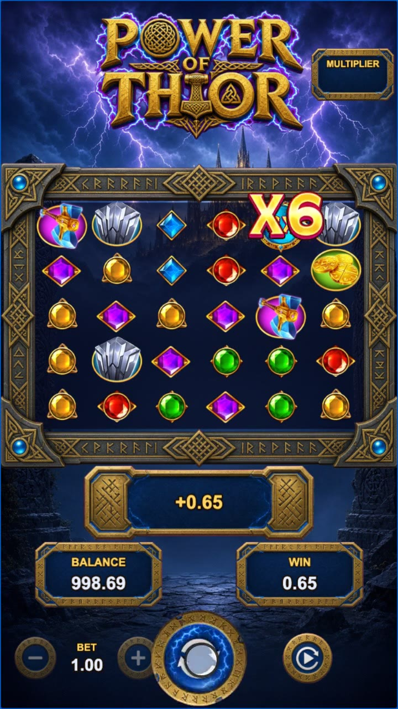
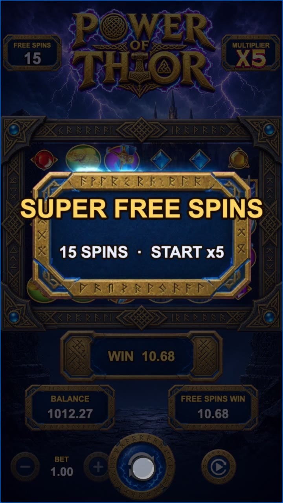
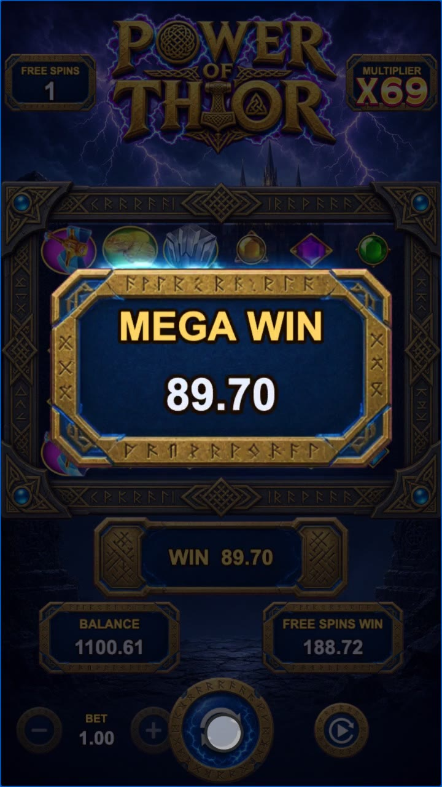
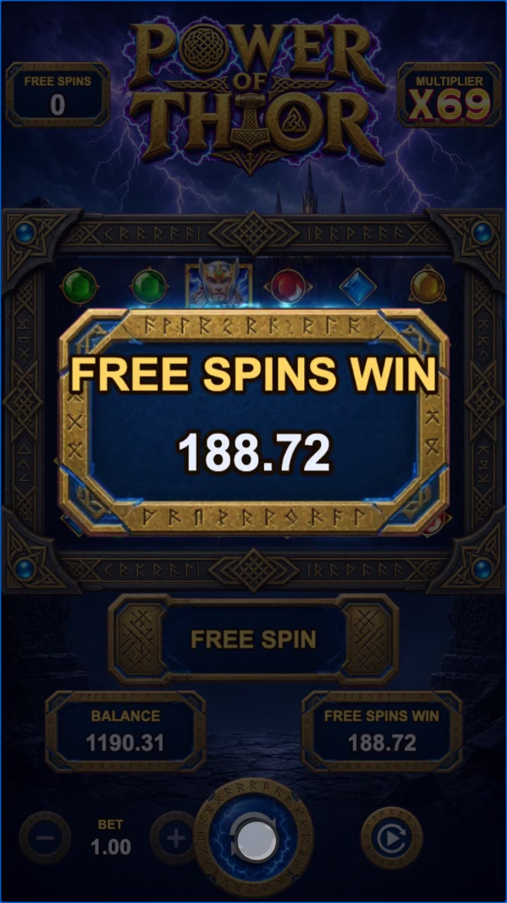

# Power of Thor · slots

A 6×5 pay-anywhere tumble slot built on the symbol pack, presentation runtime and audio of two earlier
slot projects, [CocosSlotsEditor](https://github.com/shinjiyu/CocosSlotsEditor) and
[SlotPlayableAdFrame](https://github.com/shinjiyu/SlotPlayableAdFrame). It replaces the first `slots`
demo (Lucky Reels, a 3-reel placeholder made one-shot in Docker).

- Symbols are the Power of Thor 2 Spine 3.8 pack: still frames recovered from the shipped game, Spine
  skeletons, win/eliminate effects and the multiplier bitmap font extracted from the live game's HAR
  capture with harExplorer.
- Every spin is played as SPIR frames (Slot Presentation IR) by CocosSlotsEditor's `BoardDirector` /
  `BoardView` and the IAnim animation library: drop out, drop in, win highlight with the pack's effect
  spines, eliminate, compact with refill, multiplier collect.
- The math, HUD, banners and free-spin flow are new.

Made with Enji 0.3.1 (Cocos Creator 3.8 preview runtime).



Demo video (118 s, recorded by `tools/record.mjs`, no sound): [video/slots.mp4](video/slots.mp4).

| Cluster win | Eliminate | Multiplier collect | Super free spins | Mega win | Free spins total |
|---|---|---|---|---|---|
|  |  |  |  |  |  |

## Run

```sh
cd tools && npm install && cd ..          # playwright-core, for the scripts only
enji host start --project .               # prints previewUrl
# open previewUrl; optional &seed=N for a repeatable session (8397: cascade, orb win, then super free spins)
node tools/record.mjs                      # headless session at seed 8397 -> video/slots.mp4
enji host stop --project .
```

Controls: SPIN (or Space), − / + bet (0.20 to 20), AUTO for 20 spins (tap again to stop). Free spins
play by themselves.

## Game rules

| | |
|---|---|
| Board | 6 columns × 5 rows; wins are paid anywhere for 8 or more of a symbol |
| Tumbles | winning symbols are removed, the rest fall, new ones drop in; repeats while there are wins |
| Multiplier orbs | green 2–5×, cyan 6–10×, purple 12–20×, red 25–50×, white 100–500×; they stay through the tumbles and their sum multiplies the spin's tumble win, if any |
| Free spins | 4+ BONUS/SUPER scatters pay 3/5/100× bet and award 15 free spins; 3+ in free spins add 5 |
| Free-spin multiplier | each winning free spin adds its orbs to a running multiplier that applies to the rest of the session |
| Super free spins | a SUPER scatter in the trigger starts the running multiplier at ×5 |

Paytable (× bet for 8–9 / 10–11 / 12+): helmet 9 / 22 / 45, hammer 2.2 / 9 / 22, stone 1.8 / 4.5 / 13,
coins 1.3 / 1.8 / 11, A 0.9 / 1.3 / 9, K 0.7 / 1.1 / 7, Q 0.45 / 0.9 / 4.5, J 0.35 / 0.8 / 3.5,
10 0.22 / 0.65 / 1.8.

`node tools/sim.mjs 4000000 <seed>` (two seeds, 8 M spins):

| | |
|---|---|
| RTP | 95.2% and 95.8% (base game about 66%, scatter pays 1%, free spins about 28.6%) |
| Hit rate | 29.4% |
| Free spins | 1 in 385 spins, 15% of them super, 15.2 spins on average |
| Max win seen | about 5,500× bet |

## How it is built

| Path | What |
|---|---|
| `assets/game/slot/` | Runtime copied from CocosSlotsEditor (`assets/scripts`): SPIR types (`vendor/slot-presentation-ir`), `editor-core` (board model, frame diffing), `common/anim` (IAnim), and `editor-app` without the editor screens (BoardView, BoardDirector, animation templates, symbol/asset libraries). One import path was fixed; nothing else changed. |
| `assets/game/ThorPack.ts` | Loads the pack's `manifest.json`, Spine skeletons, textures, effects and font, and builds the `AssetLibrary` / `SymbolLibrary` in code (Enji prefabs cannot hold script components, so the pack's `asset-library.prefab` / `symbol-library.prefab` are not used). |
| `assets/game/math/ThorMath.ts` | Pure TypeScript math: weighted reels per mode, pay-anywhere evaluation, tumbles, orbs, scatters, free-spin multiplier, Mulberry32 RNG. The same file runs in the game and under Node (`tools/sim.mjs`). |
| `assets/game/math/SpirBuilder.ts` | Turns a spin result into SPIR frames (`spinEnd` → `postClear`/dropOut → `reveal` → per tumble `highlight` → `postClear` → `compact` → `bonus-highlight` → `multiCollect`) plus marks for the HUD (tumble amounts, scatter, collect). |
| `assets/game/MainView.ts` | Layout, HUD, board events (win amounts float from the cluster centre, orb values fly into the multiplier badge), BIG/MEGA/EPIC banners at 20/60/200× bet, free-spin intro/retrigger/summary, auto play. |
| `assets/game/ui/` | Sprite/label/button helpers (`Art.ts`) and a throttled key-based sound player (`Sfx.ts`). |
| `assets/resources/spine-3.8/packs/power-of-thor2/` | The Thor 2 pack (without its prefabs and README). Eight symbol skeletons share one atlas (`oriSymbols/symbols.png` + `symbol.jpg`); the two cell effects share `effects/light.jpg`. |
| `assets/resources/audio/` | Sound effects and music from SlotPlayableAdFrame (see its `docs/AUDIO-SLOTS.md` for the key names). |
| `assets/resources/ui/`, `art/` | Background, logo, reel frame, buttons and panels. The four sheets in `art/` were generated with Cursor's image generation, then chroma-keyed and sliced by `tools/key_art.mjs` with the auto-ui-pipeline Node modules. |

### Asset changes made for Enji

19 pack images are WebP data (16 under `.png`/`.jpg` names in `oriSymbols/`, the two effect pages and
`font_symbolF.webp`). Creator 3.8.8 imports them; Enji's image importer cannot decode WebP (Enji issue
0006). `tools/slim-pack.mjs` transcodes them to palette PNG / mozjpeg 88, and folds the eight identical
symbol atlas copies and the two identical effect pages into one each.

Creator 3.8.8 `web-mobile` (release, no md5 cache): **7.1 MB** on disk, **3.3 MB** gzipped. Sources in
`assets/resources/` are 2.9 MB (pack 1.7 MB, UI 0.8 MB, audio 0.5 MB). The git tree is larger because of
`video/slots.mp4` (13.1 MB) and the generated art sources in `art/`.

The live game also has a Thor character Spine. It is not in the CocosSlotsEditor pack (that pack is
symbols, cell effects and the multiplier font only), and the original HAR sample
`samples/gameweb3.rsg-games.com.har` is not on this machine. SlotPlayableAdFrame's `charactor/` is
Storm of Set (Egyptian gods), so it was not used.

## Tools

| Script | Use |
|---|---|
| `tools/sim.mjs [spins] [seed]` | Monte Carlo RTP, hit rate, free-spin frequency, win distribution |
| `tools/demo-seed.mjs [max]` | Replays MainView's RNG use for a session at bet 1 and lists seeds with a cascade, an orb win and a free-spin trigger in the first five spins |
| `tools/seeds.mjs [max]` | Seeds whose first spin shows one feature (orb win, 4+ tumbles, free spins, super) |
| `tools/record.mjs [seed] [out]` | GPU (Metal ANGLE) headless session with a finger cursor, CDP screencast, ffmpeg |
| `tools/probe.mjs <prefix> <js> [every] [count] [query]` | Evaluate JS in the preview, then take periodic screenshots |
| `tools/shot.mjs <out> [waitMs] [js]` | One screenshot |
| `tools/key_art.mjs <artDir>` | Key and slice the generated art into `assets/resources/ui/` |
| `tools/slim-pack.mjs <CocosSlotsEditor>` | Rebuild the Thor 2 pack from the editor checkout: shared atlas pages, palette PNG / mozjpeg (needs `sharp`; set `SHARP=` if it is not a local dependency) |

The seed scripts are only valid while MainView consumes the RNG the same way (a quiet first board, then
one `spin()` per spin).

## Known limits

- No reel anticipation on the fourth scatter, and no per-symbol land sounds (the audio set has no such
  clips).
- The browser blocks music until the first tap; the recorded video has no sound.
- The ported runtime still has the type errors it had in CocosSlotsEditor; they do not affect the
  preview.
- No Thor character on the HUD (see above); only the symbol pack.
