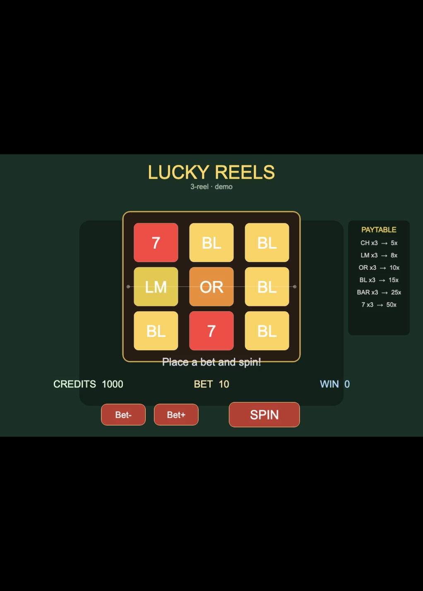

# Lucky Reels (Enji / Cocos 3.8)

Classic **3-reel** casino slots demo built for Creator **3.8.8** via Enji.

## Controls

- **SPIN** — spend the current bet, spin the reels, resolve the center payline
- **Bet- / Bet+** — cycle bet among `10 / 20 / 50 / 100`
- Start with **1000** credits
- Three matching symbols on the center payline pays (see on-screen paytable)

## How to run

This project expects the Enji preview host. In this demo setup the host runs
**inside Docker** (`WATCH_POLL=1`) with the project mounted, typically at:

```text
http://localhost:7460/?scene=db://assets/main.scene
```

Do **not** run `enji host start` / `enji host stop` on the Mac host while the
container is serving the same port — they would fight. Use HTTP instead:

```sh
curl -s http://localhost:7460/__enji/status
curl -s 'http://localhost:7460/__enji/logs?errors=1'
```

Host-side CLI (scripts auto-reload; import assets when you add non-script files):

```sh
export PATH=$NODE_BIN:$PATH
unset NODE_OPTIONS
enji() { node /path/to/enji/bin/enji.mjs "$@"; }

enji import assets/resources/<file> --project .
enji check --project .
```

Build / publish: open the project in **Cocos Creator 3.8.8** (Enji has no publish).

## Screenshot note

Open the preview URL above, press **SPIN**, and capture the machine (reels +
HUD + paytable). 
