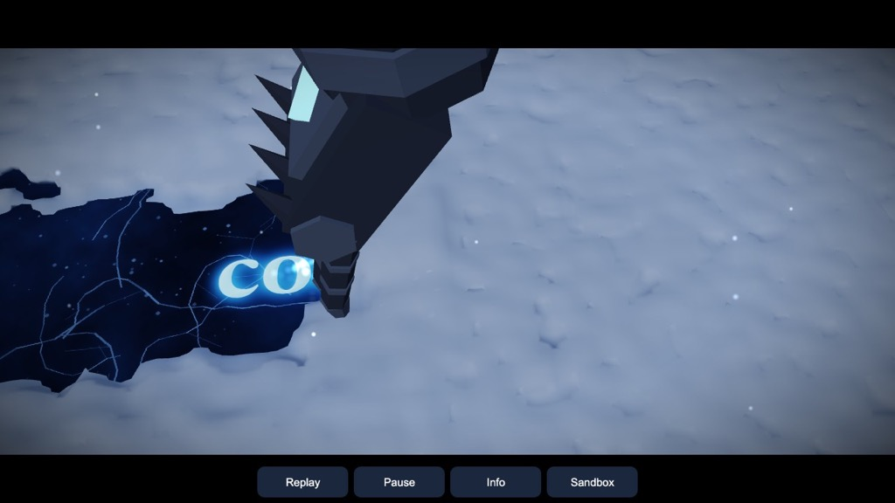
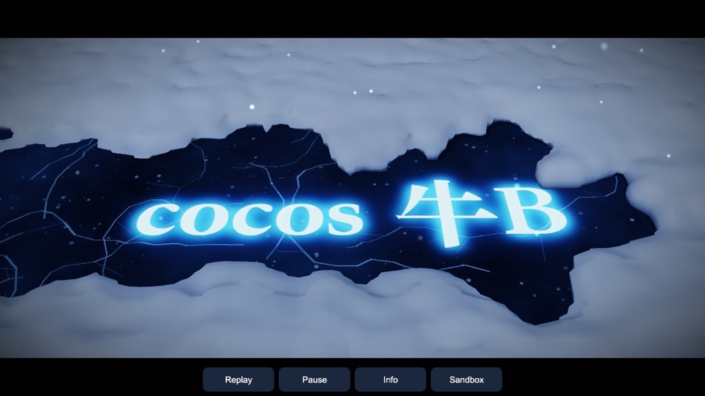

# Snow 3D: a gauntlet sweeping real snow

A 3D snow demo for Cocos Creator 3.8, built and previewed with Enji. The idea
comes from the Lich King cinematic (and its memes): an armoured gauntlet
sweeps through snow. The snow is a full **3D MLS-MPM** simulation with the
**Stomakhin et al. 2013** snow plasticity. The gauntlet is a model built by a
Blender script. It pushes the snow through eight kinematic capsules, so the
wiped line, the packed walls and the clumps that stick to the claws come
from the physics. None of it is an animation.

The demo opens on **the Lich King shot**. `?view=sandbox` (or the Sandbox
button) opens a deep tray to dig in freely.

## The Lich King shot

This is the close-up from the *Wrath of the Lich King* opening cinematic
(2008), the one the memes replace the text in. The gauntlet comes down onto
fresh snow over a sheet of ice and wipes once across it. Words frozen in the
ice light up underneath. Here they read **cocos 牛B**.

| The wipe | The words |
|---|---|
|  |  |

- **Snow:** a 7 cm layer over a 1.8 × 1.0 m patch, 26 000 particles on a 2.5 cm grid.
  At this depth its own weight compresses it by at most ρgh/E ≈ 2 % (about
  0.6 mm), so it goes to sleep as filled, with no settling pass.
  A wipe keeps about 5 000 particles awake.
- **The hand** comes in from the upper left. Its fingers trail the wrist
  (lean −0.55 rad) and the lowest claw sits right on the ice. It wipes 1.1 m in
  2.1 s, then lifts out to the right. `tools/shot-tune.mts` compares hand poses
  by how much of the text band they leave bare.
- **The ice** (`tools/ice_text.py`, PIL) is deep blue with cracks and trapped
  bubbles. The text is set in Songti SC Black, frosted with a carved bevel, plus
  a separate glow map. It uses `builtin-standard` with an albedo map and an
  emissive map. The emissive scale ramps up as the line is uncovered, then breathes.
  Change the words with `python3 tools/ice_text.py "…"`.
- **Snow surface:** a wipe leaves one or two particle layers on the ice. The
  surface leaves out snow within 1.2 cm of the ice, so that dusting reads as
  translucent, and its iso sits at half of full density, so the line reads as bare ice.
  Thin snow at the edges of the line is tinted with the blue of the ice.
- **Framing:** an untouched snowfield, flush with the settled surface, hides the
  patch's edges. Linear night fog, about 2 500 blowing flakes, and loose powder
  (awake particles faster than 0.25 m/s) as soft additive points. A vignette and
  2.2:1 bars appear on landscape screens. The camera pushes in from 55° to 42°.

In the preview, a whole frame of the wipe (simulation, surface and render)
averages 12.9 ms, with a worst case of 20 ms.

## The sandbox

A 1.2 × 0.78 m tray of snow 25 cm deep: about 17 000 particles on a
46×26×32 grid with 3 cm cells.

| Mid-sweep | After the sweep | Particles (debug view) |
|---|---|---|
|  |  |  |

In the particle view, yellow particles are awake (being simulated) and violet
ones are asleep. The capsules are the collision shape the model sits on.

## How it works

`assets/game/snow/` is pure TypeScript in typed arrays. The Node tests import
it directly.

| Module | Role |
|---|---|
| `SnowSim` | Explicit MLS-MPM (Hu et al. 2018): quadratic B-splines, APIC, P2G / grid / G2P; snow plasticity; capsule colliders; sleeping |
| `Svd3` | 3×3 SVD by cyclic Jacobi on FᵀF, with U and V kept as rotations (an inverted F shows up as σ₃ < 0) |
| `Hand` | The gauntlet's eight capsules in hand space, posed by (position, yaw, lean); positions and velocities are interpolated across substeps |
| `Frame` | One frame: move the hand, wake or sleep particles, run 6 substeps |
| `Scenes` / `Setup` | Snow bed (noise drifts, a bank at the back) and the scene constants |
| `SurfaceMesher` | Surface Nets surface over a particle density field (from `pbf-water`), with a cached field for sleeping snow |
| `Shot` / `GauntletNode` | The shot's constants, timeline and hand path; placing the model on a hand pose |

`assets/game/ShotView.ts` is the shot and `MainView.ts` the sandbox; `Boot.ts` picks one from the URL.

### Snow (Stomakhin 2013)

Each particle carries **F = F_E F_P**. Stress is fixed-corotated on the
elastic part, stiffened as the snow is packed:

\[ \boldsymbol\tau = 2\mu(J_P)\,(\mathbf F_E-\mathbf R_E)\mathbf F_E^{\mathsf T} + \lambda(J_P)\,(J_E-1)J_E\,\mathbf I, \qquad \mu,\lambda \propto e^{\xi(1-J_P)}. \]

After each step the singular values of F_E are clamped to
[1 − θ_c, 1 + θ_s]. Whatever is clipped moves into F_P. Snow that is squeezed
past 2.5 % stays squeezed (J_P < 1) and gets harder; snow that is stretched
past 0.75 % tears. The parameters are E = 4·10⁴ Pa, ν = 0.2, ρ = 400 kg/m³,
θ_c = 2.5·10⁻², θ_s = 7.5·10⁻³ and ξ = 10, with hardening capped at 4×.

### The hand

Grid nodes inside a capsule (plus a band of dx/2) take the capsule's velocity
in the normal direction, with Coulomb friction (μ = 0.4) along it.
Particles that end up inside are pushed back out in G2P. The B-spline stencil
spans 3 cells, so a hand thinner than about 3 cells lets snow through. The
whole scene is therefore scaled up (gauntlet 2.2× a human hand, snow 25 cm
deep) rather than the grid refined.

`tools/gauntlet.py` builds the model headless (Blender 5.2):

```
Blender -b --factory-startup --python tools/gauntlet.py
```

The script builds the faceted plates, finger segments, claws, knuckle and cuff
spikes, and a glowing rune in the same hand space as the capsules, then
exports `assets/resources/models/gauntlet.glb`. One test checks that 97 % of
the model's vertices lie within 3.5 cm of a capsule.

### Sleeping

Only snow near the hand is simulated. A particle that has stayed slower than
4 cm/s for 40 frames, and is more than 20 cm from the hand, falls asleep.
Grid nodes covered by sleeping snow are treated as solid ground. Snow within
12 cm of the hand wakes up. A sweep keeps up to about 7 000 of the 17 000
particles awake. The surface mesher keeps the density of sleeping snow in a
cached field and only re-splats awake particles each frame.

### Look

The surface is built with Surface Nets on a 2 cm grid, using the builtin
standard material with vertex colour. Snow below the untouched bed top is
tinted blue-grey with depth, so the furrow reads from any angle. A moon
directional light casts shadows.

## Results

`tools/test.mts` (Node, about 12 s):

| Check | Result |
|---|---|
| SVD reconstructs F, near identity and arbitrary | error 3·10⁻¹² |
| Undeformed snow without gravity | stays at rest (|v| = 0) |
| Fresh bed settles | no leak or blow-up; every column sinks 2.0–2.9 cm (drifts kept) |
| Hand hovering far away | nothing awake, nothing moves |
| Full sweep | stable; peak 7 221 of 16 571 awake |
| Furrow along the middle of the sweep | 11.2 cm deep |
| Pile where the sweep ends | 43 cm high |
| Snow 30 cm to the side | unchanged |
| Snow packed by the palm (J_P < 0.97) | 5 152 particles |
| Gauntlet model on the capsules | 97 % of vertices within 3.5 cm |
| Shot: hand pose at the start of the wipe | lowest claw 10.00 mm above the ice centre |
| Shot: the wipe | stable, 25 923 particles |
| Shot: text band left bare by one wipe | 92 % (needs ≥ 85 %) |
| Shot: snow 30 cm from the line | unchanged |

In the browser preview, simulating a sweep costs 15–30 ms per frame and the
surface 3–4 ms. Settling a fresh bed costs about 55 ms per frame for its 40
frames. All of this was measured on a loaded laptop, single-threaded.

Packed snow behaves cohesively, so the palm pushes it ahead as one mass and
drops it where the sweep ends. It does not spill sideways into berms the way
loose powder would.

## Controls

The shot: **Replay** (`R`), **Pause** (`P`, space), **Info** (`I`) for the status line, **Sandbox** to switch.

The sandbox (`?view=sandbox`):

- **Drag on the snow** to dig with the gauntlet (it follows the pointer, turning toward its motion while it is in the snow).
- **Sweep** (or `S`) plays the scripted sweep: down at the back left, an arc across, up and out.
- **New snow** (`R`) refills the tray; **Surface / Particles / Both** (`V`) switches the view; **Pause** (`P`, space).
- Right drag or two fingers orbit; the wheel zooms; the arrow keys turn the camera.

## Running

```
enji host start            # preview at http://localhost:7463
node --no-warnings --import ./tools/ts-resolve.mjs tools/test.mts
node --no-warnings --import ./tools/ts-resolve.mjs tools/bench.mts
```

## Engine notes

- Dynamic meshes: Enji draws the whole preallocated index buffer, so a shorter frame must zero the old tail and sync `ia.indexCount`.
- `primitives.capsule` with `heightSegments: 1` produces no triangles; use 12.
- No reflection probe, so fully metallic materials render black. The gauntlet uses metallic 0.55.
- A background preview tab is not animated. Screenshots drive frames with `cc.director.tick` and read the canvas in the same evaluate call (`tools/shoot.js`, `tools/grab.py`).

## Not in this demo yet

- The shot next to the CG: the gauntlet is procedural, the edge of the wipe is
  ragged rather than one clean stroke, and the glow is emissive only, with no bloom pass.

- Loose powder that spills sideways (lower cohesion near the surface, or a second, weaker snow layer).
- Snow sparkle / subsurface shading in a custom effect; screen-space surface smoothing.
- Phone performance (not measured).
