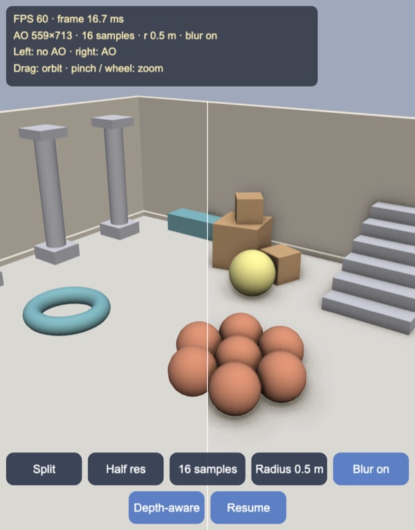
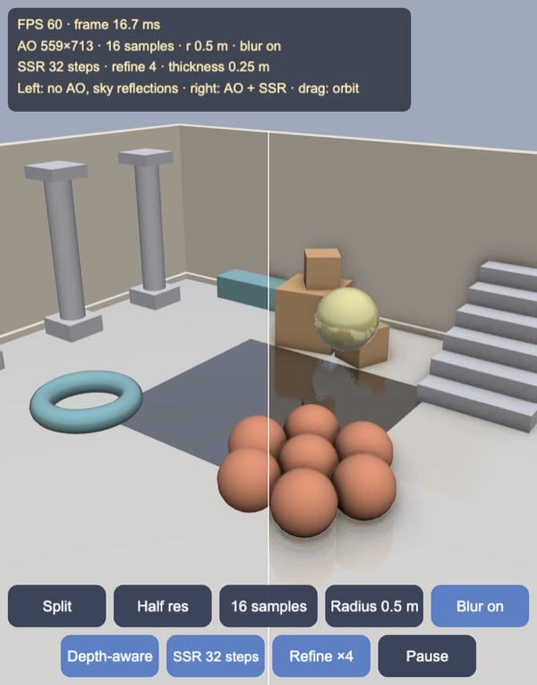
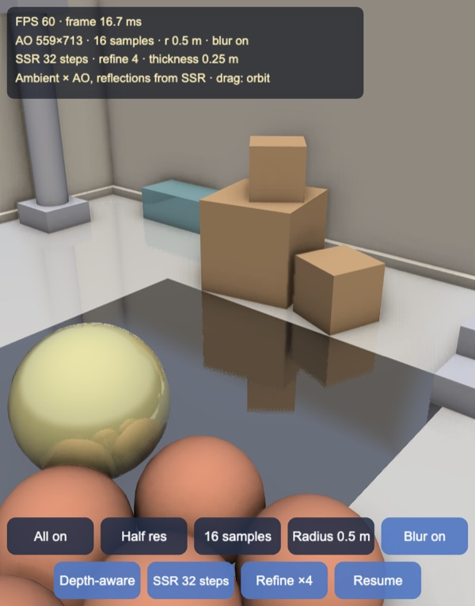
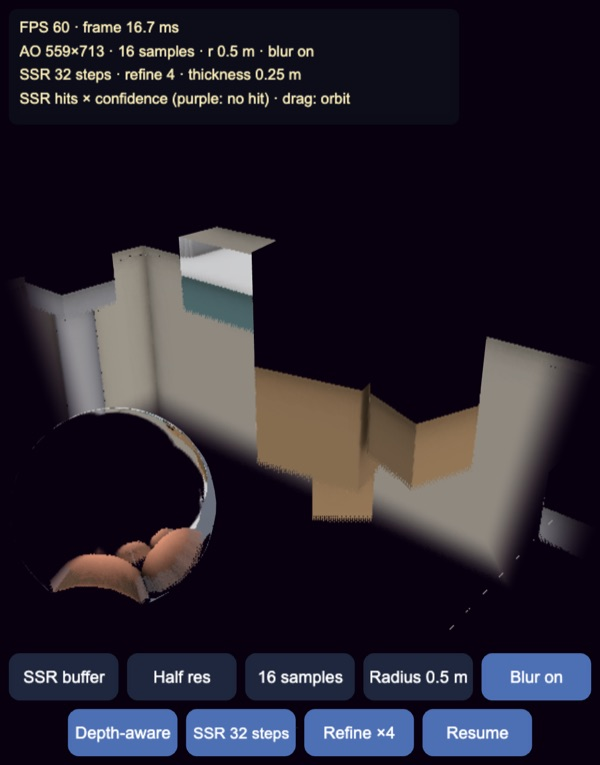
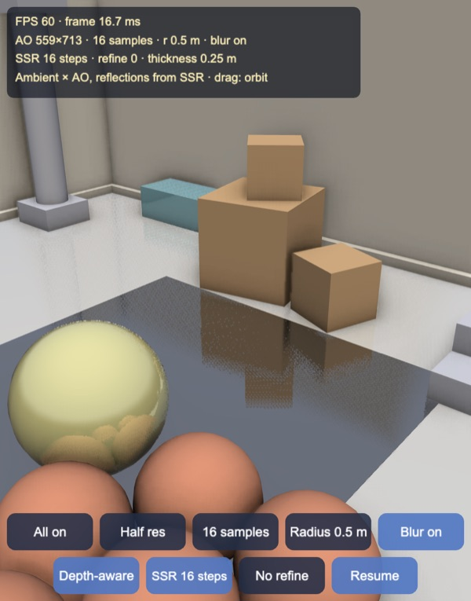
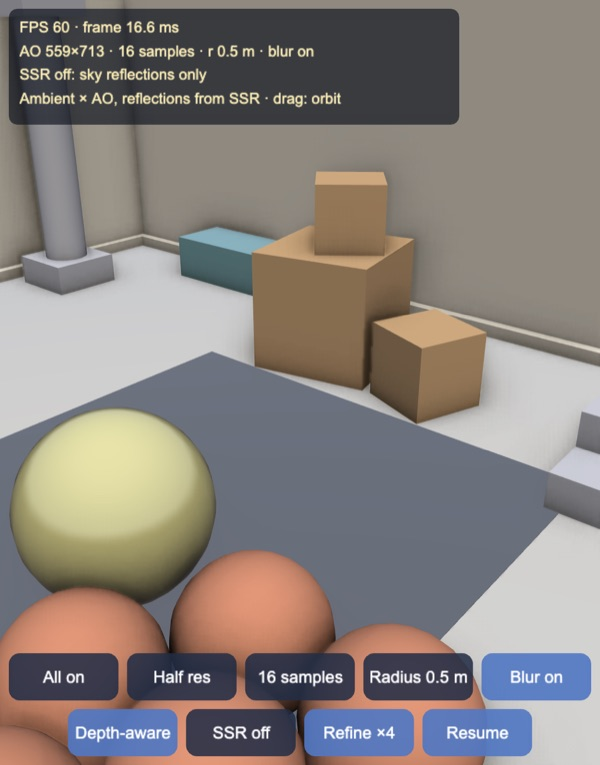
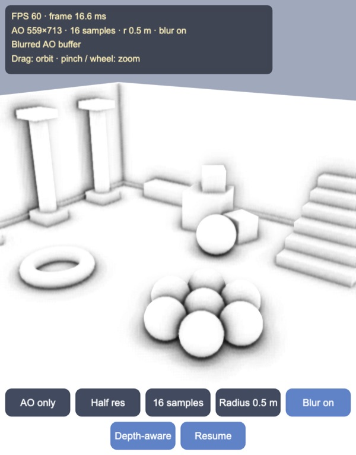
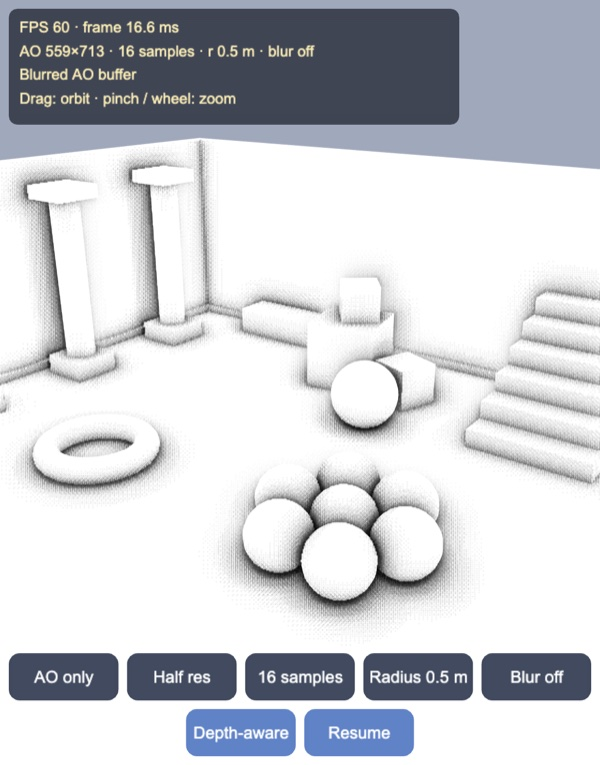
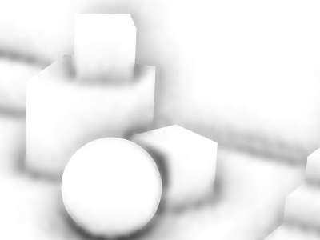

# Simplified SSAO and SSR: half-resolution G-buffer, hemisphere samples, screen-space ray marching

Screen-space ambient occlusion for Cocos Creator 3.8, built and previewed with
Enji and sized for phones. The scene's depth and normals go into a small
render texture, the AO is estimated there with a handful of samples per
pixel, blurred, and the lit meshes darken only their ambient light with it.
The same G-buffer also drives screen-space reflections on the glossy floor,
a polished slab and the ball.
Everything runs through the engine's ordinary cameras and render textures:
no custom render pipeline, no float or depth textures, no multiple render
targets, only 8-bit RGBA targets.

Split view at the default settings, from before the reflections were added (AO at half resolution, 16 samples,
0.5 m radius, blur on). Without a shadow map, the left half has nothing that
grounds the objects; on the right the spheres sit in dark contacts, the crates
and the bench meet the floor and wall, and the stairs and skirting get their
creases.

## How it works

Seven passes per frame, each a camera ordered by priority
(`assets/game/ssao/SsaoPipeline.ts`); the reflections add the colour and SSR
passes and the reflection term in the last one (see
[Screen-space reflections](#screen-space-reflections)):

1. **G-buffer.** A camera parented to the scene camera, with the same field of
   view, draws a copy of every mesh (`GBUFFER_LAYER`) with
   `ssao-gbuffer.effect` into an RGBA8 render texture at AO resolution.
   rg holds linear view depth over 40 m in two bytes (16 bits, 0.6 mm steps),
   ba the world-space normal, octahedral-encoded with byte 127 as zero, so
   floors and walls are stored exactly; the AO and SSR passes rotate it into
   view space with the camera's rotation (three uniforms). It is sampled with
   NEAREST filtering, since interpolated packed values are meaningless.
2. **AO** (`ssao-ao.effect`), a full-screen quad at the same size. For each
   pixel it rebuilds the view position from depth and the projection, then
   tests samples in the normal-oriented hemisphere (Crytek 2007, in the
   hemisphere form of Chapman and LearnOpenGL). A sample counts as occluded
   when the stored depth at its screen position is in front of it, weighted
   down when that surface is more than a radius away (range check). Details:
   - The kernel is procedural: cosine-weighted directions on a golden-angle
     spiral, lengths 0.1 to 1 of the radius, squared towards the centre. The
     sample count is a uniform, and no array is uploaded.
   - A 4×4 Bayer pattern rotates the kernel per pixel, so neighbouring pixels
     sample different directions and a 4-pixel blur averages all 16 rotations.
   - The bias is slope-scaled, as for shadow maps: 2.5 cm plus the depth the
     surface spans across half a texel, depth × texel angle × tan(view angle).
     Without the slope term a floor seen at a grazing angle occludes itself,
     because one texel stores one depth for a long strip of floor.
   - The output is r: visibility to the power 1.5, gb: the packed depth copied
     through, so the next passes read one texture instead of two.
3. **Blur x, blur y** (`ssao-blur.effect`): separable, five binomial taps,
   each weighted down by its relative depth difference to the centre, so
   occlusion does not bleed across silhouettes.
4. **Scene.** `ssao-lit.effect` shades with vertex colours, a sky/ground
   hemisphere ambient and one sun, without shadows, and multiplies only the
   ambient term by the AO at the fragment's screen position. Two ways to read
   the smaller AO texture:
   - **Bilinear:** one fetch.
   - **Depth-aware** (joint bilateral upsampling): the four nearest AO
     texels, each weighted by bilinear weight times how close its depth is to
     the fragment's own view depth (`v_clip.w`, free in the vertex shader).
     Texels within 2% count fully, beyond 6% not at all; if none matches (a
     feature thinner than a texel), it takes the nearest in depth.

`assets/game/ssao/AoMath.ts` is the AO estimator in TypeScript, line for line
the shader, and `tools/test.mts` runs it on analytic scenes.

## Screen-space reflections

| Split: sky only (left) and SSR (right) | SSR, close up |
|---|---|
|  |  |

The floor (F0 0.12), a dark polished slab (F0 0.6), the bench (0.15) and the
ball (0.3) reflect; F0 is stored in each mesh's vertex-colour alpha. On the
right of the split and in the close-up, the crates stand on their mirror
images in the slab, and the ball reflects the clay spheres beneath it.

Two more passes, after the AO and before the scene:

1. **Colour pass.** Another camera parented to the scene camera draws a third
   copy of every mesh (`COLOR_LAYER`) at G-buffer resolution with the scene
   material, AO on and reflections showing only the sky, into `sceneColor`.
   Its alpha is the surface's F0.
2. **SSR** (`ssao-ssr.effect`), a full-screen quad at G-buffer resolution.
   Texels with F0 = 0 in the colour pass return at once, so walls, crates and
   stairs cost one fetch. For the rest:
   - It rebuilds the position and normal, reflects the view ray, clips it to
     12 m and to the near plane, and projects both ends to texels. 1 / depth
     is linear on screen, so it marches along the major axis with one add per
     step (McGuire and Mara 2014). The stride spreads the 32 steps over the
     ray's on-screen length, clipped to the screen; a 4×4 Bayer offset starts
     neighbouring pixels between each other's steps.
   - A step hits when the ray's depth range over the step overlaps the stored
     surface and up to 0.25 m behind it (the thickness every surface is
     assumed to have). Four bisection steps then find the crossing.
   - It then checks the crossing texel: the ray must really be inside that
     slab there, give or take the depth it covers in one texel. Otherwise the
     step only straddled an edge, and the march goes on. Hits on surfaces
     that face away from the ray are dropped.
   - The output is the colour pass at the hit, premultiplied by a confidence
     that fades over the last 10% of the screen at each edge and over the
     last 20% of the 12 m.

The scene shader mixes the reflection in with Schlick's Fresnel,
F0 + (1 − F0)(1 − cos θ)^5. The reflected colour is the SSR hit weighted by
its confidence, over a sky/ground gradient in the mirror direction. The SSR
texture is upsampled with the same four depth-aware weights as the AO.

| SSR buffer (purple: no hit) | 16 steps, no bisection | SSR off |
|---|---|---|
|  |  |  |

The buffer view shows the edge and distance fades and the matte surfaces
skipped. With 16 steps and no bisection the reflections break into the
dither pattern. Without SSR the slab reflects only the sky gradient.

### Normal precision

The G-buffer first stored the view-space normal's x and y in 8 bits, as the
AO pass needs. For reflections that was not enough: a floor's view-space
normal is never axis-aligned, and rounding to 1/127 tilts it by up to about
a degree. Every reflection then shifts the same way. In the tests the median
error was 1.4 texels and objects' mirror images came loose from their bases
by up to 5 texels. Octahedral world-space normals in the same two bytes,
with byte 127 decoding to exactly 0, store floors and walls without error
(any other direction within 0.93°). The median error drops to 0.14 texel.

## The AO buffer

| Blurred (default) | Raw, blur off |
|---|---|
|  |  |

Without the blur the 4×4 rotation pattern shows as a dither in every
occluded area. The two 5-tap passes remove it without washing occlusion over
edges: the floor next to the ball, the crates and the column plinths stays
white right up to their outlines.

## Upsampling at quarter resolution

| Bilinear | Depth-aware |
|---|---|
|  |  |

At quarter resolution (280×357 AO texels on a 1118×1426 screen) a bilinear
lookup smears dark contact shadows over the silhouettes in blocky steps. The
depth-aware lookup keeps the ball's and the crates' outlines sharp. At half
resolution the two are hard to tell apart in this scene.

## Tests

`node --no-warnings --import ./tools/ts-resolve.mjs tools/test.mts`
ray-casts G-buffers from analytic scenes (camera 1.6 m up, 60° vertical FOV),
quantises depth and normals exactly like the 8-bit texture, and runs the
AO estimator and the SSR tracer (`assets/game/ssao/SsrMath.ts`, line for line
`ssao-ssr.effect`) with the default settings. 18 checks, all passing.

AO:

| Check | Result |
|---|---|
| Kernel: inside the unit hemisphere, lengths ≥ 0.1, mean cos θ | yes, yes, 0.667 (cosine-weighted: 2/3) |
| 4×4 dither | 16 distinct rotations |
| Depth packing, worst round-trip error | 0.31 mm at 40 m |
| Flat floor, < 10 m | AO 1.000 everywhere |
| Flat floor, 10–30 m (grazing) | 1.000; without the slope term mean 0.894, min 0.650 |
| Floor meeting a wall | crease 0.75, a metre away 1.000 |
| Sphere resting on the floor | ring round the contact 0.70, floor further out 1.000 |

Floor AO against distance to a wall, at three G-buffer sizes (wall 3 m
ahead, camera pitched 35° down). The profile hardly depends on resolution,
which is what makes half and quarter resolution usable:

| G-buffer | 0–0.1 m | 0.1–0.25 m | 0.25–0.5 m | 0.5–1 m |
|---|---|---|---|---|
| 640×480 | 0.700 | 0.917 | 0.987 | 1.000 |
| 320×240 | 0.761 | 0.935 | 0.989 | 1.000 |
| 160×120 | 0.760 | 0.909 | 0.986 | 1.000 |

Mean crease AO is 0.786 with 8 samples, 0.751 with 16 and 0.753 with 32: 16
is enough on average; 8 is a little lighter and noisier.

SSR: every floor texel within 20 m of a 320×240 G-buffer is traced and
compared with the analytic mirror ray. The scene has a 3 m wall 6 m ahead
(rays over it reach the sky), two balls and a post. A reflection is
*resolvable* when its true hit is on screen and not hidden, clear of the edge
fade and inside the distance fade. A *false hit* on a sky ray is a hit on a
surface more than 3 texels from the ray; grazing an edge within a texel or
two does not count.

| Check | Result |
|---|---|
| Bare floor | 0 self-hits over 56,960 texels |
| Defaults (32 steps, bisection 4, thickness 0.25 m) | 99.8% of 12,866 resolvable found; error median 0.14, p95 0.52 texels; false hits on 0.9% of 13,360 sky rays |
| Same, view-space xy normals | median 1.36, p95 3.64 texels; 502 hits more than 4 texels off (33 with octahedral) |
| No bisection | median 2.19, p95 5.31 texels |
| 16 / 64 steps | median 0.28 / 0.09 texels, 99.6% / 99.9% found |
| Thickness 0.05 / 0.25 / 1.5 m | 97.3% / 99.8% / 99.8% found; hidden targets and sky rays filled with something else: 1,552 / 2,341 / 2,463 |
| 160×120 / 640×480 | median 0.08 / 0.30 texels |
| Normal encoding | axis-aligned normals exact, worst direction 0.93° |

Of the 6,284 reflections that are off screen or hidden behind something,
the tracer fills about a third with whatever is in front: the main artefact
of SSR with a constant thickness. The thin setting halves the false fills
but misses more real hits on steep surfaces.

## Controls

- Drag to orbit, pinch or mouse wheel to zoom.
- Buttons: view (split, all on, all off, AO buffer, SSR buffer); AO
  resolution (half, full, quarter); samples (16, 32, 8); radius (0.5, 1,
  0.25 m); blur on / off; depth-aware / bilinear upsampling; SSR steps (32,
  64, 16, off); bisection on / off; pause the bouncing ball.
- Keys: `V` view, `Q` resolution, `N` samples, `D` radius, `B` blur,
  `U` upsampling, `R` SSR steps, `F` bisection, `Space` pause.

## Performance

On the desktop (Apple Silicon, Enji preview, 1118×1426 canvas) every
combination runs at the 60 FPS cap, including full resolution with 32
samples, so frame rate does not separate them; it has not been measured on a
phone yet. What the settings cost is clearer in texture fetches per frame on
that canvas:

| Pass | Half res, 16 samples | Full res, 32 samples | Quarter res, 8 samples |
|---|---|---|---|
| AO (1 + samples per AO pixel) | 6.8 M | 52.6 M | 0.9 M |
| Blur (2 × 5 per AO pixel) | 4.0 M | 15.9 M | 1.0 M |
| Upsample, depth-aware (4 per screen pixel) | 6.4 M | 6.4 M (no gain) | 6.4 M |
| Upsample, bilinear (1 per screen pixel) | 1.6 M | 1.6 M | 1.6 M |

SSR reads one G-buffer texel per step, one per bisection step and about six
more (own texel, colour mask, crossing check, normal, colour): at most 42
fetches per reflective texel with 32 steps, 74 with 64, and one for a matte
texel. If every texel at half resolution reflected, that would be 16.7 M per
frame, about the cost of the AO and blur together. With SSR on, the
depth-aware upsample also reads the SSR texture: 4 more fetches per screen
pixel. Even at full
resolution with 64 steps, the whole chain stays at the 60 FPS cap on the
desktop. The colour pass draws every mesh once more, a third copy after the
lit and G-buffer ones.

Two things follow for phones. The depth-aware upsample costs about as much
as the AO itself at half resolution, where it barely shows, so bilinear is
the better choice there and depth-aware pays off at quarter resolution. And
copying the depth into the AO texture halves both the blur and the upsample,
which would otherwise also read the G-buffer at every tap. The G-buffer pass
redraws every mesh once more; this scene has two meshes (4,732 + 625 vertices).

## Not in this demo yet

- Phone measurements and an automatic quality pick at start-up.
- Hierarchical (Hi-Z) tracing, which skips empty space in a depth mip chain
  instead of marching a fixed number of steps.
- Rough reflections: blurring the hit colour by cone width, or tracing
  several jittered rays per pixel; here every reflective surface is a mirror.
- A fallback for rays that leave the screen (a reflection probe instead of
  the sky gradient), and temporal accumulation of the SSR buffer.
- Reusing the scene's own depth instead of drawing a G-buffer copy of every
  mesh: Cocos 3.8's built-in forward pipeline does not expose the camera's
  depth buffer to materials without a custom pipeline.
- Temporal accumulation (reprojecting last frame's AO), which would allow 4–8
  samples per frame.
- Horizon-based variants (HBAO, GTAO), which get more out of each sample.
- Native builds: the screen-position lookup assumes WebGL's clip-to-texture
  orientation, as on the other targets render textures may be flipped.

Made with Enji 0.3.
