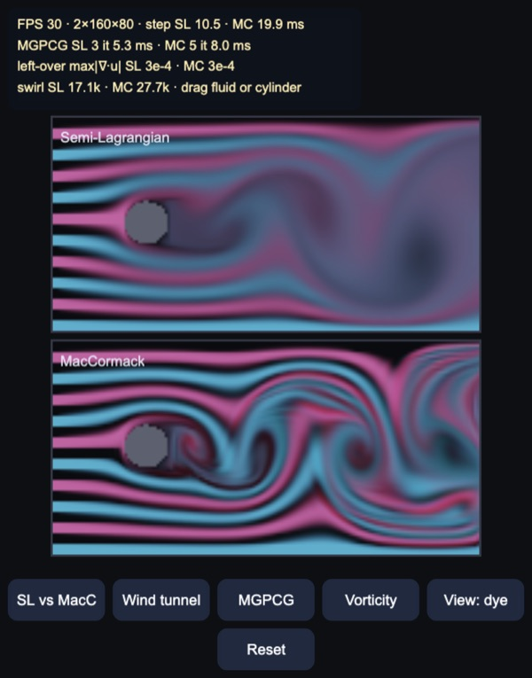
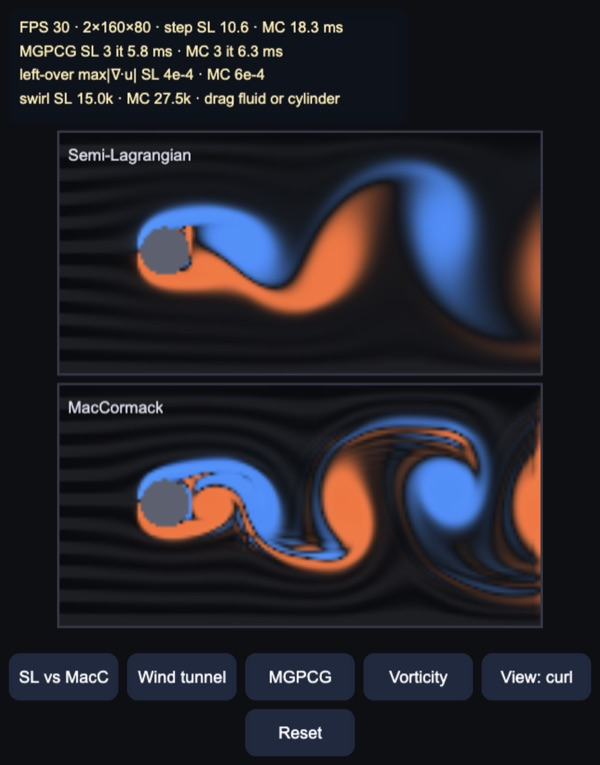
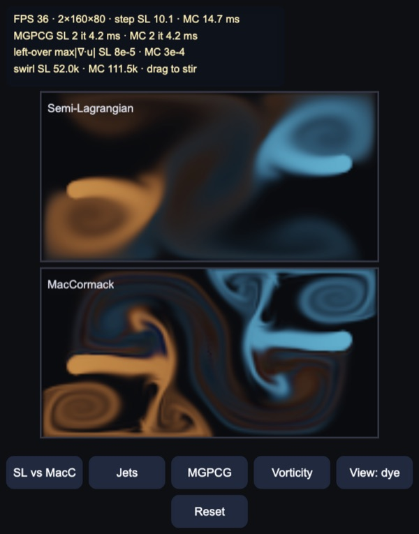
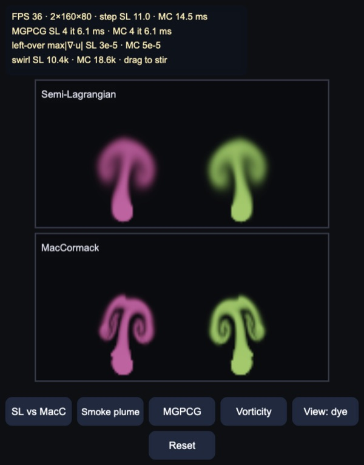

# Stable Fluids: semi-Lagrangian vs MacCormack

2D incompressible flow on the CPU (Stam 1999, "Stable Fluids") for Cocos
Creator 3.8, built and previewed with Enji. Velocity lives on a staggered
(MAC) grid, dye is carried along, and every step ends with a pressure
projection that makes the velocity divergence free. The default view runs
the same scene twice, stacked so a phone in portrait shows both: the top grid
advects with plain semi-Lagrangian lookups, the bottom one with MacCormack.

Wind tunnel, 12 s in: dye streaks flow past a cylinder 16 cells across at 24
cells/s. Both grids shed a Kármán vortex street, but semi-Lagrangian
advection blurs every vortex into a smudge a few diameters downstream;
MacCormack keeps them rolled up to the end of the tunnel. The HUD's swirl
figure (½Σω², enstrophy) was 17.1k on top and 27.7k below.

## How it works

Plain TypeScript in typed arrays (`assets/game/fluid/`), one cell = one length
unit, velocities in cells per second, one 60 Hz step per rendered frame.

- `FluidGrid.ts`: x velocity on vertical faces, y velocity on horizontal
  faces, RGB dye at cell centres. Each step:
  1. rasterise the obstacles (discs) into solid cells;
  2. advect velocity and dye along the previous, divergence-free velocity;
  3. vorticity confinement (button, off by default), buoyancy, dye decay,
     the scene's nozzles and the finger;
  4. boundary conditions;
  5. projection.
- Advection traces back from each sample with a midpoint (RK2) step and
  reads the field bilinearly.
  - **Semi-Lagrangian** (Stam): use that value. Unconditionally stable, but
    each bilinear lookup averages neighbours, which acts like viscosity of
    about half a cell per step: small vortices die.
  - **MacCormack** (Selle et al. 2008): advect forward, advect the result
    backward, and subtract half of the round-trip error. The result is
    clamped to the four samples the forward lookup used, so it cannot create
    new extrema or blow up. Within two cells of a solid it falls back to the
    semi-Lagrangian value. Without that, the backward pass reads the solid's
    zero dye as error, and the preview showed a jagged dark fringe behind
    the cylinder.
- Boundaries:
  - **Domain sides**: each is a wall (zero normal velocity, free slip),
    open (pressure 0 outside, fluid leaves freely) or an inflow.
  - **Obstacles**: faces touching an obstacle take its velocity, so dragging
    the cylinder pushes fluid. Nozzles set velocity and dye inside a disc
    with a 1.5-cell soft rim, so their edge does not show the grid's
    staircase.
- `Pressure.ts`: solves A p = −∇·u on the fluid cells. Solid faces are
  Neumann, open sides Dirichlet. In a closed box the mean is projected out,
  because pressure is only defined up to a constant there.
  - **Jacobi**: the classic GPU choice, warm-started from the previous step.
    Each iteration only spreads information one cell, so large-scale
    divergence lingers.
  - **MGPCG** (McAdams, Sifakis & Teran 2010): conjugate gradients
    preconditioned by one multigrid V-cycle.
    - Levels halve the grid down to 10 × 5 on the 160 × 80 grid (5 levels).
      Coarse face weights are the mean of the fine faces they cover, so
      obstacles and open sides carry down.
    - Restriction sums the four children and prolongation copies the coarse
      value back (its transpose).
    - Red-black Gauss–Seidel smoothing, two sweeps down, the same sweeps in
      reverse order on the way up, and 16 symmetric sweeps on the coarsest
      level. This keeps the preconditioner symmetric, which CG needs.
    - Stops at 1e-4 relative residual.
- `FluidView.ts`: one RGBA8 texture per grid, filled on the CPU and uploaded
  every frame, drawn on a quad with linear filtering.
  - **Dye view**: dye over a dark background with a soft exposure curve.
  - **Curl view**: vorticity, orange counter-clockwise and blue clockwise.
- `Scenes.ts`: everything scales with the grid height, so the lite grid
  shows the same flow.

## Scenes

| Wind tunnel, curl view | Jets | Smoke plume |
|---|---|---|
|  |  |  |

**Wind tunnel**: inflow on the left, open on the right, free-slip walls top
and bottom. The cylinder sits 0.6 cells above the centre line so shedding
starts within seconds. In the curl view, MacCormack's vortices keep thin
shear layers between them; semi-Lagrangian's are fat blobs.

**Jets**: two nozzles fire at each other slightly off axis in a closed box,
sweeping ±20°. Every pass sheds a vortex pair. With semi-Lagrangian
advection the dye turns to haze; with MacCormack the spirals stay sharp.

**Smoke plume**: two buoyant sources on the floor, open top. The screenshot
is 3.6 s in: both mushroom caps have the same size and height (the large
flow agrees), but only MacCormack resolves the curls inside the caps.

`tools/bench.mts` runs every scene headless on the 160 × 80 grid for 6 s
after a 1 s warm-up. Mean max |∇·u| is the divergence left after the
projection, averaged over the steps. Swirl is at the end of the run.

| Scene | Advection | Pressure | Iterations | Mean max \|∇·u\| | Swirl |
|---|---|---|---|---|---|
| Tunnel | semi-Lagrangian | MGPCG | 1.5 | 2.3e-4 | 16.5k |
| Tunnel | semi-Lagrangian | Jacobi 40 | 40 | 1.6e-2 | 16.4k |
| Tunnel | semi-Lagrangian | Jacobi 200 | 200 | 2.6e-3 | 16.5k |
| Tunnel | MacCormack | MGPCG | 2.0 | 1.7e-4 | 24.6k |
| Tunnel | MacCormack | Jacobi 40 | 40 | 1.9e-2 | 23.9k |
| Jets | semi-Lagrangian | MGPCG | 2.0 | 1.4e-4 | 63.6k |
| Jets | MacCormack | MGPCG | 2.3 | 4.5e-4 | 105.6k |
| Jets | MacCormack | Jacobi 40 | 40 | 5.5e-2 | 105.3k |
| Plume | semi-Lagrangian | MGPCG | 3.7 | 6.0e-5 | 23.5k |
| Plume | MacCormack | MGPCG | 3.6 | 1.1e-4 | 54.7k |
| Plume | MacCormack | Jacobi 40 | 40 | 3.6e-2 | 55.6k |

- MacCormack keeps 1.5× (tunnel), 1.7× (jets) and 2.3× (plume) the swirl of
  semi-Lagrangian advection.
- Warm-started MGPCG needs 1.5–4 iterations per step and leaves 70–330×
  less divergence than 40 Jacobi iterations. Jacobi 200 still leaves 11–55×
  more. In these scenes the Jacobi error is hard to see on screen and barely
  changes the swirl; what is left acts as small sources and sinks in the
  velocity field.

`tools/test.mts` checks:

- MGPCG reaches 1e-3 of the initial divergence in 3–6 iterations from a
  random field, with an obstacle, open or closed. Jacobi ×40 is over 100×
  worse.
- The V-cycle is symmetric (⟨Mx, y⟩ = ⟨x, My⟩ to 1e-16) and positive.
- Faces next to a moving obstacle carry its velocity.
- A blob in uniform flow travels the right distance, and MacCormack keeps
  its peak twice as high (0.67 vs 0.34 after 40 cells).
- Constant dye stays constant, and no new extrema appear.
- Every scene × advection × pressure combination runs 10 s without blowing
  up.
- With MacCormack the wake swings at least four times in 15 s (9 swings, up
  to 28 cells/s across the stream; semi-Lagrangian has 8, up to 22 cells/s).

## Controls

- Drag to stir: adds velocity and dye, and the colour cycles. A drag that
  starts on the cylinder moves it. In compare mode both grids get the same
  hand.
- Buttons:
  - advection: SL vs MacC / MacCormack / Semi-Lagr.;
  - scene: Wind tunnel / Jets / Smoke plume;
  - pressure: MGPCG / Jacobi 40;
  - Vorticity: confinement, ε = 0.35;
  - view: dye / curl;
  - Reset.
- Keys: `A` advection, `C` scene, `P` pressure, `V` vorticity, `D` view,
  `R` reset, `Q` lite grid.

## Performance

Measured only roughly so far; a phone test is still to do. At start-up the
demo averages the solver time of both grids over 60 frames, after a
30-frame warm-up. Above 9 ms per frame it switches to the lite grid
(128 × 64 instead of 160 × 80).

The machine was heavily loaded by other processes throughout (load average
27–34 on 10 cores), and the same Jacobi-40 step took anywhere from 8 to
56 ms during the bench run. Treat these as relative numbers:

- **Bench, plume rows** (run last, when load was lowest), 160 × 80, per step:
  - semi-Lagrangian advection: 3.0 ms;
  - MacCormack advection: 7.7–8.2 ms, so 2.7× (two lookups per sample plus
    the clamp);
  - MGPCG pressure: 6.3 ms;
  - Jacobi 40: 7.5–7.8 ms;
  - Jacobi 200: 36 ms.
- **Enji preview, compare mode**:
  - the start-up check picked the lite grid, with 4.3 ms (SL) + 8.8 ms (MC)
    per step at 60 FPS;
  - forced back to 160 × 80: 9–11 ms + 15–20 ms per step, 30–36 FPS.

At these sizes MGPCG is the cheaper choice as well as the more accurate one:
the warm start leaves CG one or two V-cycles of work. Moving advection and
Jacobi to texture passes on the GPU is the usual next step for larger grids.

## Not in this demo yet

- 3D, and liquids with a free surface (level set or FLIP/APIC).
- Cut-cell solid boundaries (Batty et al. 2007): the cylinder is a staircase
  of cells.
- Higher-order interpolation (monotone cubic) or BFECC as further advection
  options.
- A GPU path.

Made with Enji 0.3.
