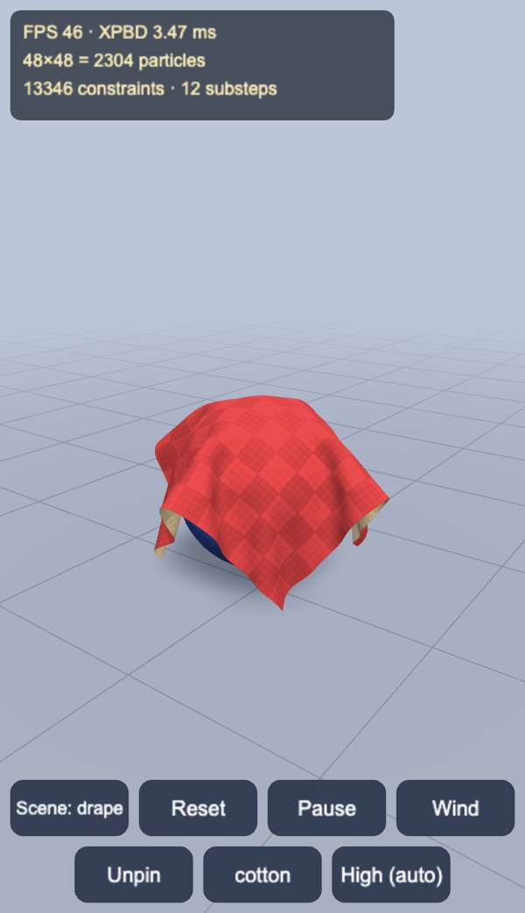
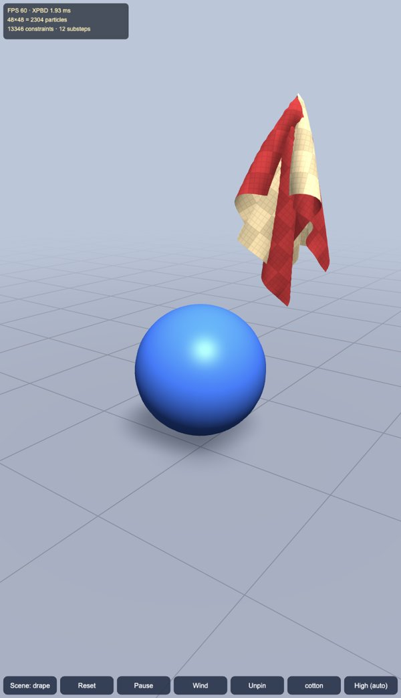
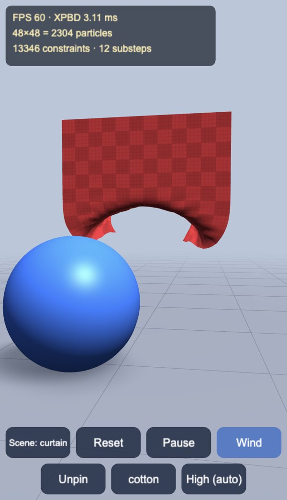
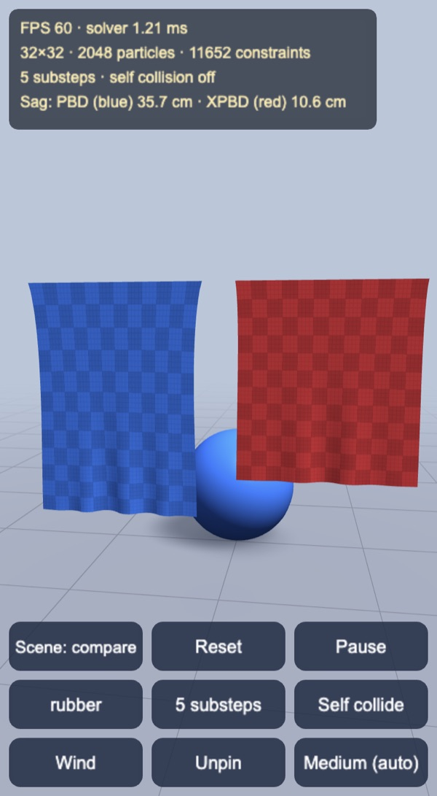
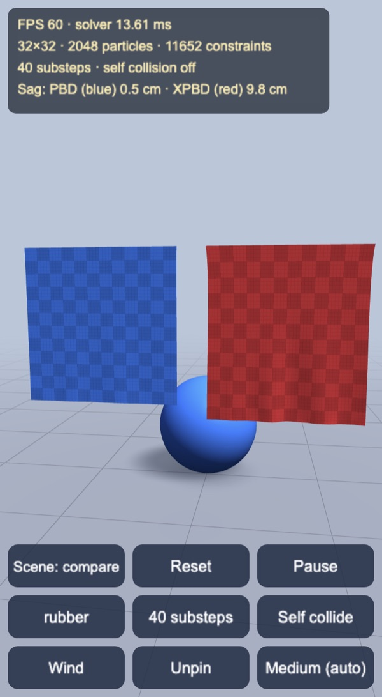
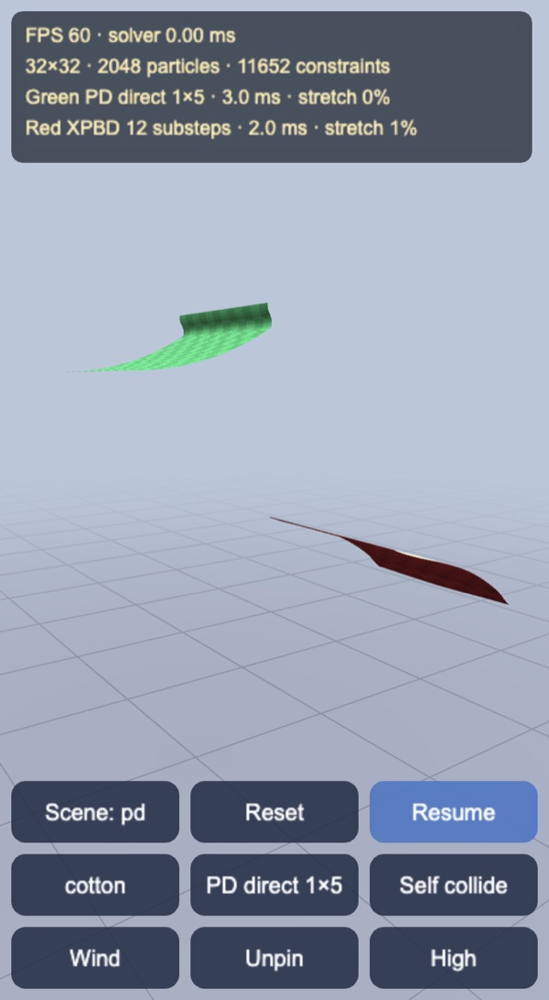
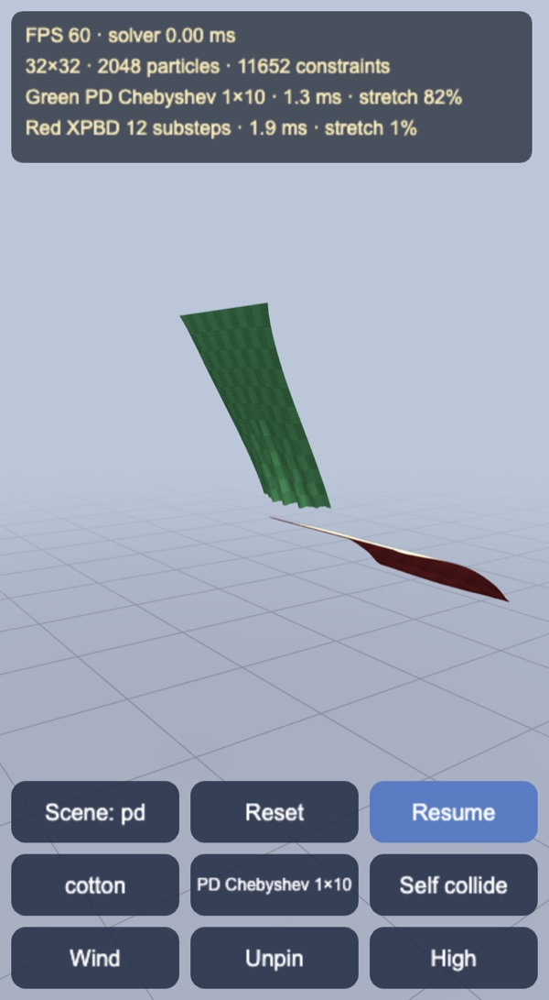
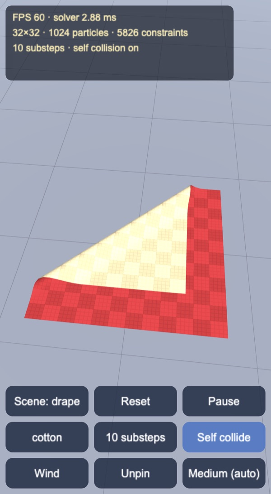
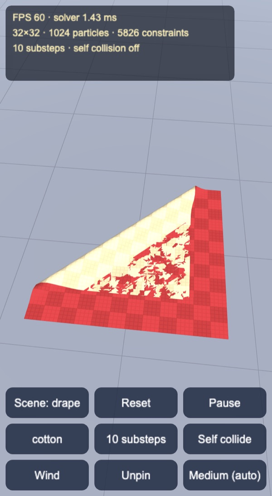

# XPBD cloth

A minimal Extended Position Based Dynamics cloth for Cocos Creator 3.8, built
and previewed with Enji, sized to run on phones. A compare scene hangs a classic
PBD sheet next to an XPBD one, and the cloth can collide with itself.

| Drape over a sphere | Grab and lift | Curtain in the wind |
|---|---|---|
|  |  |  |

## How it works

- `XpbdCloth.ts`: the solver, plain TypeScript with no engine imports.
  - XPBD (Macklin, Müller, Chentanez 2016) with the small-steps schedule
    (Macklin et al. 2019): many substeps per frame, one Gauss-Seidel sweep each.
    With one sweep the Lagrange multiplier starts at zero, so each distance
    constraint update is `dλ = -C / (w_a + w_b + α/h²)`.
  - Three constraint groups with their own compliance α (m/N): stretch (grid
    edges, α = 0), shear (cell diagonals) and bending (every second particle).
    They are solved bend, shear, stretch, so the stiffest group goes last, and
    the sweep direction alternates between substeps.
  - Long range attachments (tethers, Kim et al. 2012) keep a hanging sheet from
    stretching: a free particle may not get farther from a pin than in the rest
    pose. This cuts the worst edge stretch of a 64×64 curtain hung by two
    corners from 63% to under 1%.
  - Colliders: a kinematic sphere (its motion is spread over the substeps) and
    the ground, with position-level friction. Wind is a drag along the particle
    normals.
  - `method = 'pbd'` switches to classic Position Based Dynamics (Müller et al.
    2007) for the comparison below: `dλ = -k C / (w_a + w_b)` with a fixed
    stiffness `k` per group.
  - Optional self collision, described below.
  - All state lives in preallocated `Float32Array`s. `step()` allocates nothing,
    so there are no GC stalls on phones.
- `ClothScene.ts`: streams positions and normals into a dynamic mesh every frame.
  UVs are uploaded only once, because `updateSubMesh` maps buffers to
  attributes in order. It also owns the scene presets, the stiffness presets,
  the substep multiplier and the quality levels.
- `xpbd-cloth.effect`: two-sided cloth, with a different colour per side and a
  procedural weave. `xpbd-lit.effect`: ground grid with an analytic contact
  shadow for the sphere. There are no shadow maps, which keeps the fill cost
  low on phones.

## PBD vs XPBD

| 5 substeps | 40 substeps |
|---|---|
|  |  |

The compare scene hangs two rubber sheets by their whole top edge, PBD in blue
and XPBD in red, with the same compliance. The PBD stiffness of each group is
set to what one XPBD sweep applies at the quality level's own substep count,
`k = w / (w + α/h²)` (`matchPbdStiffness`), so the two sheets agree there. The
substep button then multiplies the substep count by 0.5, 1, 2 or 4, and the HUD
shows how far each bottom edge sags below its rest height.

PBD removes a fixed fraction of every constraint error per sweep, so more
sweeps make the material stiffer. XPBD's compliance term scales with `1/h²` and
cancels that, so the sheet keeps the stiffness it was given. Headless, 32×32
sheets matched at 10 substeps, 8 s after release
(`node --experimental-strip-types tools/compare.mts hang`):

| Substeps | XPBD sag | PBD sag |
|---|---|---|
| 5 | 10.7 cm | 34.9 cm |
| 10 | 10.4 cm | 10.2 cm |
| 20 | 11.7 cm | 2.6 cm |
| 40 | 12.2 cm | 0.6 cm |

The XPBD sag still moves by about 2 cm, because one sweep per substep does not
fully converge the soft constraints. The PBD sag changes by a factor of 60.

## Projective Dynamics

| Direct, 1 step × 5 iterations | Chebyshev, 1 step × 10 iterations |
|---|---|
|  |  |

A fourth scene hangs two cotton flaps from their back edge, PD in green and
XPBD in red. They start flat and fall through the vertical. The substep button
cycles the PD flap's solver: a banded Cholesky global step, or Jacobi
accelerated with Chebyshev (Wang 2015). XPBD keeps the quality level's
substeps. The PD scene is capped at 32×32 because the banded factor grows with
the cube of the grid side.

PD (Bouaziz et al. 2014) is an implicit Euler step on the same distance
constraints. The local step shortens every edge to its rest length; the global
step solves `(M/h² + Σ w GᵀG) x = Ms/h² + Σ w Gᵀp` with `w = 1/α`. Zero
compliance (stretch on cotton) uses a finite weight of 10⁴ N/m, otherwise the
matrix would be infinite. The matrix only depends on the time step, the
stiffness and the pins, so it is factored once; grabbing a particle is a
rank-1 update that matches a refactor to rounding error
(`node --no-warnings --import ./tools/ts-resolve.mjs tools/pd.mts`).

Headless, 32×32 cotton flaps, free-edge angle below the horizontal at 0.25 s /
0.5 s / 1 s (90° = hanging straight down), and how far the free edge then
swings past the vertical:

| Setting | 0.25 s | 0.5 s | 1 s | Past vertical | Worst stretch | Fastest frame |
|---|---|---|---|---|---|---|
| XPBD 10 substeps | 17° | 87° | 156° | 98.5 cm | 5.1% | 1.6 ms |
| XPBD 40 substeps | 17° | 89° | 158° | 98.8 cm | 0.8% | 6.4 ms |
| PD direct 1×5 | 5° | 11° | 30° | 24.5 cm | 1.0% | 2.7 ms |
| PD direct 5×2 | 12° | 42° | 117° | 65.3 cm | 0.7% | 5.6 ms |
| PD Chebyshev 1×10 | 16° | 57° | 123° | 96.6 cm | 116% | 1.2 ms |
| PD Chebyshev 2×10 | 16° | 71° | 149° | 102.7 cm | 47% | 2.5 ms |

The direct solve is accurate (stretch around 1%) and overdamped: five
iterations in one implicit Euler step barely leave the horizontal, and even
five steps of two iterations only reach 117° at 1 s against XPBD's 156°.
Chebyshev at 10 iterations keeps XPBD's swing, at XPBD's cost, but the
unconverged local step lets the cloth stretch past 100%. More implicit Euler
steps beat more iterations inside one step, the same lesson as XPBD's small
steps. A rubber sheet hung by its top edge (the PBD comparison) is the other
way around: PD's equilibrium sag is 9.4 cm after two direct iterations, and
XPBD at 10 substeps sits at 10.4 cm because one Gauss-Seidel sweep does not
finish the soft constraints.

The first factorisation of a 32×32 cotton flap takes about 5–12 ms in Node.
Later frames reuse it. The PD scene therefore steps a fixed 1/60 s, so a slow
device plays in slow motion instead of refactoring every time `dt` changes.

## Self collision

| Self collision on | Self collision off |
|---|---|
|  |  |

A corner folded over the cloth lying on the ground. Without self collision the
flap sinks through the lower layer.

Every particle keeps at least `selfThickness` (0.9 of the grid spacing) from
every other particle, with friction between the layers, as in Müller's "Ten
Minute Physics" cloth. Below 1/√2 of the spacing a particle could slip through
the middle of a cell. The particles are counting-sorted into a dense grid over
the cloth's bounding box, with cells as wide as the thickness. Cells along x are
contiguous, and each particle visits only the forward half of its 3×3×3 block
(five runs of slots), so each pair is tested once. The grid is capped at 32
cells per particle and grows its cells when the cloth spreads out.

The pass runs every second substep. A substep moves a particle far less than
the thickness, so contacts are not missed: in a sheet dropped edge-first onto
the ground (`tools/compare.mts pile`), the closest pair of particles that are
not grid neighbours stays at most 10% under the thickness at every quality
level, against 0.06–2.4 cm apart without it. In the 32×32 drape it adds about 60% to
the solver time (1.7 ms to 2.7 ms in the same run). Self collision is on in the
drape and curtain scenes and off in the compare scene.

## Mobile

| Level | Grid | Substeps | Constraints |
|---|---|---|---|
| Low | 20×20 | 8 | 2,202 |
| Medium (phone default) | 32×32 | 10 | 5,826 |
| High (desktop default) | 48×48 | 12 | 13,346 |
| Ultra | 64×64 | 15 | 23,938 |

Phones start on Medium. Auto quality drops one level when the solver averages
more than 5 ms per frame while the frame rate is under about 55 FPS. Tapping the
quality button picks a level by hand and turns auto off. The HUD lays out in CSS
pixels, so buttons stay 44 px tall on any screen. Touch controls: one finger
grabs the cloth or drags the sphere, a drag elsewhere orbits, and two fingers
pinch to zoom.

## Controls

- Drag the cloth to grab a particle, or drag the ball to move it. Drag anywhere
  else to orbit. Zoom with the wheel or a pinch.
- The buttons switch the scene (drape, curtain, compare, pd), reset, pause, cycle
  stiffness (silk, cotton, leather, rubber), multiply the substeps (or, in the
  PD scene, cycle the PD solver), toggle self collision and wind, unpin, and
  set quality.
- Keys: `C` scene, `R` reset, `Space` pause, `B` stiffness, `N` substeps, `S`
  self collision, `W` wind, `U` unpin, `Q` quality.

## Performance

Headless solver, including normals, without self collision
(`node --experimental-strip-types tools/bench.mts`, Apple Silicon Mac, Node 24):

| Grid | Substeps | Drape | Curtain | Worst edge stretch |
|---|---|---|---|---|
| 20×20 | 8 | 0.15 ms | 0.16 ms | 2.4% / 0.0% |
| 32×32 | 10 | 0.50 ms | 0.57 ms | 2.6% / 0.0% |
| 48×48 | 12 | 1.42 ms | 1.50 ms | 2.8% / 0.2% |
| 64×64 | 15 | 3.21 ms | 3.39 ms | 2.9% / 0.5% |

Enji preview measurements:

- Desktop, High (48×48): 60.2 FPS, with a median frame of 16.7 ms and a p95 of
  18.6 ms. The solver, normals and mesh upload take about 3 ms per frame. The
  viewport was 410×713 at DPR 2.
- With Chrome CPU throttling at 4× (a rough mid-range phone), Medium ran at
  60 FPS with about 3 ms of simulation, and High at 54–56 FPS with 6 ms.
- Self collision adds about two thirds to that under the same throttling
  (6.5 ms to 10.8 ms for the Medium drape, measured on a busier machine), so a
  mid-range phone running Medium sits near the 5 ms auto quality budget.

## Not in this demo yet

- Triangle-level self collision. Particles keep apart, but the folded layers
  show a gap of 0.9 grid spacings (4.6 cm on Medium), and a fast thin object
  could still pass between particles.
- Dihedral bending, and strain limiting beyond tethers.
- Projective Dynamics on area and bending constraints as in the 2014 paper;
  here it shares the cloth's distance constraints. A sparse Cholesky would
  take the direct solve past 32×32.

Made with Enji 0.4 (`feat/3d-water`).
