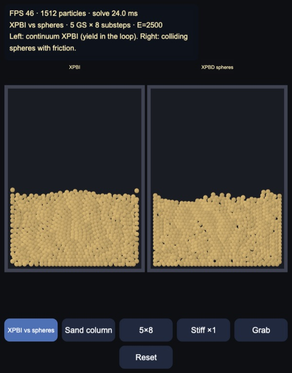
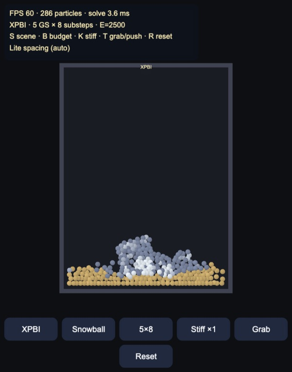
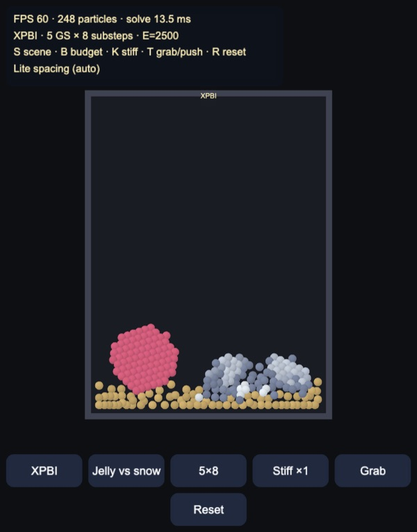
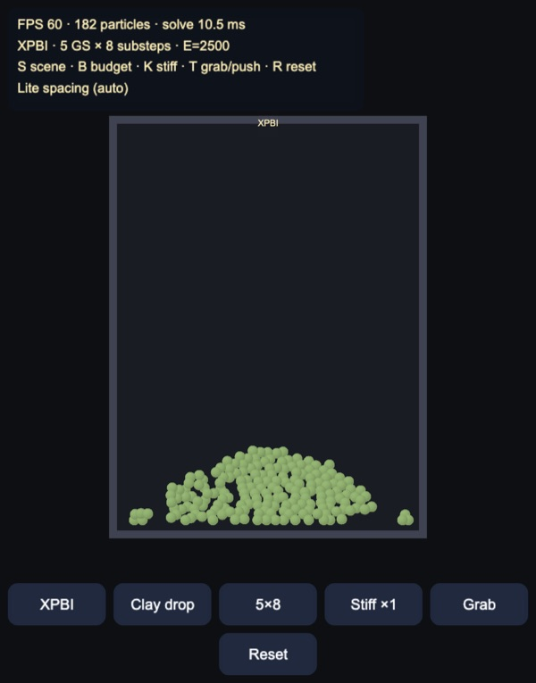

# XPBI: XPBD with smoothing kernels, for continuum plasticity

A 2D port of **XPBI** (Yu, Li, Lan, Yang & Jiang, SIGGRAPH Asia 2024) for
Cocos Creator 3.8, built and previewed with Enji. Particles are the only
degrees of freedom, as in XPBD, but each one carries a deformation gradient
**F** that is updated from a kernel estimate of ∇v, as in MPM. Plasticity
(Drucker–Prager sand, Stomakhin snow, von Mises clay) runs **inside** the
Gauss–Seidel loop, not as a post-step.

The default view puts XPBI next to **vanilla XPBD spheres with friction**
(Macklin et al. 2014) on the same sand column: continuum yield on the left,
colliding discs on the right.

| Snowball, packed white / torn grey-blue | Jelly bounces; snow breaks |
|---|---|
|  |  |

## How it works

`assets/game/xpbi/` is pure TypeScript in typed arrays. The Node tests import
it directly.

| Module | Role |
|---|---|
| `Kernel` | Wendland C2 in 2D, Bonet–Lok kernel-gradient correction **L** |
| `Svd2` | Closed-form 2×2 SVD, StVK Hencky energy and Piola, return maps |
| `Xpbi` | Neighbours, velocity-based XPBD, implicit plasticity, XSPH, distance correction |
| `Vanilla` | Pairwise sphere collisions + Coulomb friction |
| `World` / `Scenes` / `Sim` | Particles, four scenes, substeps |

### Updated-Lagrangian **F**

There is no rest mesh. The rate of **F** is ∇v · **F**, discretised as

\[ \mathbf{F}^{n+1} = \bigl(\mathbf{I} + \Delta t\,\nabla\mathbf{v}^{n+1}(\mathbf{x}^n)\bigr)\mathbf{F}^n. \]

∇v is the SPH estimate with Wendland C2 (support \(h = 2r\), \(r\) the particle
spacing) and the correction

\[ \mathbf{L}_p = \Bigl(\sum_b V_b^n \nabla W_b(\mathbf{x}_p)\otimes(\mathbf{x}_b-\mathbf{x}_p)\Bigr)^{+}, \]

so that

\[ \nabla\mathbf{v}(\mathbf{x}_p) = \sum_{b\neq p} V_b^n (\mathbf{v}_b-\mathbf{v}_p)\,(\mathbf{L}_p\nabla W_b)^\top. \]

**L** is a SVD pseudo-inverse. On a regular lattice the test's linear field
\(v = (2x, -y)\) is recovered to 0.000.

### StVK as one XPBD constraint

Hencky StVK, energy density \(\Psi = \mu\|\log\boldsymbol{\Sigma}\|_F^2 + \frac{\lambda}{2}(\mathrm{tr}\log\boldsymbol{\Sigma})^2\). One constraint per particle:

\[ \alpha = 1/V^0,\qquad C(\mathbf{F}) = \sqrt{2\Psi(\mathbf{F})}. \]

The unknown is **velocity**. Each Gauss–Seidel pass: estimate ∇v, form a trial
**F**, project it onto the yield surface, evaluate \(C\) and \(\nabla_{\mathbf{x}}C\)
from \(\partial C/\partial\mathbf{F} = \mathbf{P}/C\) and the paper's formula
involving \(\mathbf{F}^{n\top}\) and \(\mathbf{L}\nabla W\), then the usual XPBD
\(\Delta\lambda\) and \(\Delta\mathbf{v} = (1/(m\Delta t))(\nabla C)^\top\Delta\lambda\).

### Plasticity in the loop

Return mapping \(\mathcal{Z}\) runs **every** particle update, not only at the
end of the step (the semi-implicit toggle skips it inside the loop). Sand is
Drucker–Prager on Hencky strain (Klár et al. 2016); snow clamps the singular
values to \([1-\theta_c, 1+\theta_s]\) with \(J_p\) hardening (Stomakhin 2013);
clay is von Mises on the Hencky deviator.

After the iterations: XSPH (\(c = 0.01\)), then **F** and **x** are advanced
with the **same** velocity.

A pairwise distance constraint \(C = \|\mathbf{x}_p-\mathbf{x}_b\| - 0.75 r \ge 0\)
stops clumping without shifting particles outside the deformation update.

## Results

Node tests (`tools/test.mts`, ~2 s):

- Wendland integrates to 1; \(\nabla W(0) = 0\).
- \(\Psi(\mathbf{I}) = 0\); snow clamp and hardening.
- Corrected ∇v matches a linear field (worst 0.000 on 25 interior particles).
- A sand column with friction 50° stays narrower than one with 20°
  (\(\sigma_x\) 0.236 vs 0.244).
- After a drop, jelly sits higher than snow (0.216 vs 0.172).
- One XPBI step stays finite.

In the browser (M5, compare view ~1,500 particles, 5 iterations × 8 substeps):
XPBI ~18–24 ms, spheres ~3–4 ms, 46–54 FPS. Single-world snow/jelly ~250
particles at 60 FPS, 3–14 ms. Start-up drops to lite spacing if the solver
misses 50 FPS or 14 ms.

The sand compare is the paper's Fig. 13 in miniature: XPBI keeps a even
packing; the sphere side clumps and leaves holes. A cohesionless column still
slumps into the box — dry sand has no tensile strength — but raising the
friction angle in the test measurably narrows the pile.

## Controls

- Buttons: solver (XPBI vs spheres / XPBI / semi-implicit / spheres), scene,
  budget (3×4, 5×8, 8×12 iterations × substeps), stiff ×4, grab or push, reset.
- Drag to grab or push. Both halves of the compare view get the same hand.
- Keys: `S` solver, `C` scene, `B` budget, `K` stiff, `T` tool, `R` reset,
  `Q` lite spacing.

## Engine notes

- Point sprites: `MeshUtils.createDynamicMesh` + `primitive: point_list`.
  `gl_PointSize` is framebuffer pixels.
- New effects need `enji import assets/resources/effects`.
- The HUD is in CSS pixels so the buttons stay finger-sized.

## Not in this demo yet

- **Power Plastics** (Qu et al. 2023): Power PIC weights on an MLS-MPM grid.
  That paper is still open; this demo is XPBI only.
- 3D, PBF water coupling, Herschel–Bulkley, NACC fracture.
- GPU coloured Gauss–Seidel (CPU is sequential).
- Phone measurements.

Made with Enji 0.3.
